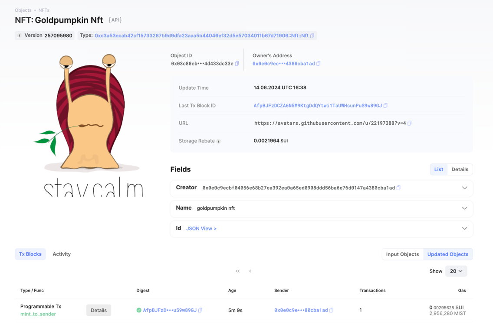

## 基本信息
- Sui钱包地址: `0x0e0c9ecbf04056e68b27ea392ea0a65ed0908ddd56ba6e76d0147a4380cba1ad`
> 首次参与需要完成第一个任务注册好钱包地址才被合并，并且后续学习奖励会打入这个地址
- github: `goldpumpkin`

## 个人简介
- 工作经验: 7年
- 技术栈: `Java` `Rust` `React`
- web2 -> web3 ing

## 任务

##   01 hello move  
- [x] package id: 
  - devnet: 0x0fc3d411a048d01a5ffc8ddd88b5df4976c175f09cb20c4cf66c9b6c66da584f
  - testnet: 0x4b87bf6a740dc0682b661e03aaf853a5a7ae2ebfb61a5fc1ea3be6604e0a5831

##   02 move coin
- [x] My Coin package id : [0x2049a291454215021d24d2def83107c6e3bb5778d945b8972e2c7d1d9bada7b2](https://suiscan.com/object/0x2049a291454215021d24d2def83107c6e3bb5778d945b8972e2c7d1d9bada7b2)
- [x] Faucet package id : [0x3b6b196b9c17390406c04d1c949179ebab1b001940dc38aa226b92cffc63b1ce](https://suiscan.xyz/mainnet/object/0x3b6b196b9c17390406c04d1c949179ebab1b001940dc38aa226b92cffc63b1ce/contracts)
- [x] 转账 `My Coin` hash: [BvxoEjvXiPrcyEvFGTL1cNufJ7yMRporDGrHe5pLozH4](https://suiscan.com/txblock/BvxoEjvXiPrcyEvFGTL1cNufJ7yMRporDGrHe5pLozH4)
- [x] `Faucet Coin` address1 mint hash:[HK6n3L8DyPg5pX1VBgU6oXdXYeintSAJgDEDSYydECUP](https://suiscan.xyz/mainnet/tx/HK6n3L8DyPg5pX1VBgU6oXdXYeintSAJgDEDSYydECUP)
- [x] `Faucet Coin` address2 mint hash:[FGC6WGMMnaUEqEfYGWCrgaZQ1xeWZ4cdJ7qmhiUHcmW7](https://suiscan.xyz/mainnet/tx/FGC6WGMMnaUEqEfYGWCrgaZQ1xeWZ4cdJ7qmhiUHcmW7)
- [x] Faucet Neo package id : [0xc2ef43cfeac82601ff1384bcb8ae45cfd8a632503f60fbc92aa71ea776ee1707](https://suiscan.xyz/mainnet/object/0xc2ef43cfeac82601ff1384bcb8ae45cfd8a632503f60fbc92aa71ea776ee1707/txs)
- [x] `Faucet Neo Coin` address1 mint hash:[9cYsqfT1GSDwNLQoUmvDSztoAXyyatcozfV2tjfFks2P](https://suiscan.xyz/mainnet/tx/9cYsqfT1GSDwNLQoUmvDSztoAXyyatcozfV2tjfFks2P)
  - Address: 0x0e0c9ecbf04056e68b27ea392ea0a65ed0908ddd56ba6e76d0147a4380cba1ad
- [x] `Faucet Neo Coin` address2 mint hash:[CZ4VhRk5WvrGy4NTn1j1XHdEgrz2FQ9Pq5jRMgCG5DLC](https://suiscan.xyz/mainnet/tx/CZ4VhRk5WvrGy4NTn1j1XHdEgrz2FQ9Pq5jRMgCG5DLC)
  - Address:0x260688fbcb5620c1343d0009e10660df145e414e7948b7ac012ff40ff4414de9

##   03 move NFT
- [x] nft package id : [0xc3a53ecab42cf15733267b9d9dfa23aaa5b44046ef32d5e57034011b67d71906](https://suiscan.xyz/mainnet/object/0xc3a53ecab42cf15733267b9d9dfa23aaa5b44046ef32d5e57034011b67d71906/contracts)
- [x] nft object id : [0x03c80ebec2bf7e61ad68783c99357d74f791198fb6a7e6dddc379d4d433dc33e](https://suiscan.xyz/mainnet/object/0x03c80ebec2bf7e61ad68783c99357d74f791198fb6a7e6dddc379d4d433dc33e)
- [x] 转账 nft  hash: [Gf3qsE8sxsxZbHSCC37ZuK27EYyVn1pmwjLffjmL3sF2](https://suiscan.xyz/mainnet/tx/Gf3qsE8sxsxZbHSCC37ZuK27EYyVn1pmwjLffjmL3sF2)
- [x] scan上的NFT截图:

##   04 Move Game
- [x] game package id : [E6PvvP7Vn57e2VxC6skwTcPivz3rSQ5aQJq2ExjoZtxu](https://suiscan.xyz/mainnet/tx/E6PvvP7Vn57e2VxC6skwTcPivz3rSQ5aQJq2ExjoZtxu)
- [x] call game hash: [5XKjJuRycWAnhWK3Zi9tYHuwEV2rzUsGmxCJp3sYhZA7](https://suiscan.xyz/mainnet/tx/5XKjJuRycWAnhWK3Zi9tYHuwEV2rzUsGmxCJp3sYhZA7)

##   05 Move Swap
- [] swap package id :
- [] call swap hash:

##   06 SDK PTB
- [] save hash :

