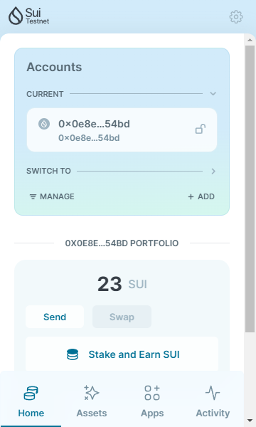
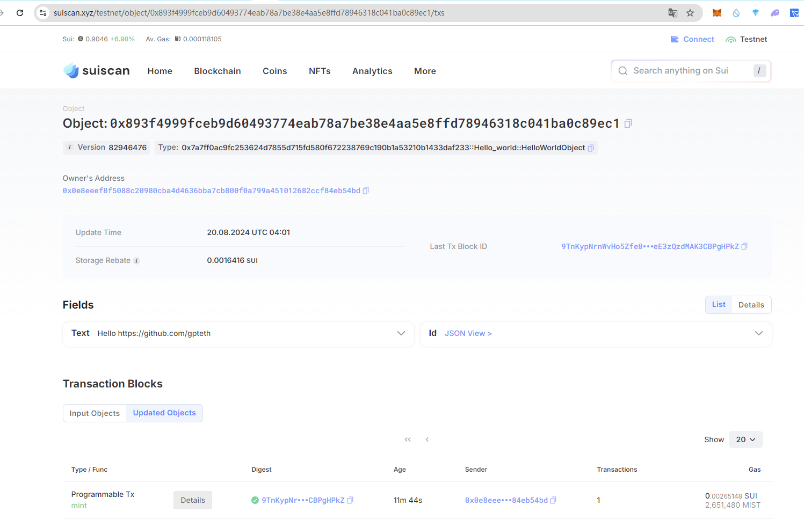

## 基本信息

- Sui钱包地址: `0x8a7a96dfa78073b49d7bfc82d888dc5aaa8f5052e83b9beb367e3322bf9349ea`

> 首次参与需要完成第一个任务注册好钱包地址才被合并，并且后续学习奖励会打入这个地址

- github: `https://github.com/gpteth`

## 个人简介

- 工作经验: 5年
- 技术栈: `Solidity` `Golang`

> 重要提示 请认真写自己的简介

- 多年web3智能合约开发经验，开发EVM生态DEFI、 NFT 、Dapp，对Move特别感兴趣，想通过Move入门区块链
- 联系方式: tg: `https://t.me/JudasLuo`

## 任务

## 01 hello move  

- [] Sui cli version:  sui 1.32.0-98c829101866
- [] Sui钱包截图: 
- [] package id: 0x7a7ff0ac9fc253624d7855d715fd580f672238769c190b1a53210b1433daf233
- [] package id 在 scan上的查看截图:

## 02 move coin

- [] My Coin package id :
- [] Faucet package id :
- [] 转账 `My Coin` hash:
- [] `Faucet Coin` address1 mint hash:
- [] `Faucet Coin` address2 mint hash:

## 03 move NFT

- [] nft package id :
- [] nft object id :
- [] 转账 nft  hash:
- [] scan上的NFT截图:

## 04 Move Game

- [] game package id :
- [] deposit Coin hash:
- [] withdraw `Coin` hash:
- [] play game hash:

## 05 Move Swap

- [] swap package id :
- [] call swap CoinA-> CoinB  hash :
- [] call swap CoinB-> CoinA  hash :

## 06 Dapp-kit SDK PTB

- [] save hash :

## 07 Move CTF Check In

- [] CLI call 截图 : 
- [] flag hash :

## 08 Move CTF Lets Move

- [] proof :
- [] flag hash :
