# 这个模板是2024年11月份的共学营才需要的

## b站，推特关注

- [√] b站关注截图: 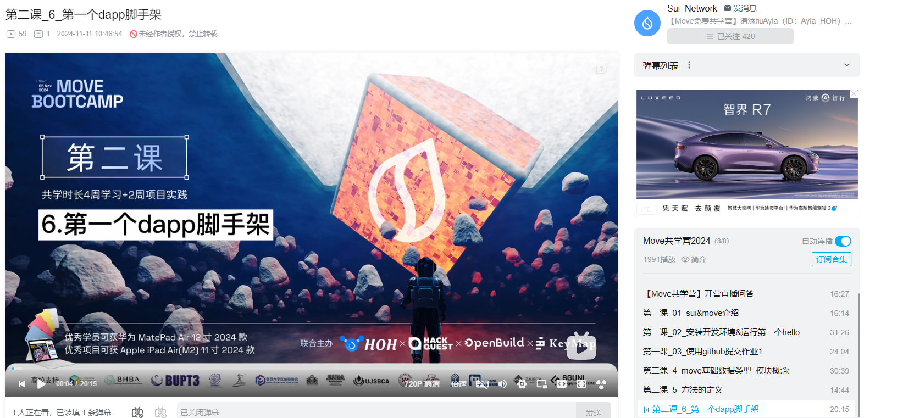
- [√] 推特关注截图: 
## 为共学营宣传（在朋友圈或者群聊中转发海报/文章）

- [√] 宣传截图: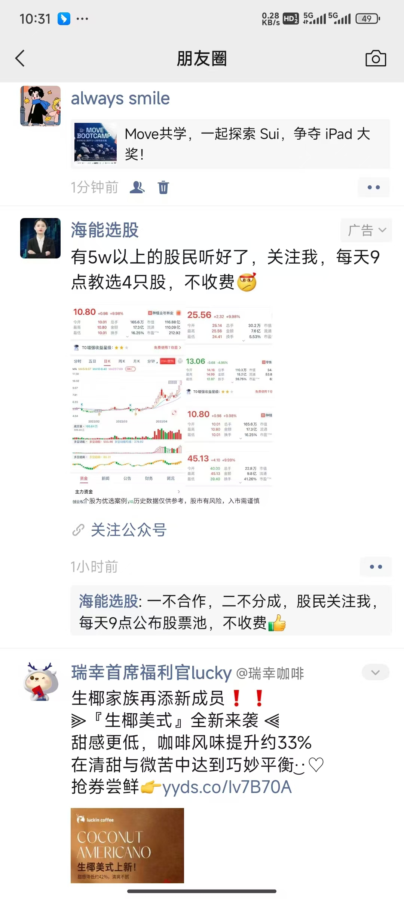

## 每周课程学习

- [√] 第一周: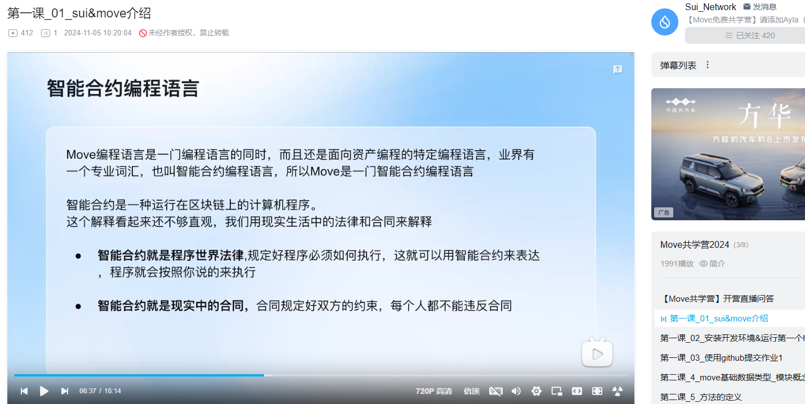
- [√] 第二周:
- [√] 第三周: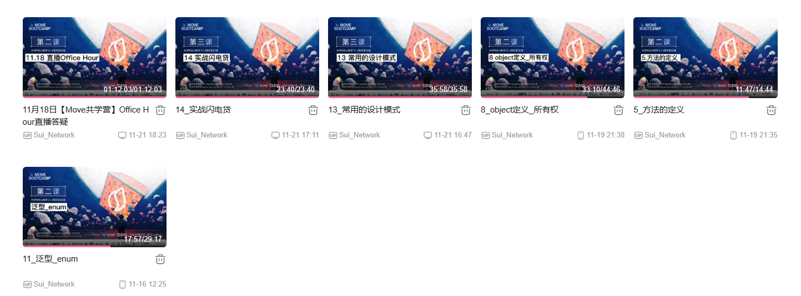
- [√] 第四周: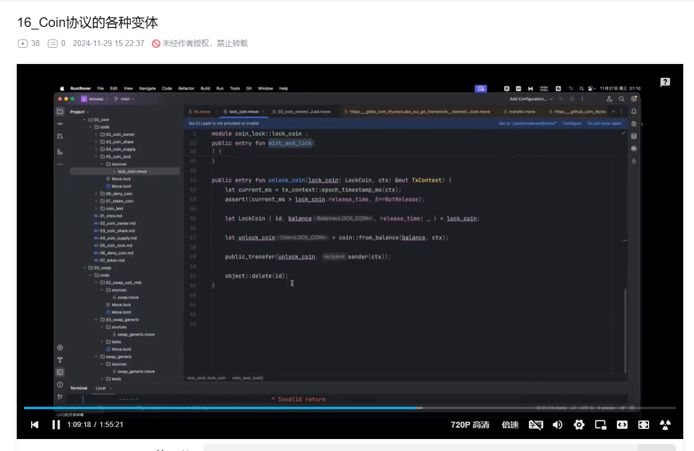

## 参加直播答疑
- [√] 第一周: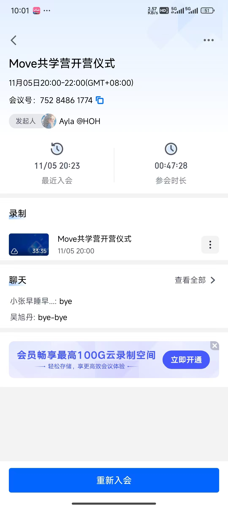:参与共学营开营仪式并积极互动
- [√] 第一周: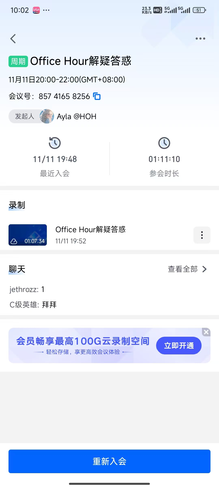:参与第一周直播答疑并积极互动
- [√] 第二周: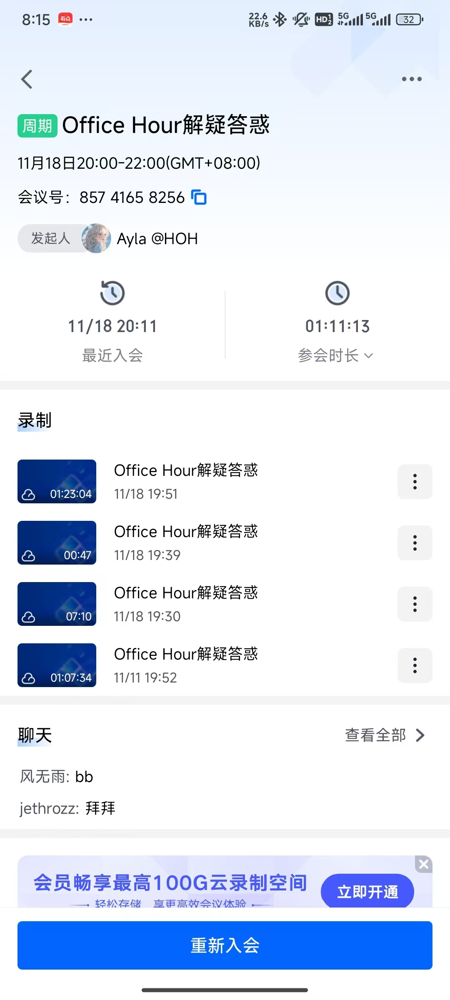:参与第二周直播答疑并积极互动
- [√] 第三周: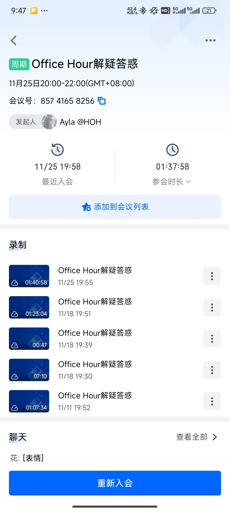:参与第三周直播答疑并积极互动
- [√] 第四周: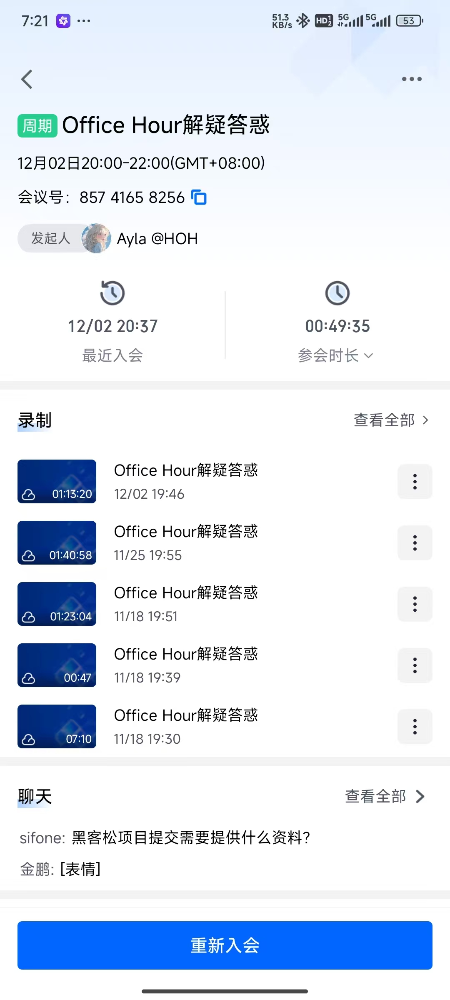:参与第三周直播答疑并积极互动

## 群里分享学习笔记

- [√] 第一篇笔记[如何安装SUI客户端](https://learnblockchain.cn/article/9860)
- [√] 第二篇笔记[MOVE共学营TASK3教程](https://learnblockchain.cn/article/9878)
- [√] 第三篇笔记[move入门之基础概念](https://learnblockchain.cn/article/9931)
- [√] 第四篇笔记[move基本数据类型(一)](https://learnblockchain.cn/article/9932)
- [√] 第五篇笔记[move基本数据类型(二)](https://learnblockchain.cn/article/9933)
- [√] 第六篇笔记[sui-cli使用指南](https://learnblockchain.cn/article/9934)
- [√] 第七篇笔记[move入门之结构体的四大能力](https://learnblockchain.cn/article/9952)
- [√] 第八篇笔记[MOVE共学营TASK4教程](https://learnblockchain.cn/article/9959)
- [√] 第九篇笔记[move入门之基础语法(一)](https://learnblockchain.cn/article/9966)
- [√] 第十篇笔记[MOVE共学营TASK5教程](https://learnblockchain.cn/article/10035)
- [√] 第十一篇笔记[move入门之泛型](https://learnblockchain.cn/article/10036)
- [√] 第十二篇笔记[move入门之集合(一)](https://learnblockchain.cn/article/10090)
- [√] 第十三篇笔记[move入门之集合(二)](https://learnblockchain.cn/article/10091)
- [√] 第十四篇笔记[move入门之集合(三)](https://learnblockchain.cn/article/10167)
- [√] 第十五篇笔记[如何使用dapp-kit构建应用](https://learnblockchain.cn/article/10163)
- [√] 第十六篇笔记[SUI中的PTB编程入门](https://learnblockchain.cn/article/10166)
## 对外输出学习笔记

- [√] 第一篇笔记[Git入门到精通](https://blog.csdn.net/jinpeng741143592/article/details/143261589?spm=1001.2014.3001.5502)
- [√] 第二篇笔记[速学150个Linux常用命令笔记](https://blog.csdn.net/jinpeng741143592/article/details/143251993?spm=1001.2014.3001.5502)
- [√] 第三篇笔记[Windows DOS命令 批处理脚本学习笔记](https://blog.csdn.net/jinpeng741143592/article/details/143251799?spm=1001.2014.3001.5502)
- [√] 第四篇笔记[如何安装SUI客户端](https://learnblockchain.cn/article/9860)
- [√] 第五篇笔记[MOVE共学营TASK3教程](https://learnblockchain.cn/article/9878)
- [√] 第六篇笔记[move入门之基础概念](https://learnblockchain.cn/article/9931)
- [√] 第七篇笔记[move基本数据类型(一)](https://learnblockchain.cn/article/9932)
- [√] 第八篇笔记[move基本数据类型(二)](https://learnblockchain.cn/article/9933)
- [√] 第九篇笔记[sui-cli使用指南](https://learnblockchain.cn/article/9934)
- [√] 第十篇笔记[move入门之结构体的四大能力](https://learnblockchain.cn/article/9952)
- [√] 第十一篇笔记[MOVE共学营TASK4教程](https://learnblockchain.cn/article/9959)
- [√] 第十二篇笔记[move入门之基础语法(一)](https://learnblockchain.cn/article/9966)
- [√] 第十三篇笔记[MOVE共学营TASK5教程](https://learnblockchain.cn/article/10035)
- [√] 第十四篇笔记[move入门之泛型](https://learnblockchain.cn/article/10036)
- [√] 第十五篇笔记[move入门之集合(一)](https://learnblockchain.cn/article/10090)
- [√] 第十六篇笔记[move入门之集合(二)](https://learnblockchain.cn/article/10091)
- [√] 第十七篇笔记[move入门之集合(三)](https://learnblockchain.cn/article/10167)
- [√] 第十八篇笔记[如何使用dapp-kit构建应用](https://learnblockchain.cn/article/10163)
- [√] 第十九篇笔记[SUI中的PTB编程入门](https://learnblockchain.cn/article/10166)
## 在HOH社区公众号发布自己的技术文章

- [] 第一篇笔记【https://mp.weixin.qq.com/s/sBanVURGcIEXKSO5ddx2fg】
- [] 第二篇笔记【公众号文章链接】
- [] 第三篇笔记【公众号文章链接】
- [] 第四篇笔记【公众号文章链接】

## 直播分享学习技巧/工具推荐

- [√] 会议截图: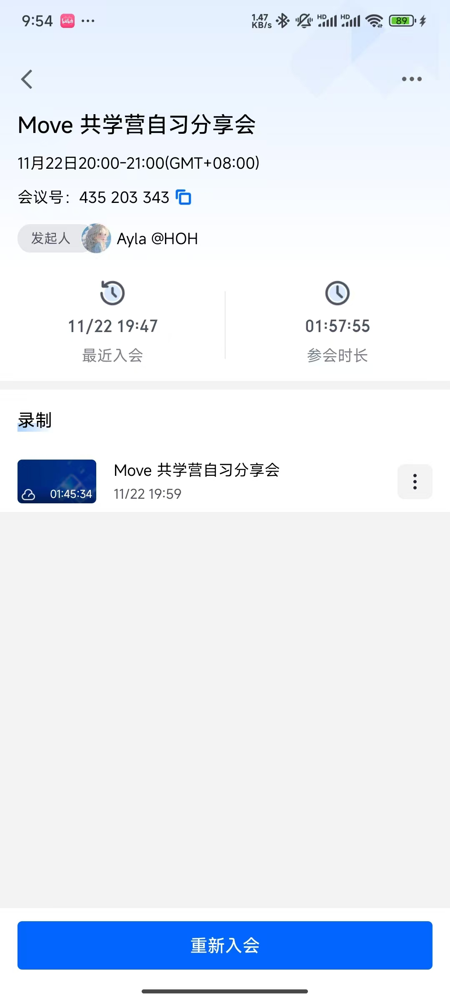

## 提交项目

- [] 项目提交

