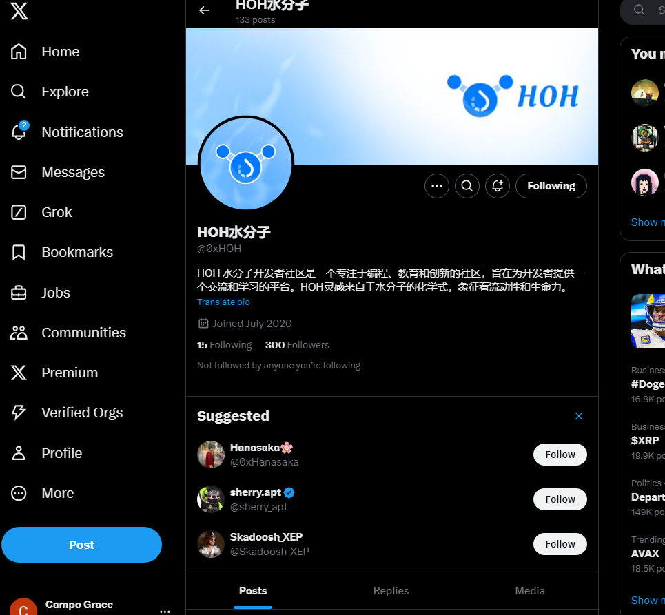

# 这个模板是2024年11月份的共学营才需要的

## b站，推特关注

- [√] b站关注截图: 
- [√] 推特关注截图: 
## 为共学营宣传（在朋友圈或者群聊中转发海报/文章）

- [√] 宣传截图:

## 每周课程学习

- [√] 第一周:
- [√] 第二周:
- [] 第三周:
- [] 第四周:

## 参加直播答疑

- [√] 第一周:
- [√] 第二周:
- [] 第三周:
- [] 第四周:

## 群里分享学习笔记

- [√] 第一篇笔记 【https://learnblockchain.cn/article/9860】
- [√] 第二篇笔记 【https://learnblockchain.cn/article/9878】
- [] 第三篇笔记
- [] 第四篇笔记

## 对外输出学习笔记

- [√] 第一篇笔记【https://blog.csdn.net/jinpeng741143592/article/details/143261589?spm=1001.2014.3001.5502】
- [√] 第二篇笔记【https://blog.csdn.net/jinpeng741143592/article/details/143251993?spm=1001.2014.3001.5502】
- [√] 第三篇笔记【https://blog.csdn.net/jinpeng741143592/article/details/143251799?spm=1001.2014.3001.5502】
- [√] 第四篇笔记【https://learnblockchain.cn/article/9860】
- [√] 第四篇笔记【https://learnblockchain.cn/article/9878】

## 在HOH社区公众号发布自己的技术文章

- [] 第一篇笔记【公众号文章链接】
- [] 第二篇笔记【公众号文章链接】
- [] 第三篇笔记【公众号文章链接】
- [] 第四篇笔记【公众号文章链接】

## 直播分享学习技巧/工具推荐

- [] 会议截图:

## 提交项目

- [] 项目提交

