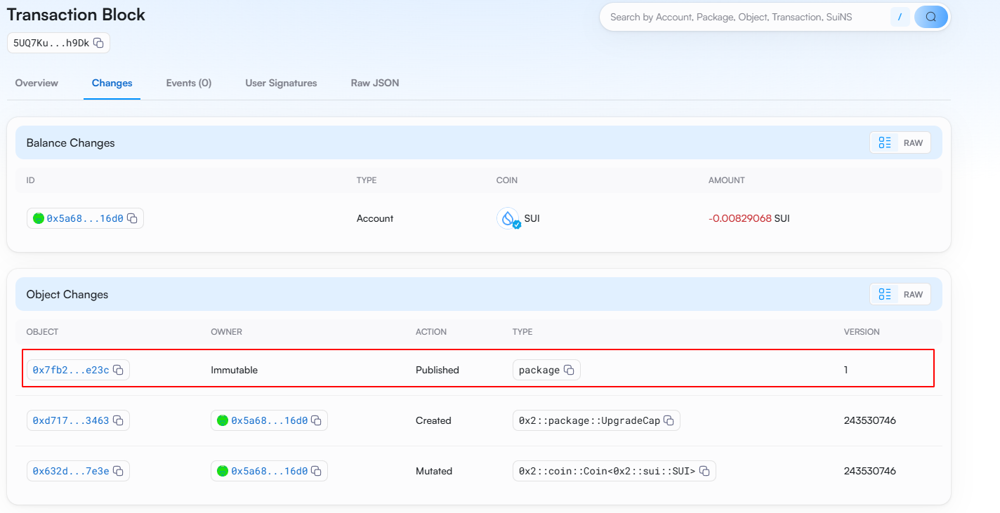

# 如何实现一个分布式计数器

说明：
该教程基于sui官方开发者文档，进行的是实战操作，需要读者具备一定的move语言基础。
[官方教程地址](https://docs.sui.io/guides/developer/app-examples/e2e-counter)：https://docs.sui.io/guides/developer/app-examples/e2e-counter

## 实战说明
该实战项目涉及的知识点有： 结构体，函数，对象的所有权，PTB编程。

通过此项目，你可以构建一个，具备前后端的基础`DAPP`，允许任何人通过此APP进行计数器的递增，但限制只有对象的所有者可以进行重置计数器。

### 前置条件

> move基础语法知识: 结构体 ，函数声明 ，变量声明， 对象的所有权 ，对象的能力

> react前端基础知识： node , npm , react框架基础 , typescript语法

### 项目分析
> 本项目分为
>>    合约部分: 计数器结构体  递增函数   重置函数

>>    前端部分  钱包组件    合约调用 
## 代码部分
### 创建项目结构
新建项目目录：counter_project

```shell
mkdir counter_project && cd counter_project
```
创建合约部分

```shell
sui move new counter_contracts
```

> 可选部分：(因为依赖为`github`地址，国内网速可能较慢，故将其改为`gitee`地址加速)

>> 修改toml文件
>>```toml
>>[dependencies]
>>Sui = { git = "https://gitee.com/MystenLabs/sui.git", subdir = "crates/sui-framework/packages/sui-framework", rev = "framework/testnet" }
>>```

### 合约部分讲解

```move
module counter_contracts::counter_contracts{
    ///声明计数器结构体：赋予结构体key的能力
    /// 结构体的元素有：
    /// id  用以在链上索引对象
    /// owner 对象的拥有者
    /// value 计数器值
    public struct Counter has key {
        id: UID,
        owner: address,
        value: u64
    }

    ///创建一个计数器:
    /// id 通过object::new(ctx)创建对象唯一索引
    /// 将owner字段赋值为函数调用地址
    /// 计数器值置为0
    public fun create(ctx: &mut TxContext) {
        transfer::share_object(Counter {
            id: object::new(ctx),
            owner: ctx.sender(),
            value: 0
        })
    }
    ///递增函数： 将计数器值+1
    public fun increment(counter: &mut Counter) {
        counter.value = counter.value + 1;
    }
    ///重置计数器值： 对计数器拥有者进行判断，如果非计数器的拥有者，则抛出异常
    public fun set_value(counter: &mut Counter, value: u64, ctx: &TxContext) {
        assert!(counter.owner == ctx.sender(), 0);
        counter.value = value;
    }
}
```

合约部分:

声明计数器结构体：

```move
    public struct Counter has key {
        id: UID,
        owner: address,
        value: u64
    }
```

该结构体体拥有key的能力，拥有`key`能力的对象，必须声明一个`id`,此条件是拥有`key`的结构体的必要条件，用于在链上创建对象并用生成的`id索引`

我们赋予该对象`id`,拥有者地址 `owner`，以及一个记录计数器值的元素：`value`

声明创建结构体函数：
```move
    public fun create(ctx: &mut TxContext) {
        transfer::share_object(Counter {
            id: object::new(ctx),
            owner: ctx.sender(),
            value: 0
        })
    }
```
此函数参数TxContext为一个包含了当前正在执行的交易的信息。它是由虚拟机创建的特权对象，

其中包含了
sender: 签署当前交易的用户地址。

tx_hash: 当前交易的哈希值。

epoch: 当前的纪元编号。

epoch_timestamp_ms: 纪元开始的时间戳（以毫秒为单位）。

ids_created: 在执行交易时创建的新 ID 的计数器，交易开始时总是为 0。

我们可以看到，在赋值`owner`地址时，我们通过调用`ctx.sender()`，获取了签署当前交易的用户地址。

`object::new(ctx)`是用于在 Sui 中创建一个新的唯一标识符（UID）的函数，它需要一个 `&mut TxContext` 作为参数，并返回一个新的 `UID`。这个函数确保生成的 `UID` 是唯一的，并且不能在对象被删除后重用。

将`value`元素赋值为`0`

`transfer::share_object` 是一个用于将对象置于共享状态的函数。一旦对象被共享，它可以被任何人通过可变引用访问和修改。这个操作是不可逆的，也就是说，一旦对象被共享，它将永远保持共享状态。

我们通过transfer::share_object方法，将结构体对象置于共享状态,用以使任何人都可以操作此对象。

声明递增函数：
```move
    public fun increment(counter: &mut Counter) {
        counter.value = counter.value + 1;
    }
```
此函数参数为前一个函数`create`创建的对象，通过`counter.value = counter.value + 1`，进行计数器值的递增

我们在调用时，通过传入对象ID, 函数中通过获取计数器对象的value元素，并将其原有值基础上+1，实现计数器值的递增逻辑

重置计数器值函数
```move
    public fun set_value(counter: &mut Counter, value: u64, ctx: &TxContext) {
        assert!(counter.owner == ctx.sender(), 0);
        counter.value = value;
    }
```
此函数通过传入计数器对象`counter`，值`value`，以及交易上下文对象`ctx`,通过判断`counter`对象的owner地址与`ctx`中签署当前交易的用户地址对比，进行权限限制。

就是说虽然对象的共享的，所有人都可以通过`increment`函数进行修改`value`值，但是重置`value`只有owner地址才能进行修改

### 发布合约
```shell
sui client publish
```
可以通过控制台看到，我们发布的合约包信息，以及合约包的packageID
```text
UPDATING GIT DEPENDENCY https://gitee.com/MystenLabs/sui.git
INCLUDING DEPENDENCY Sui
INCLUDING DEPENDENCY MoveStdlib
BUILDING counter_contracts
Successfully verified dependencies on-chain against source.
Transaction Digest: 5UQ7KuURAeMEdkQLAYq6NqM56VTLUDkkSG9WYQ8nh9Dk
```

控制台此信息包含了发布的交易摘要: `Transaction Digest: 5UQ7KuURAeMEdkQLAYq6NqM56VTLUDkkSG9WYQ8nh9Dk`

我们可以通过区块浏览器进行查看具体的信息：https://testnet.suivision.xyz/txblock/5UQ7KuURAeMEdkQLAYq6NqM56VTLUDkkSG9WYQ8nh9Dk

查询时交易摘要需替换为你发布包的摘要信息。



也可在控制台查看信息，如下图所示
```text
╭──────────────────────────────────────────────────────────────────────────────────────────────────╮
│ Object Changes                                                                                   │
├──────────────────────────────────────────────────────────────────────────────────────────────────┤
│ Created Objects:                                                                                 │
│  ┌──                                                                                             │
│  │ ObjectID: 0xd717e1dc9011acb282da01c5fbc5d2dacb795c145b91e64c08fa618362893463                  │
│  │ Sender: 0x5a684e30c7760309906a4ed7b25e2d0c4bbeff74a3995a8ccbfe49be084d16d0                    │
│  │ Owner: Account Address ( 0x5a684e30c7760309906a4ed7b25e2d0c4bbeff74a3995a8ccbfe49be084d16d0 ) │
│  │ ObjectType: 0x2::package::UpgradeCap                                                          │
│  │ Version: 243530746                                                                            │
│  │ Digest: 8pWgX77LTK5CRAg651foQpMauQKq7t9Y4GESvpUf6nyR                                          │
│  └──                                                                                             │
│ Mutated Objects:                                                                                 │
│  ┌──                                                                                             │
│  │ ObjectID: 0x632d35058587efd468ac3fa5f8fbe6c17a599e51806710f910ac7aa0c3747e3e                  │
│  │ Sender: 0x5a684e30c7760309906a4ed7b25e2d0c4bbeff74a3995a8ccbfe49be084d16d0                    │
│  │ Owner: Account Address ( 0x5a684e30c7760309906a4ed7b25e2d0c4bbeff74a3995a8ccbfe49be084d16d0 ) │
│  │ ObjectType: 0x2::coin::Coin<0x2::sui::SUI>                                                    │
│  │ Version: 243530746                                                                            │
│  │ Digest: AWGTQQZ5hsvguk4GKpEvQkDdAFNmkKjHrCehpXx4n9Dx                                          │
│  └──                                                                                             │
│ Published Objects:                                                                               │
│  ┌──                                                                                             │
│  │ PackageID: 0x7fb2fd5c8ce79106206eda8759b7569588479c4057673e38113d4bf07361e23c                 │
│  │ Version: 1                                                                                    │
│  │ Digest: BbbQT37SUxtRcnvv43dyBfejyDiDTSveog7yKE9Xxdcp                                          │
│  │ Modules: counter_contracts                                                                    │
│  └──                                                                                             │
╰──────────────────────────────────────────────────────────────────────────────────────────────────╯
```

### 前端部分讲解

## 总结
