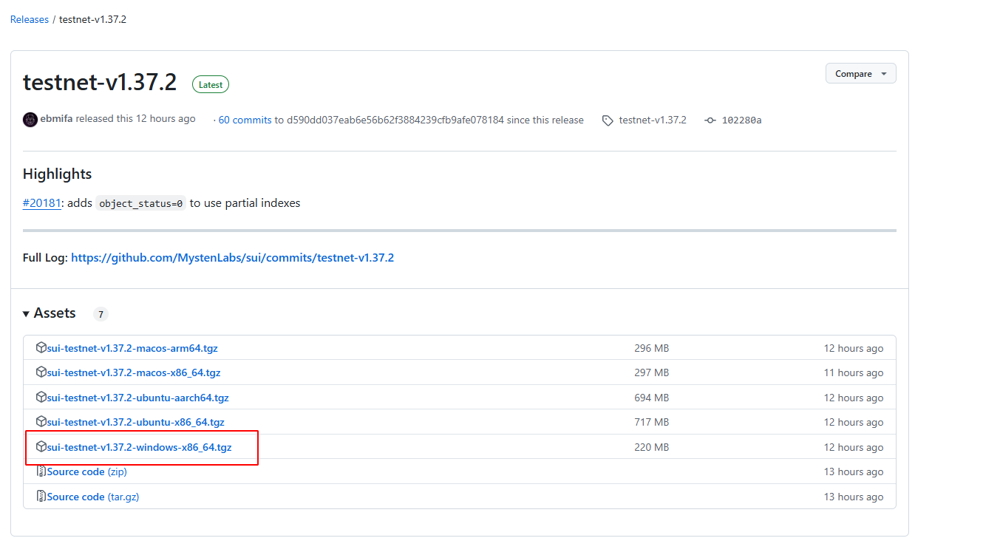
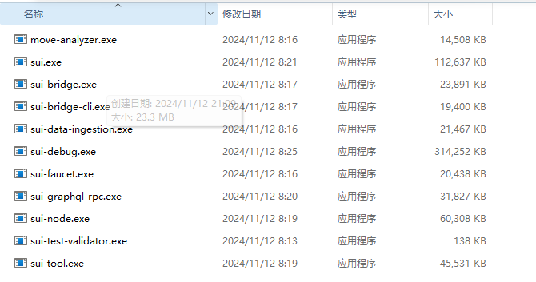
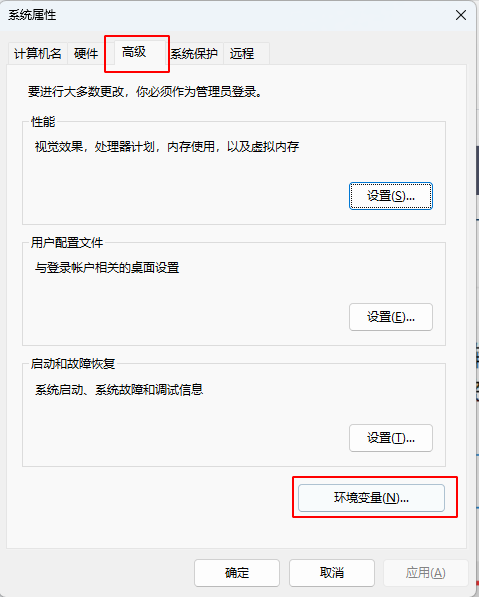
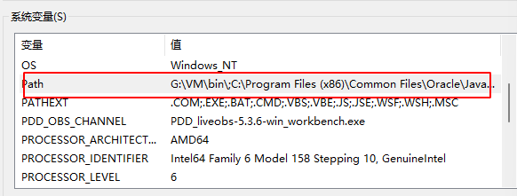
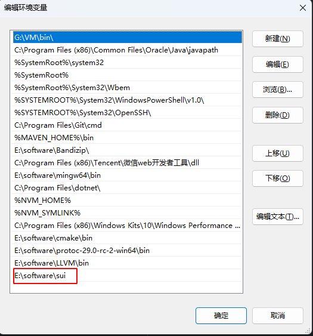

# 如何安装SUI客户端

💧  [HOH水分子公众号](https://mp.weixin.qq.com/s/d0brr-ao6cZ5t8Z5OO1Mog)

🌊  [HOH水分子X账号](https://x.com/0xHOH)

📹  [课程B站账号](https://space.bilibili.com/3493269495352098)

💻  Github仓库 https://github.com/move-cn/letsmove

🧑‍💻作者：gracecampo

## 支持的系统
> Linux - Ubuntu 版本 20.04 （Bionic Beaver） 或更高版本
 
> macOS - macOS Monterey 或更高版本

> Microsoft Windows - Windows 10 和 11

Linux 和macOS 安装比较简单,执行以下安装命令即可

## Linux/macOS 安装命令
>> brew install sui

## windows安装步骤
### 下载二进制文件
[下载地址:](https://github.com/MystenLabs/sui)
https://github.com/MystenLabs/sui
点击链接会显示以下页面

点击右侧release,下载最新版本，当前最新版本为testnet-v1.37.2,故选择此版本 sui-testnet-v1.37.2-windows-x86_64.tgz

下载完成后，修改压缩包名称为sui.tgz 然后解压安装包
要记录解压目录，比如我解压目录为：E:\software\sui

解压后目录信息

### 配置环境变量
按下“win+R”快捷键，打开运行对话框，输入指令：
>> sysdm.cpl

选择高级，点击环境变量

在系统变量中，找到path双击，点击新建，添加环境变量

验证是否安装完成：
按下“win+R”快捷键，打开运行对话框，输入指令：
>> cmd

输入：
>> sui --version

如果输出sui版本号，说明安装成功

如果输出错误,则需要确认sui目录路径是否正常，如果配置正确，可以尝试重启电脑，再次执行验证步骤。

更新安装包，也是以上步骤，下载最新版的安装包，解压替换原有文件即可。

