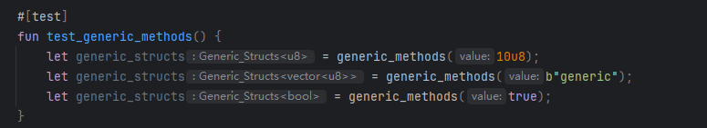

# move入门之泛型
🧑‍💻作者：gracecampo
## 泛型是什么？
泛型是 Move 中许多高级特性的基础，比如集合、抽象实现等

在 Move 中，泛型是高级语言特性，它可以使结构体或者函数接受任意类型的参数

在日常开发中，当我们希望一个结构体或者函数，在不同的场景下，某个字段，或者方法可以不指定具体类型，可以根据不同场景或者业务传入不同的类型参数，
这种情况下，泛型将是我们的不二选择。

## 泛型语法
定义泛型类型或函数时，泛型类型需要有一组用尖括号（< 和 >）括起来的泛型参数，参数之间用逗号分隔
### 定义支持泛型的结构体
```sui move
public struct Generic_Structs<T> has drop {
    value: T,
}
```
上面的例子，结构体Struct_Name后跟T类型的泛型类型，在结构体参数中，我们可以将value指定为泛型T
这个T最终类型是什么，有我们决定，这个就是最直观的表现
### 定义支持泛型的函数体
```sui move
public fun generic_methods<T>(value: T): Generic_Structs<T> {
    Generic_Structs { value }
}
```
generic_methods 函数是一个具有单个类型参数 T 的泛型函数，它返回一个包含给定值的 generic_structs

在上面的方法中，我们定义函数是T类型,value 是T类型，返回类型是generic_structs<T>，这个T类型可以是int ，string，coin等

泛型方法，不再局限与只支持一种类型，它可以是多变的，具体什么类型，由调用者定义

泛型语法对于代码复用，提高合约内聚性，是至关重要的

## 泛型的高级应用
### 多类型参数
```sui move
public struct Generic_Structs<T, U> {
    first: T,
    second: U,
}

public fun generic_methods<T, U>(first: T, second: U): Generic_Structs<T, U> {
    Generic_Structs { first, second }
}
```
在这个例子中，Generic_Structs 是一个具有两个类型参数 T 和 U 的泛型类型，而 Generic_Structs 函数是一个具有两个类型参数的泛型函数。函数返回一个包含给定值的 Generic_Structs。

在这个例子中，我们为Generic_Structs多提供了一个类型U, 将U赋给second参数，当我们调用generic_methods函数时，传入T,U类型的参数，初始化Generic_Structs结构体，并将其返回给调用者。

### 如何调用泛型函数
我们可以声明一个测试函数
```sui move
#[test]
fun test_generic_methods() {
    // these three lines are equivalent
    let generic_structs = generic_methods(10u8);
    let generic_structs = generic_methods(b"generic");
    let generic_structs = generic_methods(true);
}

```


可以从图中看到，这个函数既支持int，也只是vector,也可以是bool,它的类型是多变的，是由调用者确定的

### 约束泛型
当我们使用泛型时，虽然提高了代码的灵活性和复用性，但是也相对的，代码的安全性也受到挑战，如果用户随意传值，可能造成意想不到的错误
所以当我们使用泛型时，应该给泛型参数添加限制，比如只能拥有 key+store 能力的参数,这个可以在一定程度上提升安全性。

语法：
约束类型参数的语法是 T: <ability> + <ability>

```sui move
///这个限制了传入的T必须拥有drop能力
public struct Generic_Structs<T: drop> {
    value: T,
}

///这个限制了传入的参数必须拥有copy + drop的能力
public struct Generic_Structs<T: copy + drop> {
    value: T, 
}

```
在上述例子中，我们将Generic_Structs的泛型T增加了drop能力，限制传入类型必须有用drop能力
generic_methods 函数，我们限定泛型T必须拥有copy + drop能力

如果在使用这两个结构体中，传入的类型不具备结构体限制的能力，代码将无法编译
```sui move
module struct_test::struct_test{

    ///这个限制了传入的T必须拥有drop能力
    public struct Generic_Structs01<T: drop>  has drop{
        value: T,
    }

    ///这个限制了传入的参数必须拥有copy + drop的能力
    public struct Generic_Structs02<T: copy + drop> has drop{
        value: T,
    }

    public struct NoAbilities has drop{}

    #[test]
    fun test_constraints() {
        //正确：编译并执行成功
        Generic_Structs01<NoAbilities> { value: NoAbilities{} };
        //错误：将无法编译并报错：The type 'struct_test::struct_test::NoAbilities' does not have the ability 'copy'
        Generic_Structs02<NoAbilities> { value: NoAbilities{} };
    }
}
```

### phantom类型参数
phantom 类型参数是指在类型的字段或方法中未被使用的泛型参数。它们用于区分不同的类型实例，但不影响类型的内部实现。
使用 phantom 关键字的主要目的是在类型系统中提供额外的类型安全和区分，而不影响运行时的性能或存储。
虽然 phantom 类型参数不直接用于存储或计算，但它们可以帮助在编译时捕获类型错误。
例如，当你需要在逻辑上区分不同种类的 Coin 时，phantom 类型参数可以确保不同类型的 Coin 不能相互混淆或错误地使用。
这在编译时提供了额外的安全性，而不会在运行时增加开销。
因此，虽然在某些情况下看起来没有区别，但在类型安全性和代码可读性上，phantom 类型参数可以提供重要的益处。
比如sui::balance模块中，对于Balance结构体的定义：
```move
public struct Balance<phantom T> has store {
    value: u64,
}
```
在上面的例子中，`Balance`结构体的类型参数`T`是phantom类型参数，它不参与结构体的能力推导。
如果泛型参数在结构体或函数中未被使用，编译器会发出警告。可以将未使用的类型参数声明为phantom类型参数，以避免警告。

## 实际应用示例
## 泛型集合
标准库中的`vector`和`option`类型是泛型的典型应用。`vector`可以容纳任何类型的元素，而`option`可以表示可能存在或不存在的值。
```move
let vec_of_u8 = vector<u8>();
let opt_of_bool: option<bool> = Some(true);
```
## 泛型方法
泛型方法是一种强大的工具，它们可以在结构体或模块中定义。
旨在提供一种对不同类型数据进行通用操作的机制。这种方法的引入，极大地增强了代码的复用性和灵活性， 使得开发者能够编写出更加通用和高效的代码。
泛型方法允许函数或方法在不指定具体数据类型的情况下工作，而是在调用时根据传入的参数类型动态地确定操作的具体实现。
这种方式不仅减少了代码的重复，还提高了代码的可维护性和可扩展性。
在sui的基础库中大量使用，例如：module sui::balance 中：
```sui move
//传入任意币种的Balance类型引用，返回余额
public fun value<T>(self: &Balance<T>): u64 {
    self.value
}
//传入任意币种的Supply类型引用，返回供应量
public fun supply_value<T>(supply: &Supply<T>): u64 {
    supply.value
}
//创建供应量，传入带有drop能力的泛型
public fun create_supply<T: drop>(_: T): Supply<T> {
    Supply { value: 0 }
}
```


## 结论
泛型作为 Move 语言中一项至关重要的特性，具有强大的功能和显著的优势。
它能够极大地增强代码的灵活性，让代码在不同的场景下都能发挥出色的作用。
同时也大幅提升了代码的可重用性，避免了重复编写相似功能的代码，从而有效地减少代码量。
通过合理地运用泛型，开发者能够显著提高代码的质量，使代码更加简洁、清晰且易于维护。
不仅如此，合理使用泛型还能极大地提升开发效率，让开发者能够更快速地构建出功能强大的应用程序。
本文旨在深入剖析 Move 语言中的泛型机制，通过详细的讲解和丰富的示例，希望能帮助读者全面、深入地理解和熟练应用 Move 中的泛型机制，
让读者在编程实践中能够充分发挥泛型的优势，提升开发能力和代码质量。 

💧  [HOH水分子公众号](https://mp.weixin.qq.com/s/d0brr-ao6cZ5t8Z5OO1Mog)

🌊  [HOH水分子X账号](https://x.com/0xHOH)

📹  [课程B站账号](https://space.bilibili.com/3493269495352098)

💻  Github仓库 https://github.com/move-cn/letsmove