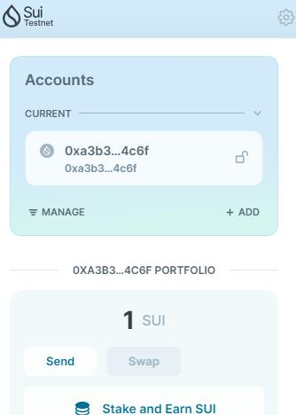
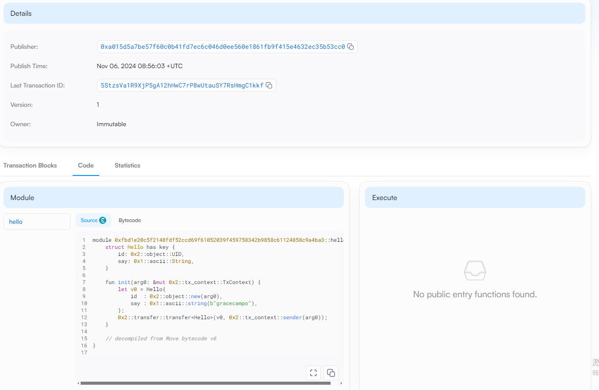
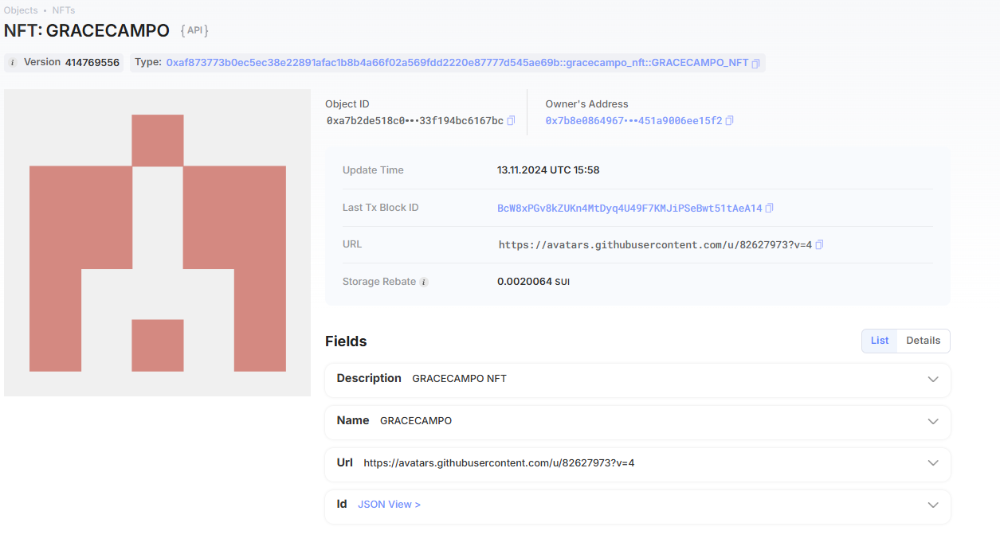
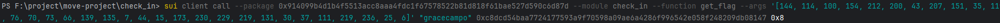

## 基本信息

- Sui 钱包地址: `0xa3b3e16a06bc3d449a8c716d6834da7ba7143a2d7c84067976d14ed886124c6f`
  > 首次参与需要完成第一个任务注册好钱包地址才被合并，并且后续学习奖励会打入这个地址
- github: `gracecampo`

## 个人简介

- 工作经验: 5 年
- 技术栈: `java` `shell` `solidity` `javaScript`
  > 重要提示 请认真写自己的简介
- 服务端码农，梭哈专业户，100%胜率爆仓，数据分析师
- 联系方式: tg: `@gracecampo123`

## 任务

## 01 hello move

- [√] Sui cli version: sui 1.37.1-7839b9501066
- [√] Sui 钱包截图: 
- [√] package id: 0xfbd1e20c5f2148fdf52ccd69f61052039f459758342b9858c61124858c9a4ba3
- [√] package id 在 scan 上的查看截图:

## 02 move coin

- [√] My Coin package id : 0xa25825763b380efa4c01d5d8fd490f9c7cae403ac116161779a4433a8f225fae
- [√] Faucet package id : 0xa25825763b380efa4c01d5d8fd490f9c7cae403ac116161779a4433a8f225fae
- [√] 转账 `My Coin` hash: 9G442mbXWPB14dXMDV7zRHMZ7Z6Zs5Q4HZdYtkUuGBac
- [√] `Faucet Coin` address1 mint hash: 6GAFqAm1djQ6HjJDVsAX6UUHjkKMwArviNBAZteKtpGv
- [√] `Faucet Coin` address2 mint hash: HKDpQC529yqn57M9to7Ppp6m7KemxjHNEHfu2yo2JtJx

## 03 move NFT

- [√] nft package id : 0xaf873773b0ec5ec38e22891afac1b8b4a66f02a569fdd2220e87777d545ae69b
- [√] nft object id : 0xa7b2de518c067b6fc7b62f92d99a930362eb6a98bed92e8ed233f194bc6167bc
- [√] 转账 nft hash: BcW8xPGv8kZUKn4MtDyq4U49F7KMJiPSeBwt51tAeA14
- [√] scan 上的 NFT 截图:

## 04 Move Game

- [√] game package id : 0xd5bc31660d727e41fcf1fc12c315045d2de4fa2ac176573088a4a67f2c0ab8a0
- [√] deposit Coin hash: 8x5jM31YA6GdG1gwM5cqReAQj1amytcsFwZkWrnH9u58
- [√] withdraw `Coin` hash: 8GgCL7MuexN955nDnp4P5cBHkJDo4a4RFgxEop6syZ7Z
- [√] play game hash: A9miomg8CSDZkJH7B6Emgabb3RNuXV48aPQoweXFYuZB

## 05 Move Swap

- [√] swap package id :  0x46fb85b6741a545440b0eed059f2152bb6b47dfd10f36509b2780ecc7b5ca346
- [√] call swap CoinA-> CoinB hash :  9nPXcW9VqTvD4LsHG9WMZ8HfmkAMPq7UPcVzsWzdHTSB
- [√] call swap CoinB-> CoinA hash :  A5i884VwgzsatS15hC8rZDBbH8jHHrYMC7uYVvi7JYWY

## 06 Dapp-kit SDK PTB

- [√] save hash : 8ZUdehTybkXLm5GW3dXKnuPJRBTqHtHScsGXCwENTD9T

## 07 Move CTF Check In

- [√] CLI call 截图 : 
- [√] flag hash :  GusFVityk257Li1vDbbGYzz33xq3JXwzZrdPYUgSrDug

## 08 Move CTF Lets Move

- [] proof :
- [] flag hash :
