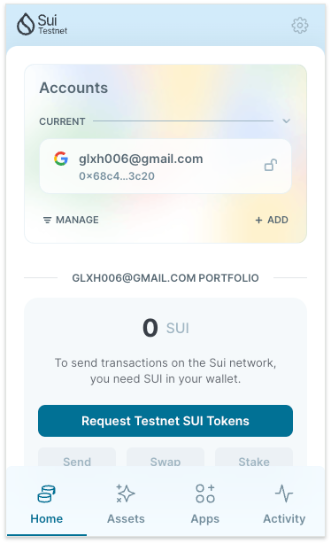
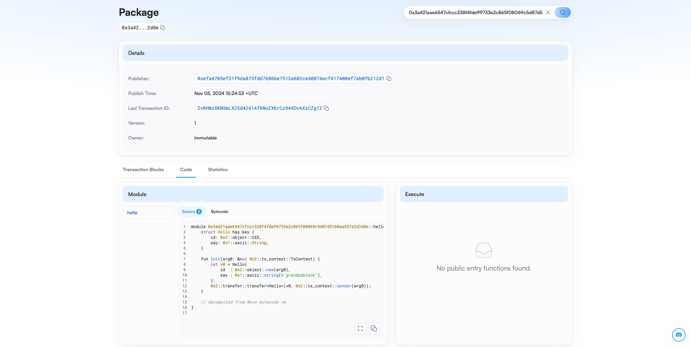

## 基本信息
- Sui钱包地址: `0x68c4ee18763b87c5ce610d85b25c09e3108ce40d197c7533e375a391a4763c20`
> 首次参与需要完成第一个任务注册好钱包地址才被合并，并且后续学习奖励会打入这个地址
- github: `grandpablack`

## 个人简介
- 工作经验: 6年
- 技术栈: python,java
- web3测试新人,努力学习中
- 联系方式: tg: `https://t.me/rays_black` 

## 任务

##   01 hello move  
- [x] Sui cli version: 1.35.1
- [x] Sui钱包截图: 
- [x] package id: 0x3a421aae6547cfccc338f4fde99733e2c865f08069c5d87d5160aa557e2d2d8e
- [x] package id 在 scan上的查看截图:

##   02 move coin
- [] My Coin package id : 
- [] Faucet package id : 
- [] 转账 `My Coin` hash: 
- [] `Faucet Coin` address1 mint hash: 
- [] `Faucet Coin` address2 mint hash:

##   03 move NFT
- [] nft package id : 
- [] nft object id :  
- [] 转账 nft  hash:  
- [] scan上的NFT截图:

##   04 Move Game
- [] game package id : 
- [] deposit Coin hash:  
- [] withdraw `Coin` hash: 
- [] play game hash: 

##   05 Move Swap
- [] swap package id :
- [] call swap CoinA-> CoinB  hash : 
- [] call swap CoinB-> CoinA  hash : 

##   06 Dapp-kit SDK PTB
- [] save hash : 

##   07 Move CTF Check In
- [] CLI call 截图 : 
- [] flag hash : 

##   08 Move CTF Lets Move
- [] proof :  
- [] flag hash : 
