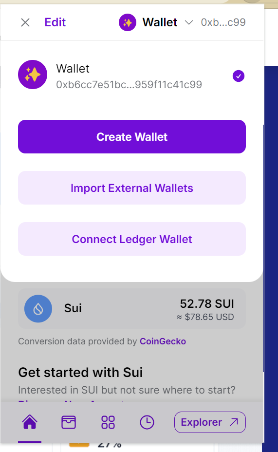
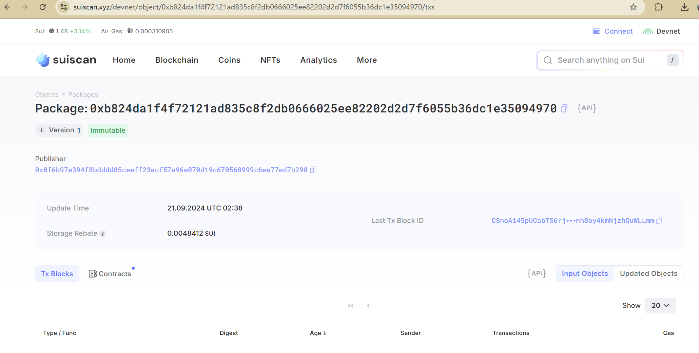

## 基本信息

- Sui钱包地址: `0xb6cc7e51bc4af8f48fa9cebdf9fa837e416d5edd39b82752350f959f11c41c99`

> 首次参与需要完成第一个任务注册好钱包地址才被合并，并且后续学习奖励会打入这个地址

- github: `https://github.com/greyd0g`

## 个人简介

- 工作经验: 5年
- 技术栈: `python` `c`

> 重要提示 请认真写自己的简介

- 对区块链感兴趣，想通过Move入门区块链
- 联系方式: tg: `https://t.me/warmb0dy`

## 任务

## 01 hello move  

- [] Sui cli version:  sui 1.33.2-c8b7f9823a7d
- [] Sui钱包截图: 
- [] package id: 0xb824da1f4f72121ad835c8f2db0666025ee82202d2d7f6055b36dc1e35094970
- [] package id 在 scan上的查看截图:

## 02 move coin

- [] My Coin package id :
- [] Faucet package id :
- [] 转账 `My Coin` hash:
- [] `Faucet Coin` address1 mint hash:
- [] `Faucet Coin` address2 mint hash:

## 03 move NFT

- [] nft package id :
- [] nft object id :
- [] 转账 nft  hash:
- [] scan上的NFT截图:

## 04 Move Game

- [] game package id :
- [] deposit Coin hash:
- [] withdraw `Coin` hash:
- [] play game hash:

## 05 Move Swap

- [] swap package id :
- [] call swap CoinA-> CoinB  hash :
- [] call swap CoinB-> CoinA  hash :

## 06 Dapp-kit SDK PTB

- [] save hash :

## 07 Move CTF Check In

- [] CLI call 截图 : 
- [] flag hash :

## 08 Move CTF Lets Move

- [] proof :
- [] flag hash :
