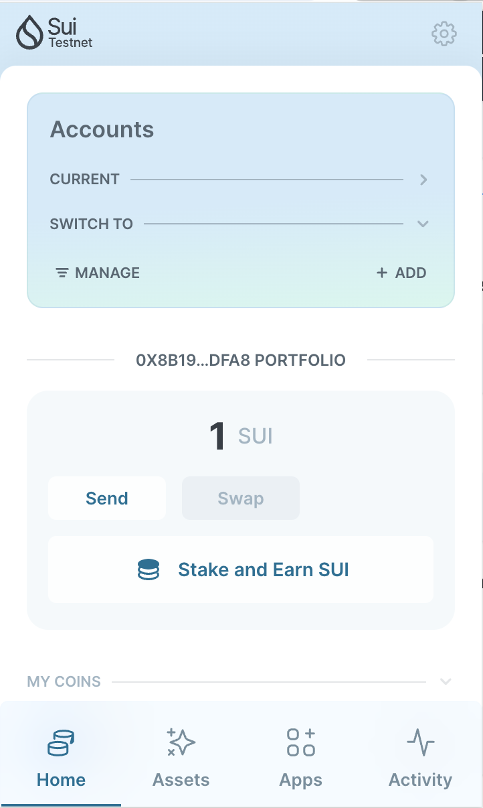
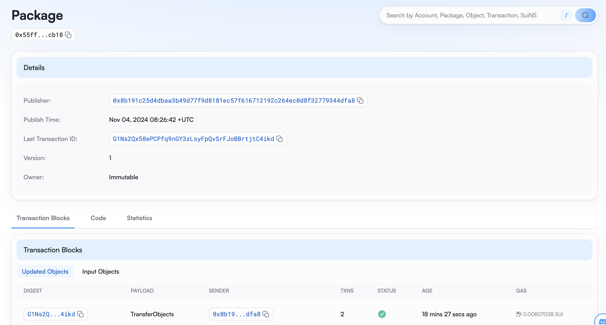
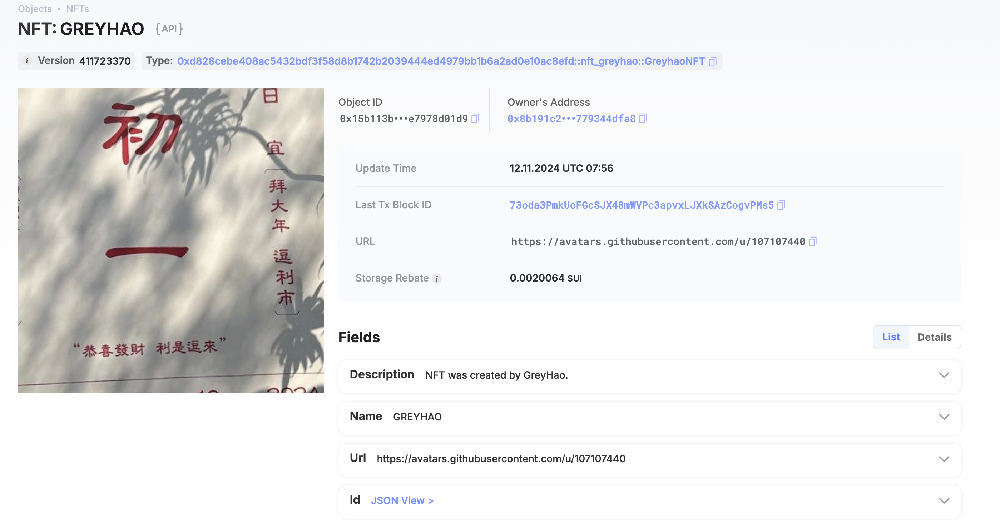

## 基本信息
- Sui钱包地址: `0xd123e6de58c45994bcb04a9b2fec83de6bcf21b12d29f1b4b1d85d243d7969dd`
> 首次参与需要完成第一个任务注册好钱包地址才被合并，并且后续学习奖励会打入这个地址
- github: `greyhao`

## 个人简介
- 工作经验: 5年+
- 技术栈: `Java` `React`
> 重要提示 请认真写自己的简介
- 多年web2开发经验及web3钱包客户端开发经验，想通过Move开始区块链项目开发
- 联系方式: tg: `@gerygreyhao`

## 任务

##   01 hello move
- [x] Sui cli version: sui 1.36.2-3ada97c109cc
- [x] Sui钱包截图: 
- [x] package id: 0x55ff6092fee0e2ce0b079f8677b2e040b4746d9c7e236cd856a60184abeacb18
- [x] package id 在 scan上的查看截图:

##   02 move coin
- [x] My Coin package id : 0x803a4f31065d27a1a3c79a41e2040c5b524538e508ff77a25ba9312103e5fdcb
- [x] Faucet package id : 0x803a4f31065d27a1a3c79a41e2040c5b524538e508ff77a25ba9312103e5fdcb
- [x] 转账 `My Coin` hash: 9uVJwJcjeu9tGmPY9mqo2ZQonqjvDtkEXQn7EKPm4amh
- [x] `Faucet Coin` address1 mint hash: GywUovkiws7sM9MK5kahXmDQH7N1XWyLaSVegUCxoJHC
- [x] `Faucet Coin` address2 mint hash: 4SCJjrbTiM2XeTHUCg6MqbirfrSEqkatE3sNijt8YKnr

##   03 move NFT
- [x] nft package id : 0xd828cebe408ac5432bdf3f58d8b1742b2039444ed4979bb1b6a2ad0e10ac8efd
- [x] nft object id : 0x15b113b55f44dadda61c60831097e6c7a8a8e25e479921b3cc49c1e7978d01d9
- [x] 转账 nft  hash: J61D2PQBMqv1W7sSt5hm5DhFVKcnF6tkHZJofe2ScSPF
- [x] scan上的NFT截图:

##   04 Move Game
- [x] game package id : 0x2d0e3906adb1fb5ec0419fbfa6e7834b6691e2b14c825f10d21df096ca84a3e1
- [x] deposit Coin hash: dqkzPzNWv35FeTqQMt528hatWo2fdefZUfTSh4Gffak
- [x] withdraw `Coin` hash: 41pqoQVM1BZ7sHBss7FX5yD2nptfqNLJr6oycBcSrHsB
- [x] play game hash: 3iHLJy2RdMqyTyHUkkZqY24haRdfmpp2tjSsjDEig8uj

##   05 Move Swap
- [x] swap package id : 0x6c3e1daf8f647f4f36d9b5b48b6504eb79119bbaf390418da018a5af97ce2d3d
- [x] call swap CoinA-> CoinB  hash : EuRU39fWnTHrhb2MajVTghRmEHtqcR6n1oqjbFLbRmim
- [x] call swap CoinB-> CoinA  hash : 9gnXYwZcMca7eyTaC6k4Z2S3UpszTtq6e6HueFWDjpmN

##   06 Dapp-kit SDK PTB
- [] save hash :

##   07 Move CTF Check In
- [] CLI call 截图 : 
- [] flag hash :

##   08 Move CTF Lets Move
- [] proof :
- [] flag hash :
