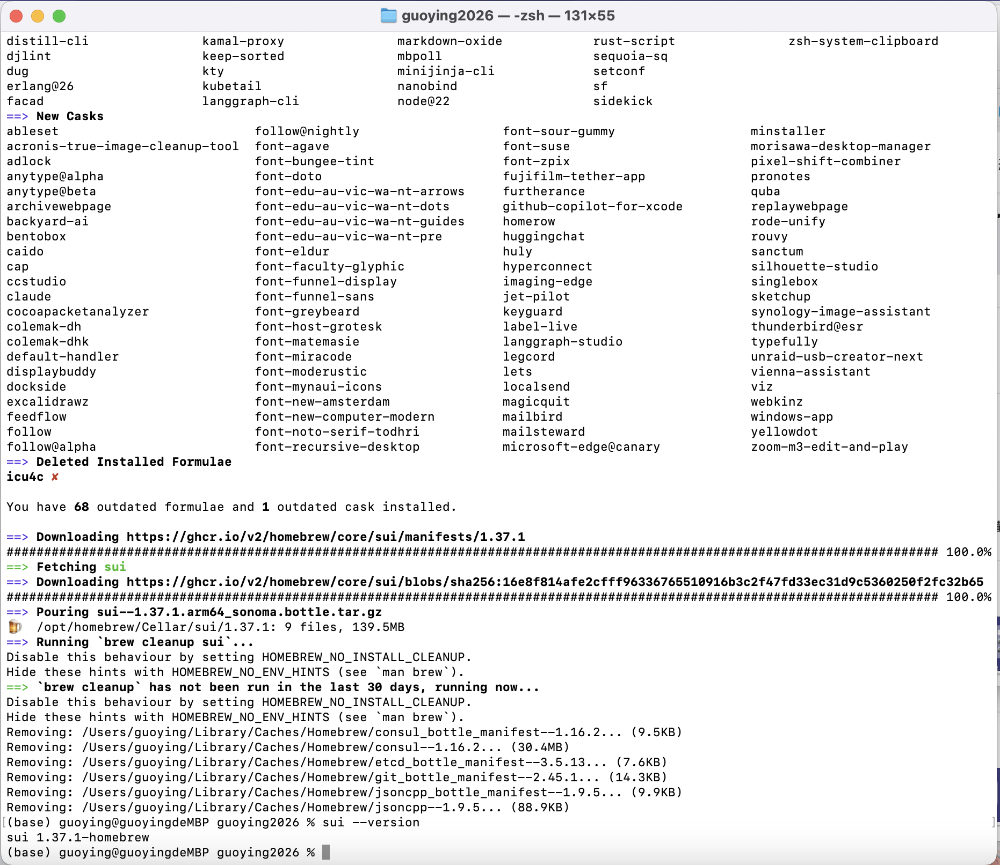
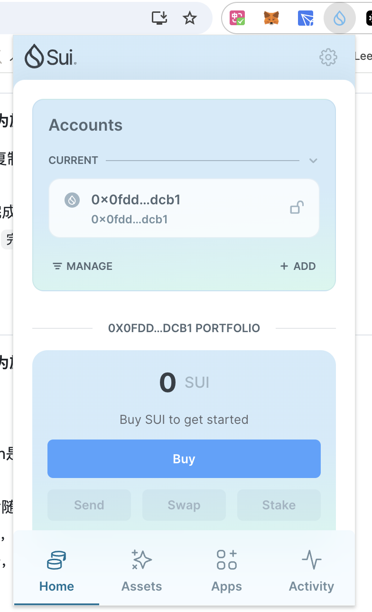
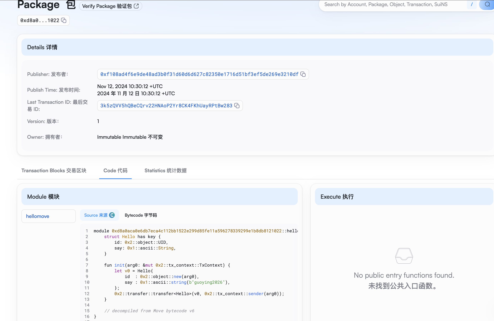
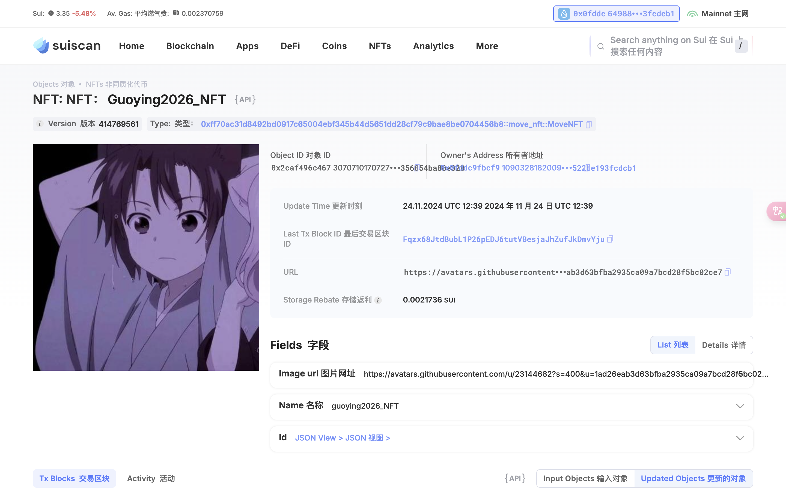

## 基本信息
- Sui钱包地址: `0x0fddc9fbcf9e340fe1b64ea3160d3905eeea39a1951c5084f4522be193fcdcb1`
> 首次参与需要完成第一个任务注册好钱包地址才被合并，并且后续学习奖励会打入这个地址
- github: `guoying2026`

## 个人简介
- 工作经验: 5年
- 技术栈: `Rust` `PHP`
> 公司的产品为律动，担任后端开发，律动app以及pc端的社区是基于以太坊的去中心化社交模块。后续将会涉及更多web3的功能。
- 经同事介绍，发现了Move，对Move特别感兴趣，想好好了解move
- 联系方式: tg: `xxx` 

## 任务

##   01 hello move  
- [✅] Sui cli version: sui 1.37.1-homebrew
  
- [✅] Sui钱包截图: 
- [✅] package id: 0xd8a0aca0e6db7eca4c112bb1522e299d85fe11a596278339299e1b8db8121022
- [✅] package id 在 scan上的查看截图:

##   02 move coin
- [✅] My Coin package id :0x8712a36ab8b40aeb50d18951fccf4f6775eb9404119ac9312c8ae623bb006c5b
- [✅] Faucet package id : 0x6388a5b287e979f5f51632e320c6ae0cfdd96b39b087113ae58c3b26c5d03d4e
- [✅] 转账 `My Coin` hash: 5Ygie3FyH9yGCia1YvXK3G37DcJGENxvcMMhd7mXjLbU
- [✅] `Faucet Coin` address1 mint hash: 63GMkxFcBTPnzqvjFSR96p17n32VC1EkB2YfVEkqKGUX
- [✅] `Faucet Coin` address2 mint hash: C45tBCrFgRbqPhGT9RbDPQWpv7ziBZ7WGTpXebTsHVds

##   03 move NFT
- [✅] nft package id :0xff70ac31d8492bd0917c65004ebf345b44d5651dd28cf79c9bae8be0704456b8
- [✅] nft object id : 0x2caf496c467c610ff1692e26314b88861d4517c6e75f40271d356854ba80e328
- [✅] 转账 nft  hash: CfLtBZGwPG3A1BxrVYiSCRLhaZBxNTJVAwmk9favZ2ro
- [✅] scan上的NFT截图:

##   04 Move Game
- [✅] game package id : 0xa0874140d8ddd624ba37142f0e9ca89c180a7affb311ee041a6e97f05253eff7
- [✅] deposit Coin hash: GAk6o7FiUDgYPqipV2ANbRabJeG9uZHpiiMxnFiibrPM
- [✅] withdraw `Coin` hash: 6XXjyRRvefyhasUPkn7nczMtWVJiTo7ckzt4oZSCEnv
- [✅] play game hash: 2FtKCjrx37hGCpy9tcbPCea6TTTL8tkgqixXjYDnGj4A

##   05 Move Swap
- [✅] swap package id : 0x83e27c5e20c77f5c91ebea299c9d67cdb36c7a1eb8d1e8bdb448f9e4feec109e
- [✅] call swap CoinA-> CoinB  hash : GmVPWf6REWymsu3TgVYdiDcDRy4kGczvxYdL2G3YyrWg
- [✅] call swap CoinB-> CoinA  hash : 4R8GrVfQWQjHd5hqKAbyYN3wbViF38Lmr7etDxb82UXu

##   06 Dapp-kit SDK PTB
- [] save hash :

##   07 Move CTF Check In
- [] CLI call 截图 : 
- [] flag hash :

##   08 Move CTF Lets Move
- [] proof : 
- [] flag hash :
