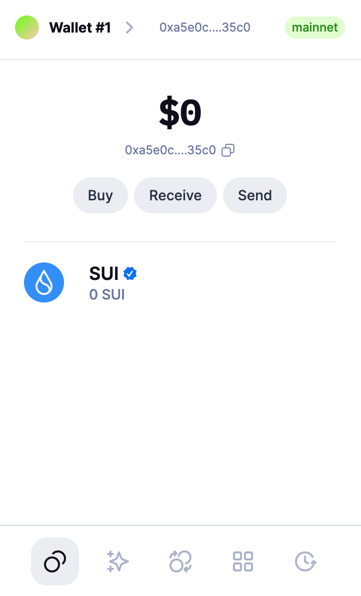
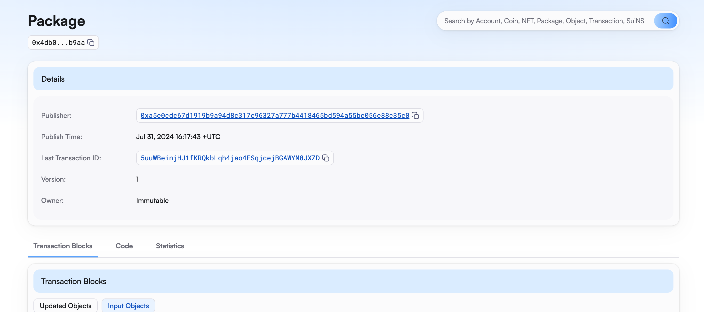
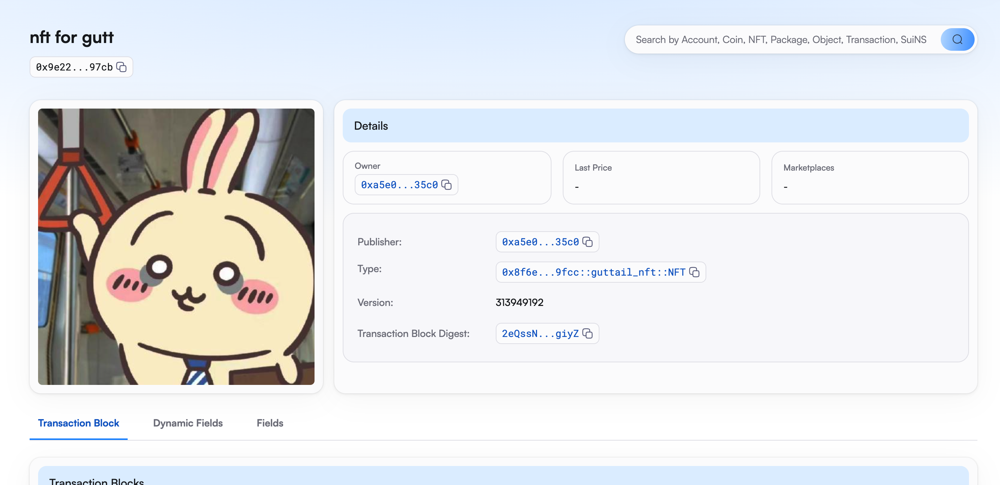

## 基本信息
- Sui钱包地址: `0xa5e0cdc67d1919b9a94d8c317c96327a777b4418465bd594a55bc056e88c35c0`
> 首次参与需要完成第一个任务注册好钱包地址才被合并，并且后续学习奖励会打入这个地址
- github: `guttail`

## 个人简介
- 工作经验: 1年
- 技术栈: `C#`
> 重要提示 请认真写自己的简介
- 多年web2开发经验，对Move特别感兴趣，想通过Move入门区块链
- 联系方式: tg: `gutt` 

## 任务

##   01 hello move  
- [x] Sui cli version: 1.30.1
- [x] Sui钱包截图: 
- [x] package id: 0x4db08d3f95d967db8b602234f8e5804b47e164147995ed6d59ac52952c67b9aa
- [x] package id 在 scan上的查看截图:

##   02 move coin
- [x] My Coin package id :  0xf06c7175c67a88e1d42c6f3ba24856b20497daad1c161519b4d0e28a27c7c82a
- [x] Faucet package id : 0xf06c7175c67a88e1d42c6f3ba24856b20497daad1c161519b4d0e28a27c7c82a
- [x] 转账 `My Coin` hash:  Fn1CSV6RcimkkKgukfepjjYE3uRKhJHpNmNgWeYkfEQ1
- [x] `Faucet Coin` address1 mint hash:  8UHZJdtEFXetcXMHV2mCMKJJZ6aS19x6PPeHc5ik8nJt
- [x] `Faucet Coin` address2 mint hash:  6MWFPPp5cVireHAMiBaeiyxiXuK8pSs5kiaCTVj3rWAo

##   03 move NFT
- [x] nft package id : 0x8f6eae6c9eb5a13577dff0a9e57082966a9f56b2acc28d76993c2804e2789fcc
- [x] nft object id : 0x9e228fd5b8b8a87ae1ecbdfc88554b2342998bfa5f388df19b243b05076f97cb
- [x] 转账 nft  hash: BtgjZF1ZUHRq2QzHgqi5aD8hsVLnpokPVD36cRscrkzJ
- [x] scan上的NFT截图:

##   04 Move Game
- [x] game package id : [0xffc5c937d285d618a1a65798287dc3e13c9600adef1f358c3f126467bd51e2b9](https://testnet.suivision.xyz/package/0xffc5c937d285d618a1a65798287dc3e13c9600adef1f358c3f126467bd51e2b9)
- [x] deposit Coin hash: [AYwF5VtCFazTnq4CecZ7NjCBr9DAsZNJCCKaQhaqx565](https://testnet.suivision.xyz/txblock/AYwF5VtCFazTnq4CecZ7NjCBr9DAsZNJCCKaQhaqx565)
- [x] withdraw `Coin` hash:  [2FTifEPixidJPDui3ZrMuduRAHi8C3ARrsVRtyZhMtJJ](https://testnet.suivision.xyz/txblock/2FTifEPixidJPDui3ZrMuduRAHi8C3ARrsVRtyZhMtJJ)
- [x] play game hash: [FEDeXWHADSjjDhh5zQTXDaVeV2tFqgUMBezkzX3kinLz](https://testnet.suivision.xyz/txblock/FEDeXWHADSjjDhh5zQTXDaVeV2tFqgUMBezkzX3kinLz)

##   05 Move Swap
- [x] swap package id : [0x3466cdc82f5a783a341a7d565933fee83ad2b9eaf6d7caec02844926ece43f16](https://suivision.xyz/package/0x3466cdc82f5a783a341a7d565933fee83ad2b9eaf6d7caec02844926ece43f16)
- [x] call swap CoinA-> CoinB  hash : [H2TRJ3UHVDxvftap5rJ8SXVmAZ8xwnbxADNfD23nbq3e](https://suivision.xyz/txblock/H2TRJ3UHVDxvftap5rJ8SXVmAZ8xwnbxADNfD23nbq3e)
- [x] call swap CoinB-> CoinA  hash : [EbUnkWiYp1zXiY5D36tucAJNCc5MAqEGr1w8fm1XLhxK](https://suivision.xyz/txblock/EbUnkWiYp1zXiY5D36tucAJNCc5MAqEGr1w8fm1XLhxK) 

##   06 Dapp-kit SDK PTB
- [x] save hash : [9EhZSzSnJ2fmsDnSXPbEB8jRANMXkJs3xhaxPXTXPeBa](https://suivision.xyz/txblock/9EhZSzSnJ2fmsDnSXPbEB8jRANMXkJs3xhaxPXTXPeBa)

##   07 Move CTF Check In
- [x] CLI call 截图 : 
- [x] flag hash : J8K8gDVDJocvHRk5aLUCBKMXXCEw3QLYi2SPnH5wpnKd

##   08 Move CTF Lets Move
- [x] proof : 0853c45488dc6ca7e5be
- [x] flag hash : BNArvmWNM9s4C9up2SjSXwYesCUur7w8asdTSxPBtyAo
