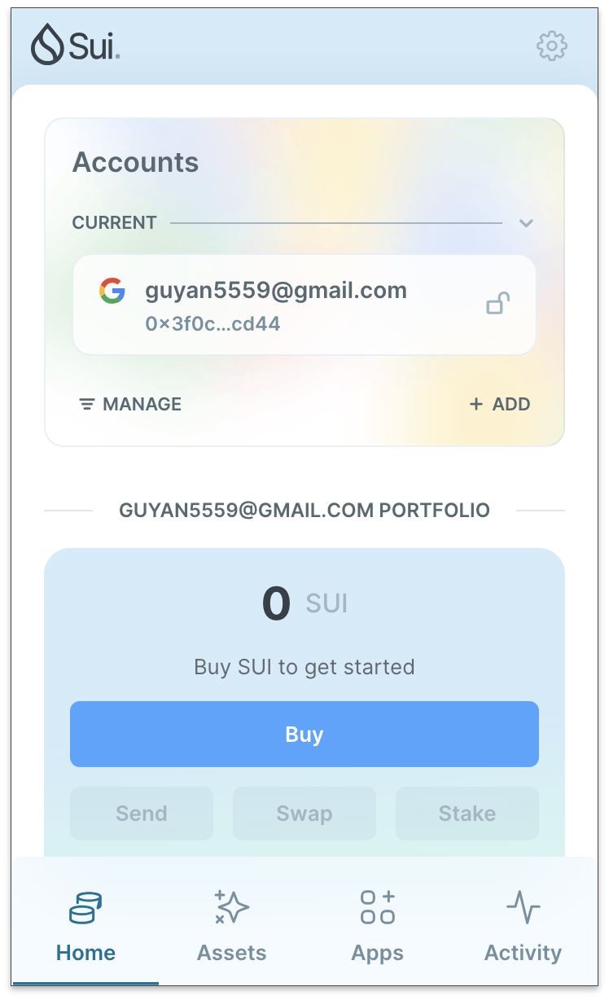
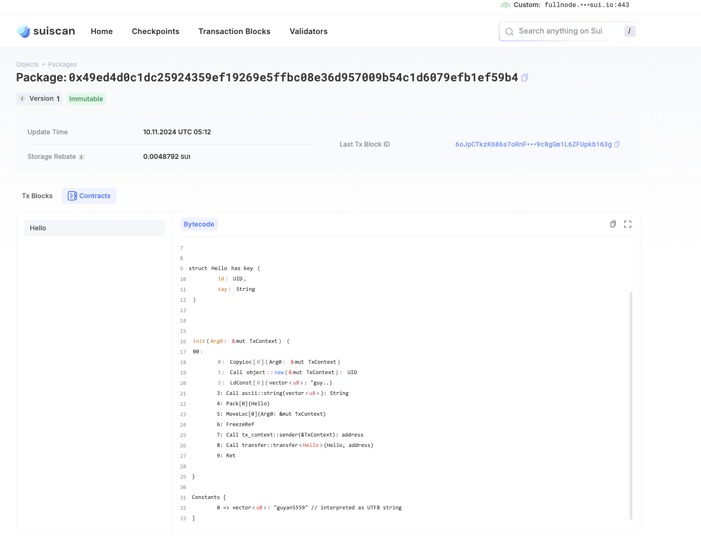

## 基本信息
- Sui钱包地址: `0x3f0ca6b058b19f26de2c6d0e5331347260f7bd6a0605de2a64330bc4fad7cd44`
> 首次参与需要完成第一个任务注册好钱包地址才被合并，并且后续学习奖励会打入这个地址
- github: `guyan5559`

## 个人简介
- 工作经验: 5年
- 技术栈: `go` `python` 
> 重要提示 请认真写自己的简介
- 想学一门web3开发语言
- 联系方式:  `guyan5559@gmail.com` 

## 任务

##   01 hello move  
- [✓] Sui cli version: sui 1.36.2-homebrew
- [✓] Sui钱包截图: 
- [✓] package id: 0x49ed4d0c1dc25924359ef19269e5ffbc08e36d957009b54c1d6079efb1ef59b4
- [✓] package id 在 scan上的查看截图:

##   02 move coin
- [] My Coin package id : 
- [] Faucet package id : 
- [] 转账 `My Coin` hash:
- [] `Faucet Coin` address1 mint hash:
- [] `Faucet Coin` address2 mint hash:

##   03 move NFT
- [] nft package id :
- [] nft object id : 
- [] 转账 nft  hash:
- [] scan上的NFT截图:

##   04 Move Game
- [] game package id :
- [] deposit Coin hash:
- [] withdraw `Coin` hash:
- [] play game hash:

##   05 Move Swap
- [] swap package id :
- [] call swap CoinA-> CoinB  hash :
- [] call swap CoinB-> CoinA  hash :

##   06 Dapp-kit SDK PTB
- [] save hash :

##   07 Move CTF Check In
- [] CLI call 截图 : 
- [] flag hash :

##   08 Move CTF Lets Move
- [] proof : 
- [] flag hash :
