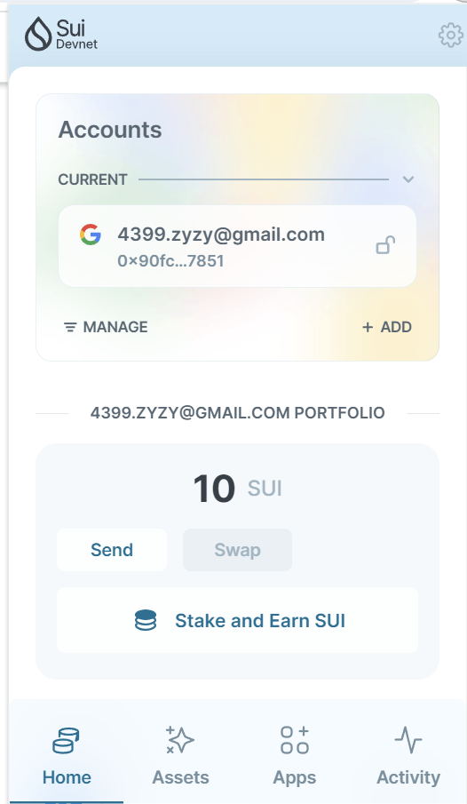

## 基本信息
- Sui钱包地址: `0x90fc8597f9949065b3378e62c6e892d8b21ce8ae69c3d770493b3c0906fb7851`
> 首次参与需要完成第一个任务注册好钱包地址才被合并，并且后续学习奖励会打入这个地址
- github: `haihaizy`

## 个人简介
- 工作经验: 0年
- 技术栈: `python` `c`
> 重要提示 请认真写自己的简介
- 小白，了解过区块链技术，看到move后对Move特别感兴趣，想通过Move入门区块链，将来从事本行业
- 联系方式: qq: `2667622606@qq.com` 

## 任务

##   01 hello move  
- [] Sui cli version:1.25.0-b10ea7331e1c-dirty
- [] Sui钱包截图: 
- [] package id: 0x6c469294525501ebc64d5b19a7a6004f2a0f36fdff73f4c2826d64e0e4fba779
- [] package id 在 scan上的查看截图:

##   02 move coin
- [] My Coin package id : 
- [] Faucet package id : 
- [] 转账 `My Coin` hash:
- [] `Faucet Coin` address1 mint hash:
- [] `Faucet Coin` address2 mint hash:

##   03 move NFT
- [] nft package id :
- [] nft object id : 
- [] 转账 nft  hash:
- [] scan上的NFT截图:

##   04 Move Game
- [] game package id :
- [] deposit Coin hash:
- [] withdraw `Coin` hash:
- [] play game hash:

##   05 Move Swap
- [] swap package id :
- [] call swap CoinA-> CoinB  hash :
- [] call swap CoinB-> CoinA  hash :

##   06 Dapp-kit SDK PTB
- [] save hash :
1