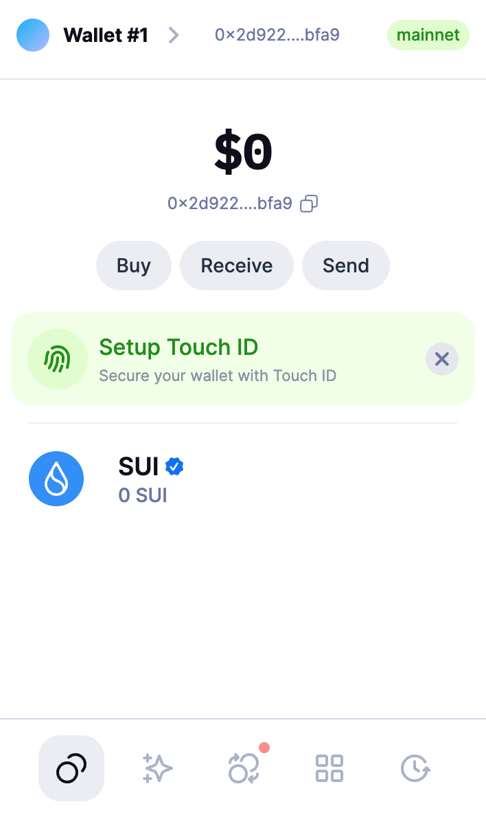
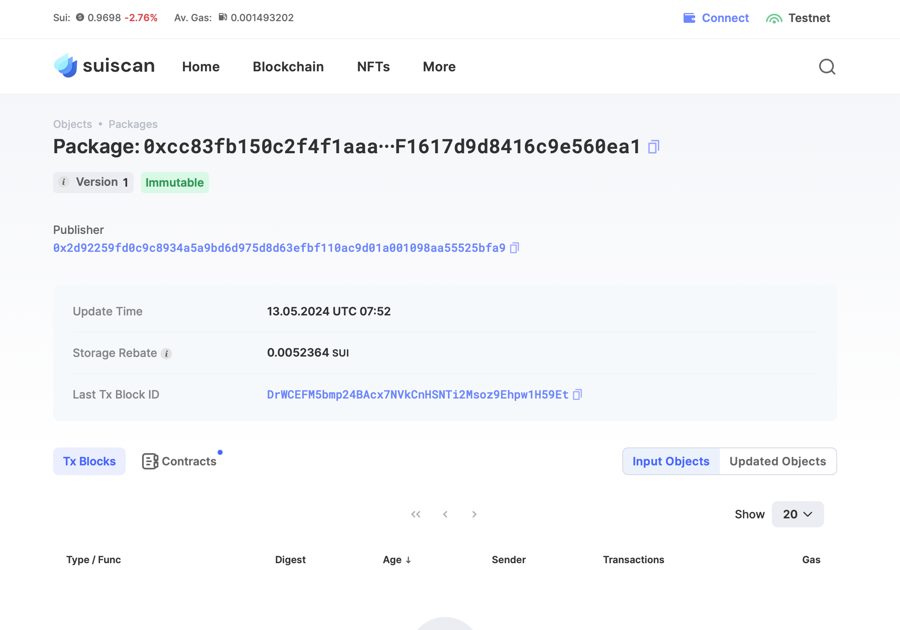
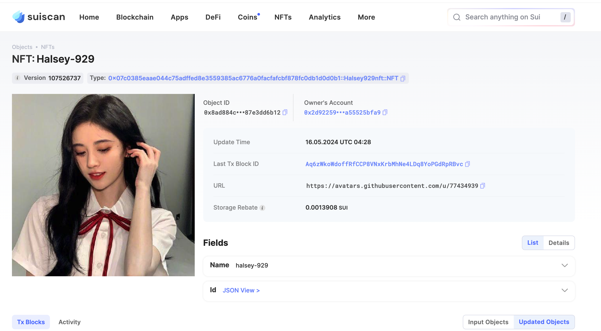

## 基本信息
- Sui钱包地址: `0x2d92259fd0c9c8934a5a9bd6d975d8d63efbf110ac9d01a001098aa55525bfa9`
> 首次参与需要完成第一个任务注册好钱包地址才被合并，并且后续学习奖励会打入这个地址
- github: `halsey-929`

## 个人简介
- 工作经验: 1年
- 技术栈: `Python`
> 重要提示 请认真写自己的简介
- 想通过move语言学习sui生态
- 联系方式: tg: `litohzm` 

## 任务

##   01 hello move  
- [x] Sui cli version: sui-client 1.24.1
- [x] Sui钱包截图: 
- [x] package id:  0xcc83fb150c2f4f1aaae43191dc358f6d3da39d6501ff1617d9d8416c9e560ea1
- [x] package id 在 scan上的查看截图:

##   02 move coin
- [x] My Coin package id : 0x37b20406866053c3944f1f89ea1d86120dae36a791941cc6cf22ae65232f7c54
- [x] Faucet package id : 0x37b20406866053c3944f1f89ea1d86120dae36a791941cc6cf22ae65232f7c54
- [x] 转账 `My Coin` hash: 3Xw7Y2vFjdvqw7rfJuU7iBSe7RLdXWk7a9nneQA1ZGry
- [x] `Faucet Coin` address1 mint hash: 2189oRdqRCYXJB8Sv9Y3wjtJo7nFxU3Aeawe7dUGQ3gE
- [x] `Faucet Coin` address2 mint hash: 5a34JzFn5PSVjZJt1LWPXu7XYxiL5jWeyBhHvWppDtu4

##   03 move NFT
- [x] nft package id :0x07c0385eaae044c75adffed8e3559385ac6776a0facfafcbf878fc0db1d0d0b1
- [x] nft object id : 0x8ad884c58e6fc68b56abf0b60b03162a0a784dff16e5e09237a55a87e3dd6b12
- [x] 转账 nft  hash: bVDfvtnFQWLVmmDoc6T1iNcbRA6fDHGjgxhc6DD9AH2
- [x] scan上的NFT截图:

##   04 Move Game
- [x] game package id : 0x1b18172aab840cd86a560003faaf5758b51b67dcbb49d2692f1c4218f8970585
- [x] deposit Coin hash: 5eCHnAnzgk4Rd4wda3W4jYwih1fNi6gziJErKjzGZ6Ni
- [x] withdraw `Coin` hash: EgpemyfosNWUK6ieaA46BQJ6uy1hL8HoCHL2vZqyfppC
- [x] play game hash: 3AmurKeLmBh8SNdz4R8eLgHzUxQnnAQ6XaTaVm3wo5oU

##   05 Move Swap
- [x] swap package id : 0xdf170e2c35274c633b3a22f5d489dae5137a0be7c2be0004c956ba08a17eab3a 
- [x] call swap CoinA-> CoinB  hash : 5nfo2mtS4mn4U8BPRsTksiSSNBi6Jc2FVYHMp4nhgX57
- [x] call swap CoinB-> CoinA  hash :  EyBFLqve6oT4ozbtysKT8tZA5p64gRvcJ9v1eHBSiLrH

##   06 SDK PTB
- [x] save hash : 5wpR6wNxfb3NmCEy7bfQ4BgpRyQmTigWKRKqMgLMM9Rw
