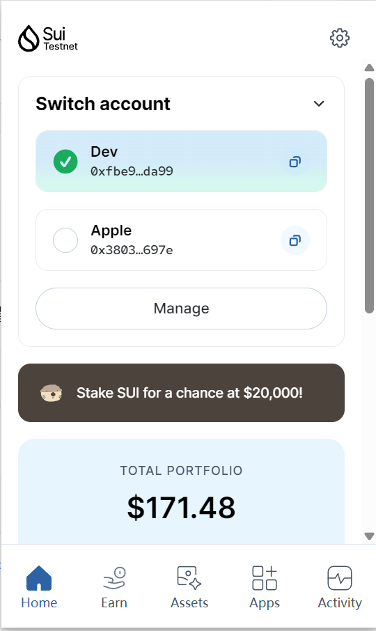
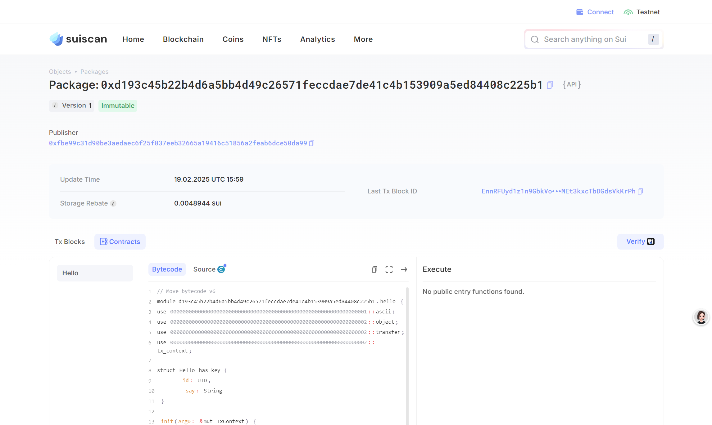

## 基本信息
- Sui钱包地址: `0xfbe99c31d90be3aedaec6f25f837eeb32665a19416c51856a2feab6dce50da99`
> 首次参与需要完成第一个任务注册好钱包地址才被合并，并且后续学习奖励会打入这个地址
- github: `hawkli-1994`

## 个人简介
- 工作经验: 8年
- 技术栈: `Golang` `Python` `TypeScript` `Kubernetes`
> 重要提示 请认真写自己的简介
- 多年web2开发经验，擅长web传统业务开发, DevOps平台开发, 云原生运维平台开发, 有丰富的云原生CICD系统开发经验. 对vLLM, Ollama 推理框架源码有一定了解. 
  对Move和Rust特别感兴趣，想通过Move入门区块链世界.
- 联系方式: tg: `developsolana`, 微信号: `Sputnik-1satellite`

## 任务

##   01 hello move  
- [√] Sui cli version: sui 1.43.1-2f52a7283e5f
- [√] Sui钱包截图: 
- [√] package id: 0xd193c45b22b4d6a5bb4d49c26571feccdae7de41c4b153909a5ed84408c225b1
- [√] package id 在 scan上的查看截图:

##   02 move coin
- [] My Coin package id : 0xfe29bfaf05bfabc3983cbc286583785c39ff9e4ac55f8c5129785a25c9301ca6
- [] Faucet package id : 
- [] 转账 `My Coin` hash: 91wSPKSGJD5W6Uz9zFPpnzTLhM5wFA5ACCdFSvtNnxD3
- [] `Faucet Coin` address1 mint hash:
- [] `Faucet Coin` address2 mint hash:

##   03 move NFT
- [] nft package id :
- [] nft object id : 
- [] 转账 nft  hash:
- [] scan上的NFT截图:

##   04 Move Game
- [] game package id :
- [] deposit Coin hash:
- [] withdraw `Coin` hash:
- [] play game hash:

##   05 Move Swap
- [] swap package id :
- [] call swap CoinA-> CoinB  hash :
- [] call swap CoinB-> CoinA  hash :

##   06 Dapp-kit SDK PTB
- [] save hash :

##   07 Move CTF Check In
- [] CLI call 截图 : 
- [] flag hash :

##   08 Move CTF Lets Move
- [] proof : 
- [] flag hash :

