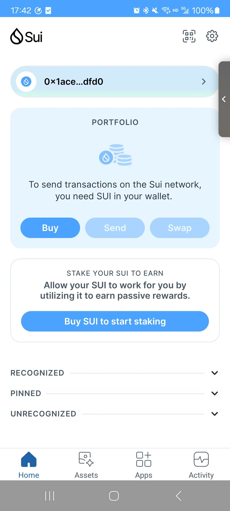
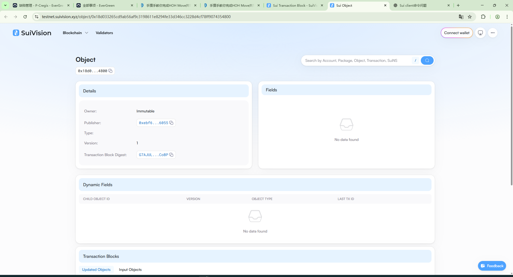

## 基本信息
- Sui钱包地址: `0x1ace6c78853837ebeaf9d899b7c4802a459d0c5764e8b69c358f1c5bfddcdfd0`
> 首次参与需要完成第一个任务注册好钱包地址才被合并，并且后续学习奖励会打入这个地址
- github: `hellogaod`

## 个人简介
- 工作经验: 12年
- 技术栈: 'java/spring'、'android/kotlin'、'swift'、'vue/js'
> 重要提示 请认真写自己的简介
- 2013年毕业，从事过java后端（2年）、vue前端开发（2年），当前从事android开发（估计8-9年了），
2023年开始从事区块链（android）开发，因为排查同事（rust开发工程师）一个bug不小心看了一下rust，又不小心买了move币，又不小心move币暴跌，所以闲暇之余看看move语言（看看它有没有那么神奇），想通过Move入门区块链，一环一环的每一步都是定数。
- 联系方式: tg: `QQ:1105107264` 

## 任务

##   01 hello move  
- [x] Sui cli version:sui 1.48.2-17a9eb8e1914
- [x] Sui钱包截图: 
- [x] package id: 0x18d033265cd9ab56af9c3198611e8294fe33d346cc3228d4cf78ff9074354800
- [x] package id 在 scan上的查看截图:

##   02 move coin
- [] My Coin package id : 
- [] Faucet package id : 
- [] 转账 `My Coin` hash:
- [] `Faucet Coin` address1 mint hash:
- [] `Faucet Coin` address2 mint hash:

##   03 move NFT
- [] nft package id :
- [] nft object id : 
- [] 转账 nft  hash:
- [] scan上的NFT截图:

##   04 Move Game
- [] game package id :
- [] deposit Coin hash:
- [] withdraw `Coin` hash:
- [] play game hash:

##   05 Move Swap
- [] swap package id :
- [] call swap CoinA-> CoinB  hash :
- [] call swap CoinB-> CoinA  hash :

##   06 Dapp-kit SDK PTB
- [] save hash :

##   07 Move CTF Check In
- [] CLI call 截图 : 
- [] flag hash :

##   08 Move CTF Lets Move
- [] proof : 
- [] flag hash :

