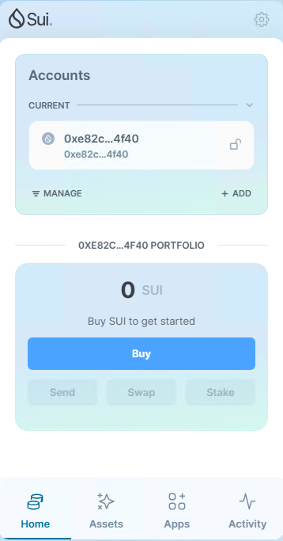
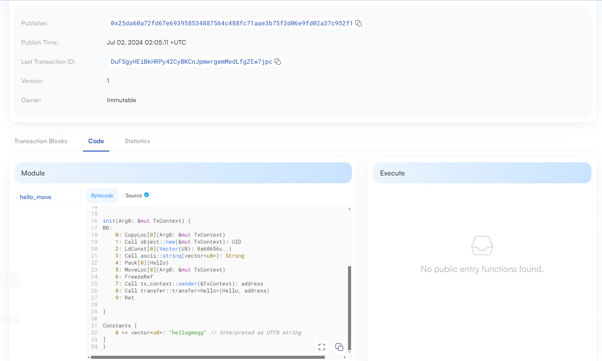
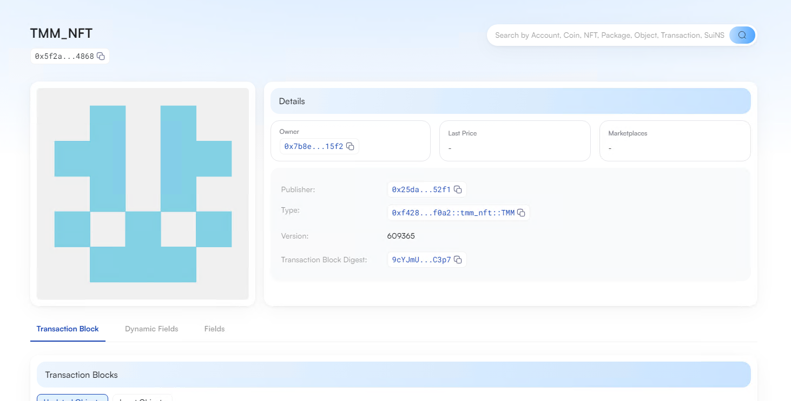
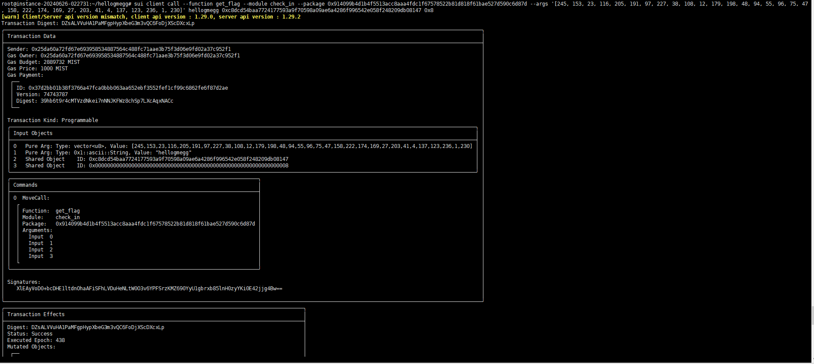

## 基本信息
- Sui钱包地址: `0xe82c8d9d92a61fa5f583addd9d7b29cd3d45da5abd0ff5cf155a6fe9779e4f40`
> 首次参与需要完成第一个任务注册好钱包地址才被合并，并且后续学习奖励会打入这个地址
- github: `hellogmegg`

## 个人简介
- 工作经验: 3年
- 技术栈: `Python` `Javascript`
> 重要提示 请认真写自己的简介
- 从大学开始对区块链感兴趣，btc、evm、sol均有涉猎，喜欢写一下脚本打土狗，自动化玩游戏之类的
- 联系方式: tg: `hellogmegg` 

## 任务

##   01 hello move  
- [] Sui cli version: sui 1.29.0-1bc3c6996246
- [] Sui钱包截图: 
- [] package id: 0x84ff356cfac876fdb308a5203a88dd4c15c9e645f08d3bb036d3ebdcfa3dfb59
- [] package id 在 scan上的查看截图:

##   02 move coin
- [] My Coin package id : 0xcb1ae9e203c0de5d70271aebb5a7dca82186ef3572647d82a4bde975c5b6a59c
- [] Faucet package id : 0x0cd90c8de37218c15b9e7b908057eab00c19a1910147cb4f59046db8fe5410b7
- [] 转账 `My Coin` hash: 45tC8EPhWFY2ARvkApefESGAKyM2MPgjzcuEScVoew7D
- [] `Faucet Coin` address1 mint hash: Bfqih3Av3CcQ7jHjzNtT1tJ59tkxonh32AMo8478gUHx
- [] `Faucet Coin` address2 mint hash: 3F7f8Lfhskc8TXk8zvLxGATYpPpbaVXRidfp3EgKMMmh

##   03 move NFT
- [] nft package id : 0xf428422051433310369762186ba9b0984c524d269d83d0e8368ae04db7adf0a2
- [] nft object id : 0x5f2a408396c4c93a989ac64a99d690d55e0c042ea9a283c64629d8dabc374868
- [] 转账 nft  hash: 9cYJmUSgtdW3VLht2yfpvELEhzWDDRMpQB48f8R5C3p7
- [] scan上的NFT截图:

##   04 Move Game
- [] game package id : 0x9e5c0c0930ac1c2a35fd1b326735b4f4d79cbad32e26415c768381bec369a616
- [] deposit Coin hash: 3FzMDATUExwVTFPDzAHbtzdgER6cV2bZBNjrdga4N5tG
- [] withdraw `Coin` hash: CRsLXRo4Zj4RQbVwsJxewoLesfmoEiQqvqwLKt6egM2w
- [] play game hash: krnqvu6A942hm2ZG8in9CuDanukLieoz8ps3nD4pSkh

##   05 Move Swap
- [] swap package id : 0x0e045d10ae1557afb8e9d79095157bf807fec73d64b2dc3fb1e34825e2d850ff
- [] call swap CoinA-> CoinB  hash : 4h42SJWfoMFjdL2u61TkRmyd8Hd1q6yAvg2PXtDZKHwy
- [] call swap CoinB-> CoinA  hash : 14fbFY59N9YSX7nLJYje5dDVBY4scC8VK6Bf1h8pRaqv

##   06 Dapp-kit SDK PTB
- [] save hash : 6MnKKbMGFLke8oPW7LKvrs4dPNBLpJxv57eusm3gC7s4

##   07 Move CTF Check In
- [] CLI call 截图 : 
- [] flag hash : DZsALVVuHA1PaMFgpHypXbeG3m3vQC6FoDjXScDXcxLp

##   08 Move CTF Lets Move
- [] proof : [181,206,102]
- [] flag hash : 51wiUMgR1UyHHj1wWqC9emjjwAbBFmoEyNPwto1ouQAS
