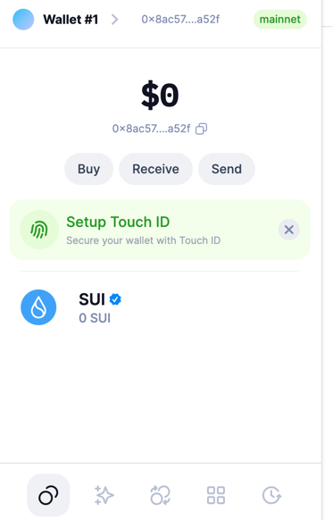
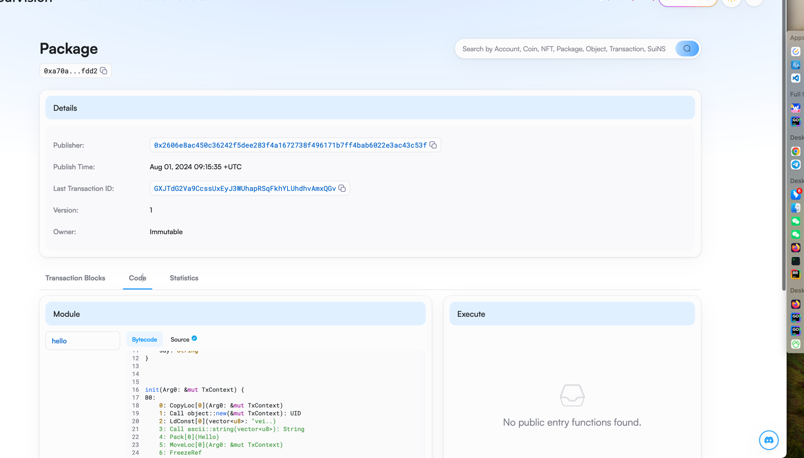

## 基本信息
- Sui钱包地址: `0x2606e8ac450c36242f5dee283f4a1672738f496171b7ff4bab6022e3ac43c53f`
> 首次参与需要完成第一个任务注册好钱包地址才被合并，并且后续学习奖励会打入这个地址
- github: `helloworldyuhaiyang`

## 个人简介
- 工作经验: 11年
- 技术栈: `golang` `C++` `Java`
> 重要提示
- 多年服务端开发，熟悉网络编程，并发编程，加解密。现在对Move特别感兴趣，想通过Move入门区块链。
- 感谢计算机作为职业，永远有新技术可以满足我的好奇心。
- 联系方式: tg: `@GoHelloWorld`

## 任务

##   01 hello move  
- [] Sui cli version: sui 1.29.2-homebrew
- [] Sui钱包截图: 
- [] package id: 0xa70aa001eb0c86cbbb5bb64d1b21951d0950dd6fccc3acaeaa2416ac3bd8fdd2
- [] package id 在 scan上的查看截图:

##   02 move coin
- [] My Coin package id : 
- [] Faucet package id : 
- [] 转账 `My Coin` hash:
- [] `Faucet Coin` address1 mint hash:
- [] `Faucet Coin` address2 mint hash:

##   03 move NFT
- [] nft package id :
- [] nft object id : 
- [] 转账 nft  hash:
- [] scan上的NFT截图:

##   04 Move Game
- [] game package id :
- [] deposit Coin hash:
- [] withdraw `Coin` hash:
- [] play game hash:

##   05 Move Swap
- [] swap package id :
- [] call swap CoinA-> CoinB  hash :
- [] call swap CoinB-> CoinA  hash :

##   06 Dapp-kit SDK PTB
- [] save hash :

##   07 Move CTF Check In
- [] CLI call 截图 : 
- [] flag hash :

##   08 Move CTF Lets Move
- [] proof : 
- [] flag hash :
