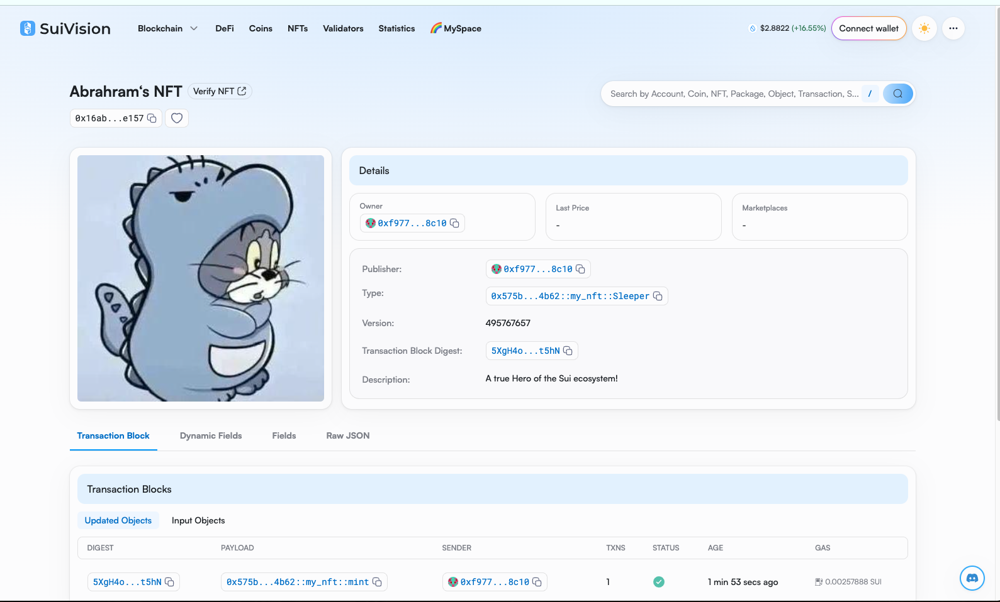

## 基本信息
- Sui钱包地址: `0xf977bfa03bdfa9adf42aaf455f9187f753bf9aab7856327e1f98a6ab7f648c10`
> 首次参与需要完成第一个任务注册好钱包地址才被合并，并且后续学习奖励会打入这个地址
- github: `Abrahram`

## 个人简介
- 工作经验: x年
- 技术栈: `Java` `go` `python`
> 重要提示 web3开发新人，准奶爸
- 5年web2开发经验，对Move特别感兴趣，想通过Move入门区块链
- 联系方式: tg: `sleeperonce@gmail.com` 

## 任务

##   01 hello move  
- [√] Sui cli version: sui 1.42.2-homebrew
- [√] Sui钱包截图: 
- [√] package id: 0x07158a36c53ae4b6653c08a78fb8227caa98db5b89528b10b73219be527f6551
- [√] package id 在 scan上的查看截图:

##   02 move coin
- [] My Coin package id : 
- [] Faucet package id : 
- [] 转账 `My Coin` hash:
- [] `Faucet Coin` address1 mint hash:
- [] `Faucet Coin` address2 mint hash:

##   03 move NFT
- [√] nft package id : 0x575bb64e0b704c83a54445eecddfdf06837404272d19abfcfe866a8b32d44b62
- [√] nft object id : 0x63f05d3a3e32cad820653994c2912e256c488e0b191a0e15ce1ead89aa764328
- [√] 转账 nft  hash: CCYxT9Yg5LFsi2Zdgbpp1o7Z9YbwSZoLTzaD42oR25XN
- [√] scan上的NFT截图:

##   04 Move Game
- [] game package id :
- [] deposit Coin hash:
- [] withdraw `Coin` hash:
- [] play game hash:

##   05 Move Swap
- [] swap package id :
- [] call swap CoinA-> CoinB  hash :
- [] call swap CoinB-> CoinA  hash :

##   06 Dapp-kit SDK PTB
- [] save hash :

##   07 Move CTF Check In
- [] CLI call 截图 : 
- [] flag hash :

##   08 Move CTF Lets Move
- [] proof : 
- [] flag hash :

