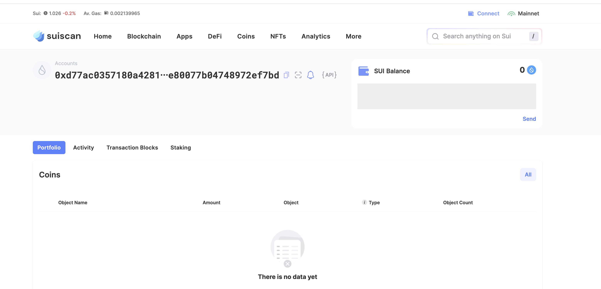
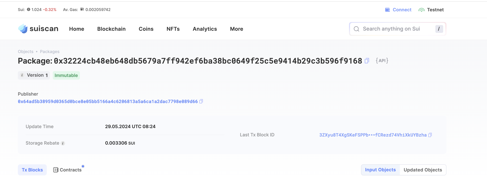

## 基本信息
- Sui钱包地址: `0xd77ac0357180a42816c59237a29cc14390475dc02db0e80077b04748972ef7bd`
> 首次参与需要完成第一个任务注册好钱包地址才被合并，并且后续学习奖励会打入这个地址
- github: `holopopo`

## 个人简介
- 工作经验: 8年
- 技术栈: `java` `vue`
> 重要提示 请认真写自己的简介
- 多年web2开发经验，对Move特别感兴趣，想通过Move入门区块链
- 联系方式: QQ: `944903520` 

## 任务

##   01 hello move  
- [] Sui cli version:
- [] Sui钱包截图: 
- [] package id: 0x32224cb48eb648db5679a7ff942ef6ba38bc0649f25c5e9414b29c3b596f9168
- [] package id 在 scan上的查看截图:

##   02 move coin
- [] My Coin package id : 0x2f2df05764b2f0ba50d6b2d7b827c5d12750864dddd0740189ee9133bc87b188
- [] Faucet package id : 0x5f6387d503e1a798c80c1ce162c3836f433b77f326daed1675935ff6c1562a4d
- [] 转账 `My Coin` hash:HdfzKc5vQpojmMaTvtUdhha5vz7gciww4RFRz5AetcHy
- [] `Faucet Coin` address1 mint hash:APqknZKuhkiMg4AYgxKAPFRawSNtWzj7V8JDMNBcVyU6
- [] `Faucet Coin` address2 mint hash:7pd3ieANQQr8dhbDvMAw4UGLFvGzxA6CrF8YY1qugFqK

##   03 move NFT
- [] nft package id :
- [] nft object id : 
- [] 转账 nft  hash:
- [] scan上的NFT截图:

##   04 Move Game
- [] game package id :
- [] deposit Coin hash:
- [] withdraw `Coin` hash:
- [] play game hash:

##   05 Move Swap
- [] swap package id :
- [] call swap CoinA-> CoinB  hash :
- [] call swap CoinB-> CoinA  hash :

##   06 Dapp-kit SDK PTB
- [] save hash :
