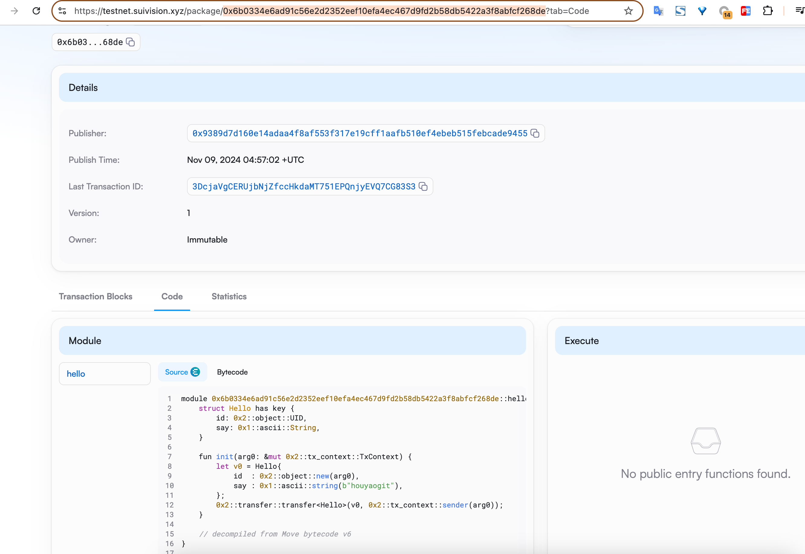

## 基本信息
- Sui钱包地址: `0x7a2b5355de2b4fd7cfc5527ac3678452a3b15bed65c759581525ba74a1c11e50`
> 首次参与需要完成第一个任务注册好钱包地址才被合并，并且后续学习奖励会打入这个地址
- github: `houyaogit`

## 个人简介
- 工作经验: 8年
- 技术栈: `Java` `python`
> 重要提示 请认真写自己的简介
- 多年Java开发经验，对Move特别感兴趣，想通过Move入门区块链，加入黑客松大家庭  
- 对sui链感兴趣，欢迎大家一起交流学习，一起学习，一起进步
- 联系方式: tg: `houyao0921@foxmail.com` 

## 任务

##   01 hello move  
- [x] Sui cli version: sui 1.37.1-homebrew
- [x] Sui钱包截图: 
- [x] package id: 0x6b0334e6ad91c56e2d2352eef10efa4ec467d9fd2b58db5422a3f8abfcf268de
- [x] package id 在 scan上的查看截图:

##   02 move coin
- [] My Coin package id : 
- [] Faucet package id : 
- [] 转账 `My Coin` hash:
- [] `Faucet Coin` address1 mint hash:
- [] `Faucet Coin` address2 mint hash:

##   03 move NFT
- [] nft package id :
- [] nft object id : 
- [] 转账 nft  hash:
- [] scan上的NFT截图:

##   04 Move Game
- [] game package id :
- [] deposit Coin hash:
- [] withdraw `Coin` hash:
- [] play game hash:

##   05 Move Swap
- [] swap package id :
- [] call swap CoinA-> CoinB  hash :
- [] call swap CoinB-> CoinA  hash :

##   06 Dapp-kit SDK PTB
- [] save hash :

##   07 Move CTF Check In
- [] CLI call 截图 : 
- [] flag hash :

##   08 Move CTF Lets Move
- [] proof : 
- [] flag hash :
