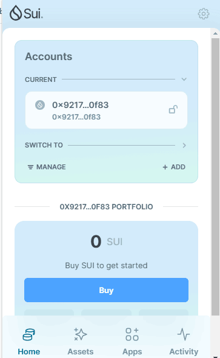
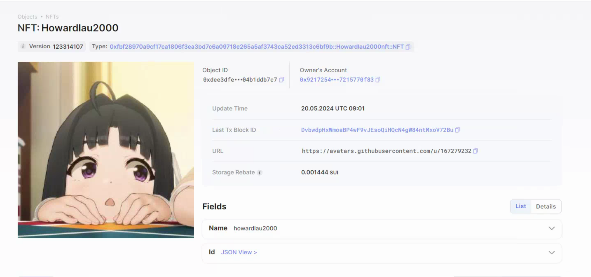

## 基本信息
- Sui钱包地址: `0x92172547190c5dcc69eeacd9072ab718e8e9e66343f6aff0d9cb757215770f83`
> 首次参与需要完成第一个任务注册好钱包地址才被合并，并且后续学习奖励会打入这个地址
- github: `howardlau2000`

## 个人简介
- 工作经验: 2年
- 技术栈: `Kotlin` `Java`
> 重要提示 请认真写自己的简介
- 多年android开发经验，对Move特别感兴趣，想通过Move入门区块链
- 联系方式: tg: `howardlau2000` 

## 任务

##   01 hello move  
- [x] Sui cli version: 1.25.0
- [x] Sui钱包截图: 
- [x] package id: 0x3771fda630c8236d6a5cf08a77ae222d7ee9376053717eb834d00fb6784b218d 
- [x] package id 在 scan上的查看截图:

##   02 move coin
- [x] My Coin package id :  [0xedfec1a78e883e790eae6e873d5643a6c309c40103fbbab8717285976d0767c5](https://suivision.xyz/package/0xedfec1a78e883e790eae6e873d5643a6c309c40103fbbab8717285976d0767c5)        
- [x] Faucet package id : [0xedfec1a78e883e790eae6e873d5643a6c309c40103fbbab8717285976d0767c5](https://suivision.xyz/package/0xedfec1a78e883e790eae6e873d5643a6c309c40103fbbab8717285976d0767c5)        
- [x] 转账 `My Coin` hash: [AJW9uZmriSANFBvSpTGjQot2MU9rHKn7p6kxPm9Bxazn](https://suivision.xyz/txblock/AJW9uZmriSANFBvSpTGjQot2MU9rHKn7p6kxPm9Bxazn)
- [x] `Faucet Coin` address1 mint hash: [AqFFwffNFbuiovwn7cE77Gmk3Xt3sR7LKoWnEy46zLTa](https://suivision.xyz/txblock/AqFFwffNFbuiovwn7cE77Gmk3Xt3sR7LKoWnEy46zLTa)
- [x] `Faucet Coin` address2 mint hash: [D3FdcCPwPQixE3MYUwgR9TR9mMgZtDZQXwaUeM2qtq9v](https://suivision.xyz/txblock/D3FdcCPwPQixE3MYUwgR9TR9mMgZtDZQXwaUeM2qtq9v)

##   03 move NFT
- [x] nft package id : [0xfbf28970a9cf17ca1806f3ea3bd7c6a09718e265a5af3743ca52ed3313c6bf9b](https://suivision.xyz/package/0xfbf28970a9cf17ca1806f3ea3bd7c6a09718e265a5af3743ca52ed3313c6bf9b)     
- [x] nft object id :  [0xdee3dfef790963860c39a07c1cc503161beded4e55944f4942995f04b1ddb7c7](https://suiscan.xyz/mainnet/object/0xdee3dfef790963860c39a07c1cc503161beded4e55944f4942995f04b1ddb7c7)
- [x] 转账 nft  hash:  [5jntJ6NaYWc17dVhMvdcrYxAEpFdbye8PpEstJEk8oEC](https://suivision.xyz/txblock/5jntJ6NaYWc17dVhMvdcrYxAEpFdbye8PpEstJEk8oEC)
- [x] scan上的NFT截图:

##   04 Move Game
- [x] game package id : [0x4bbd66618ff7e5e6cdd06a19c08ee324bd8252c0032f9377566cb4230595f430](https://suivision.xyz/package/0x4bbd66618ff7e5e6cdd06a19c08ee324bd8252c0032f9377566cb4230595f430)
- [x] deposit Coin hash: [2Q7CDAAZzQXLxmopGuXTY9t4ksM6yKHbETaGJL6j7aFL](https://suivision.xyz/txblock/2Q7CDAAZzQXLxmopGuXTY9t4ksM6yKHbETaGJL6j7aFL)
- [x] withdraw `Coin` hash: [9tTVW4SDwQKGT9tsLD5JrtfSdEzS9iTYTVW3s3yWPXqt](https://suivision.xyz/txblock/9tTVW4SDwQKGT9tsLD5JrtfSdEzS9iTYTVW3s3yWPXqt)
- [x] play game hash: [FfNo8jjAF4PkTz8zryAPya7ntJaEJ63hoFzv5mQQXcYp](https://suivision.xyz/txblock/FfNo8jjAF4PkTz8zryAPya7ntJaEJ63hoFzv5mQQXcYp)

##   05 Move Swap
- [x] swap package id :  [0x5041dd5ba3e70208da7faaa415bfd371acd5256a25d5d5e4875eda0109c1f7ea](https://suivision.xyz/package/0x5041dd5ba3e70208da7faaa415bfd371acd5256a25d5d5e4875eda0109c1f7ea)   
- [x] call swap CoinA-> CoinB  hash :  [D541pFZoRZQWvvKwYDtYqcmaLCtbtgzwMxdYM16AeU6g](https://suivision.xyz/txblock/D541pFZoRZQWvvKwYDtYqcmaLCtbtgzwMxdYM16AeU6g)
- [x] call swap CoinB-> CoinA  hash : [3FuozTZCPppir3karAA9GBJ8ATe65AUzsZhET3vFbR4E](https://suivision.xyz/txblock/3FuozTZCPppir3karAA9GBJ8ATe65AUzsZhET3vFbR4E)

##   06 Dapp-kit SDK PTB
- [x] save hash : [FWEVZ6L9YEfNCpKB8f9wDFtg9hxVdw4KvAqvjQeYuWWf](https://suivision.xyz/txblock/FWEVZ6L9YEfNCpKB8f9wDFtg9hxVdw4KvAqvjQeYuWWf)
