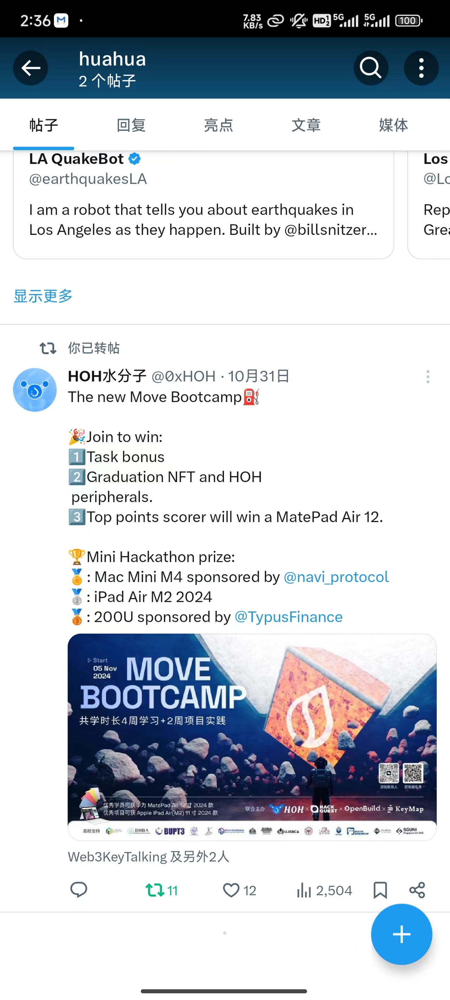

# 这个模板是2024年11月份的共学营才需要的

## b站，推特关注

- [x] b站，推特关注截图: 

## 为共学营宣传（在朋友圈或者群聊中转发海报/文章）

- [x] 宣传截图:

## 每周课程学习

- [x] 第一周:
- [x] 第二周:
- [x] 第三周:
- [x] 第四周:

## 参加直播答疑

- [x] 第一周:
- [x] 第二周:
- [x] 第三周:
- [x] 第四周:

## 群里分享学习笔记

- [x] 第一篇笔记
- [x] 第二篇笔记
- [x] 第三篇笔记
- [x] 第四篇笔记
- [x] 第五篇笔记
- [x] 第六篇笔记
- [x] 第七篇笔记
- [x] 第八篇笔记
- [x] 第九篇笔记
- [x] 第十篇笔记

## 对外输出学习笔记

- [x] 第一篇笔记【[学习笔记链接](https://blog.csdn.net/Huahua_1223/article/details/143750762)】
- [x] 第二篇笔记【[学习笔记链接](https://hua1223.blog.csdn.net/article/details/143866005)】
- [x] 第三篇笔记【[学习笔记链接](https://hua1223.blog.csdn.net/article/details/143895408)】
- [x] 第四篇笔记【[学习笔记链接](https://hua1223.blog.csdn.net/article/details/144032486)】
<!-- - [x] 第五篇笔记【[学习笔记链接](https://hua1223.blog.csdn.net/article/details/144032486)】 -->

## 在HOH社区公众号发布自己的技术文章

- [x] 第一篇笔记【[公众号文章链接](https://mp.weixin.qq.com/s/xNgX7heNowggNLYcCwGPdQ)】
- [x] 第二篇笔记【[公众号文章链接](https://mp.weixin.qq.com/s/X5cYcL2bC6etKMkp_Lt3Xg)】
- [x] 第三篇笔记【[公众号文章链接](https://mp.weixin.qq.com/s/tWx03o77KXxWSYYnz0L1sQ)】
- [x] 第四篇笔记【[公众号文章链接](https://mp.weixin.qq.com/s/w5SNITGL6sWx7FoWLoT2dQ)】
- [x] 第五篇笔记【[公众号文章链接](https://mp.weixin.qq.com/s/zc5MyY9OITld0z4-q1C-IQ)】

## 直播分享学习技巧/工具推荐

- [] 会议截图:

## 提交项目

- [] 项目提交

