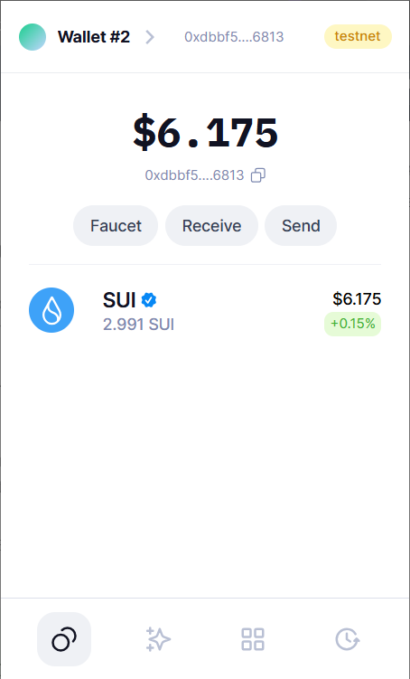
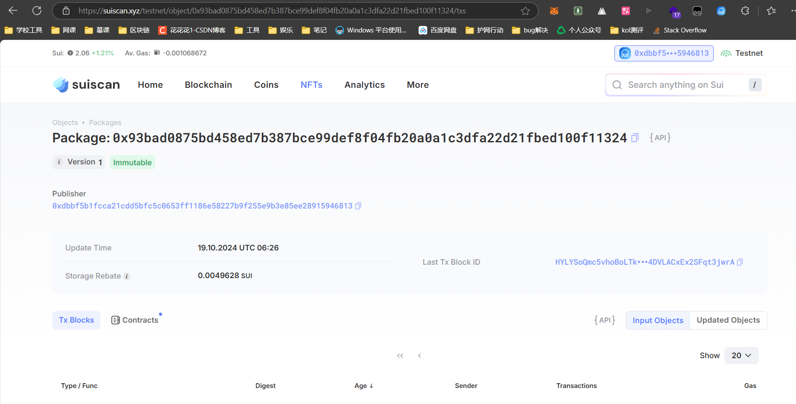
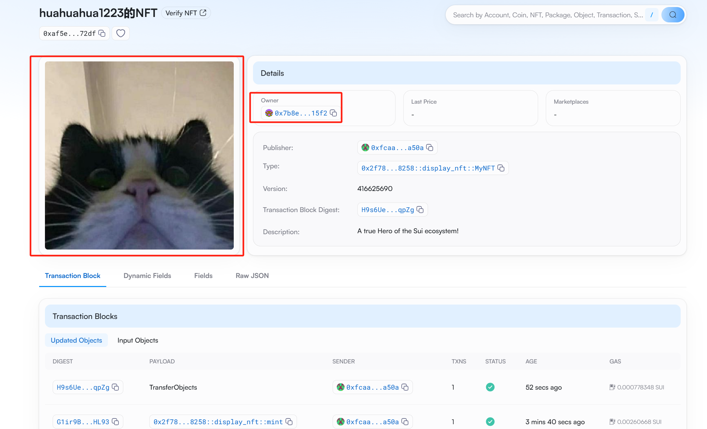

## 基本信息
- Sui钱包地址: `0xba05e5ff69321ed26d686dc08ecb9df43113139f6483893740b35a8361c6c4a7`
> 首次参与需要完成第一个任务注册好钱包地址才被合并，并且后续学习奖励会打入这个地址
- github: `huahuahua1223`

## 个人简介
- 工作经验: 1年
- 技术栈: `nodejs` `solidity`
> 重要提示 请认真写自己的简介
- 三年以太坊web3开发经验，对Move特别感兴趣，想学习move语言，对sui链感兴趣，想学习，也想参与sui链的生态，欢迎大家一起交流学习，一起学习，一起进步。
- 联系方式: Email: `1494133104@qq.com` 

## 任务

##   01 hello move  
- [x] Sui cli version: `sui 1.35.2-4e46da89efd5`
- [x] Sui钱包截图: 
- [x] package id: `0x93bad0875bd458ed7b387bce99def8f04fb20a0a1c3dfa22d21fbed100f11324`
- [x] package id 在 scan上的查看截图:

##   02 move coin
- [x] My Coin package id : `0x4e393fad36baba534f8cbfa9852665c49a69be64cf5b82576f267007e187d036`
- [x] Faucet package id : `0x4e393fad36baba534f8cbfa9852665c49a69be64cf5b82576f267007e187d036`
- [x] 转账 `My Coin` hash:`4DafrEdShrs2JpCEubqMvQABB7f51iid2j3yNfgDAFsp`
- [x] `Faucet Coin` address1 mint hash:`F9xZ7fnvucHvviSNeJQ3EiUX3599kBv1yVMw2vpyQpD9`
- [x] `Faucet Coin` address2 mint hash:`825rrdSMnRQwKB6ebNvVjhzYPhE4Wk3LVPwWt7STxJGc`

##   03 move NFT
- [x] nft package id :`0x2f7822ab2a65f1a15dfbe475e24ff39cc13f1bd7b824265d697e4aeab3998258`
- [x] nft object id : `0xac19559587d38820e6b88089dc5cb22abe9296c2f0d10e7bcdd778733bb36103`
- [x] 转账 nft  hash:`H9s6UewebGgA2QVZsKutfZh72vFDHfuBUv7hnWw4qpZg`
- [x] scan上的NFT截图:

##   04 Move Game
- [x] game package id : `0xa6a77abc39f150237a73c656f044f0cdb1ad14462eead9b383a3dd6130f23ef1`
- [x] deposit Coin hash: `46C8FSbvPNDSE1MTAidYFjc5CbCS66nfvwEEtTqLud4J`
- [x] withdraw `Coin` hash: `5eRbyqeZ3LkvrmM6PvAmzLfxG3LiqVkoe8uZTeuuCSCH`
- [x] play game hash: `GqkAhUER6TEwXHJb4BVgSyfzZms8J6eb7uTLuMeWDVue`

##   05 Move Swap
- [x] swap package id : `0xa665c6416f27a047ff6224b770e916b98c7385ac68fc4f6d79ae6ebd5243e92f`
- [x] call swap CoinA-> CoinB  hash : `2Kav9AiQXt1gb9NzXB5VYRm2jMZ5VVcr15HhKJqFBFtn`
- [x] call swap CoinB-> CoinA  hash : `5SVJqWQEnSvjDW7QmTPyT1oj1G1qBjv2rrfnv197o2CK`

##   06 Dapp-kit SDK PTB
- [x] save hash : `DFQdL24Ln5FPDK838EE4PSCXyuAw65w3mzzAJvwArGh5`

##   07 Move CTF Check In
- [] CLI call 截图 : 
- [] flag hash :

##   08 Move CTF Lets Move
- [] proof : 
- [] flag hash :
