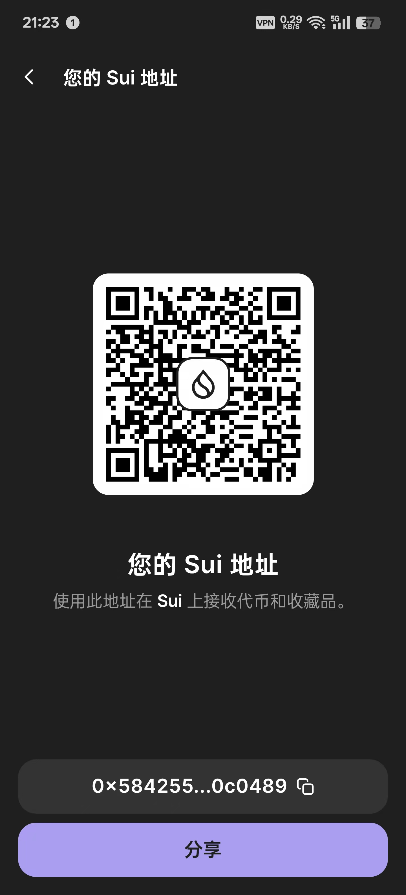
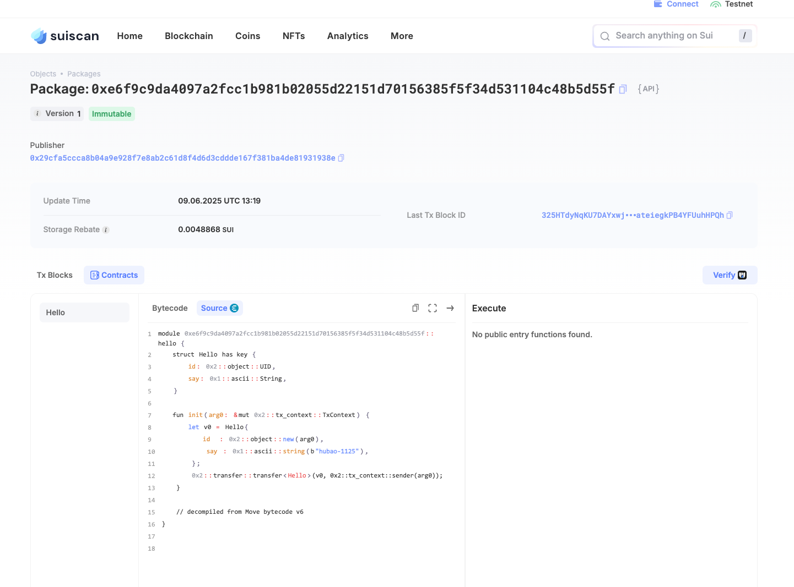

## 基本信息
- Sui钱包地址: `0x58425554630ae53f38cf9dd2056c62a9c43c1134bfbe41a86eeb32dc820c0489`
> 首次参与需要完成第一个任务注册好钱包地址才被合并，并且后续学习奖励会打入这个地址
- github: `hubao-1125`

## 个人简介
- 工作经验: 10年
- 技术栈: `Java` `React`
> 重要提示 请认真写自己的简介
- 多年支付、交易行业从业经验，熟悉区块链、支付、等场景，对清结算有一定的理解。
- 联系方式: discord: `hubao_1125` 

## 任务

##   01 hello move  
- [] Sui cli version: 1.49.2-homebrew
- [] Sui钱包截图: 
- [] package id: 0xe6f9c9da4097a2fcc1b981b02055d22151d70156385f5f34d531104c48b5d55f
- [] package id 在 scan上的查看截图:

##   02 move coin
- [] My Coin package id : 
- [] Faucet package id : 
- [] 转账 `My Coin` hash:
- [] `Faucet Coin` address1 mint hash:
- [] `Faucet Coin` address2 mint hash:

##   03 move NFT
- [] nft package id :
- [] nft object id : 
- [] 转账 nft  hash:
- [] scan上的NFT截图:

##   04 Move Game
- [] game package id :
- [] deposit Coin hash:
- [] withdraw `Coin` hash:
- [] play game hash:

##   05 Move Swap
- [] swap package id :
- [] call swap CoinA-> CoinB  hash :
- [] call swap CoinB-> CoinA  hash :

##   06 Dapp-kit SDK PTB
- [] save hash :

##   07 Move CTF Check In
- [] CLI call 截图 : 
- [] flag hash :

##   08 Move CTF Lets Move
- [] proof : 
- [] flag hash :

