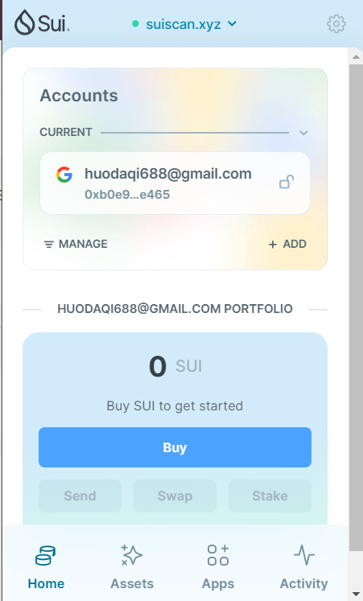
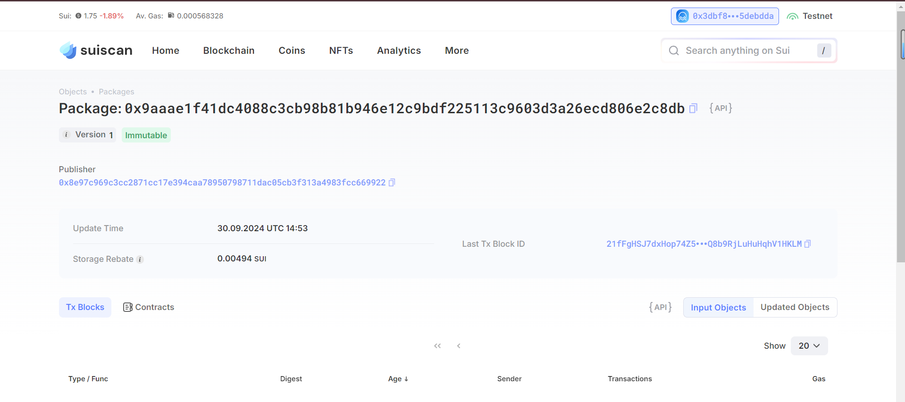

## 基本信息
- Sui钱包地址: `0x3dbf8444f8c1963b9530cf665cbe1b42cebaff665db4fbf7739d0f0625debdda`
> 首次参与需要完成第一个任务注册好钱包地址才被合并，并且后续学习奖励会打入这个地址
- github: `自己的githubid`

## 个人简介
- 工作经验: 1年
- 技术栈:  `C++`
> 重要提示 请认真写自己的简介
- 太原理工大学区块链应届生，自学了c语言c++和python，对Move特别感兴趣，想通过Move入门区块链
- 联系方式: tg: `13047716316` 

## 任务

##   01 hello move  
- [] Sui cli version:
- [] Sui钱包截图: 
- [] package id: 0x9aaae1f41dc4088c3cb98b81b946e12c9bdf225113c9603d3a26ecd806e2c8db
- [] package id 在 scan上的查看截图:

##   02 move coin
- [] My Coin package id : 
- [] Faucet package id : 
- [] 转账 `My Coin` hash:
- [] `Faucet Coin` address1 mint hash:
- [] `Faucet Coin` address2 mint hash:

##   03 move NFT
- [] nft package id :
- [] nft object id : 
- [] 转账 nft  hash:
- [] scan上的NFT截图:

##   04 Move Game
- [] game package id :
- [] deposit Coin hash:
- [] withdraw `Coin` hash:
- [] play game hash:

##   05 Move Swap
- [] swap package id :
- [] call swap CoinA-> CoinB  hash :
- [] call swap CoinB-> CoinA  hash :

##   06 Dapp-kit SDK PTB
- [] save hash :

##   07 Move CTF Check In
- [] CLI call 截图 : 
- [] flag hash :

##   08 Move CTF Lets Move
- [] proof : 
- [] flag hash :
