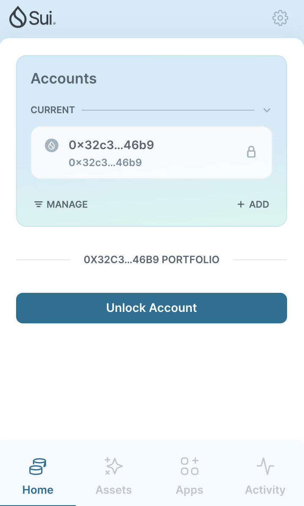
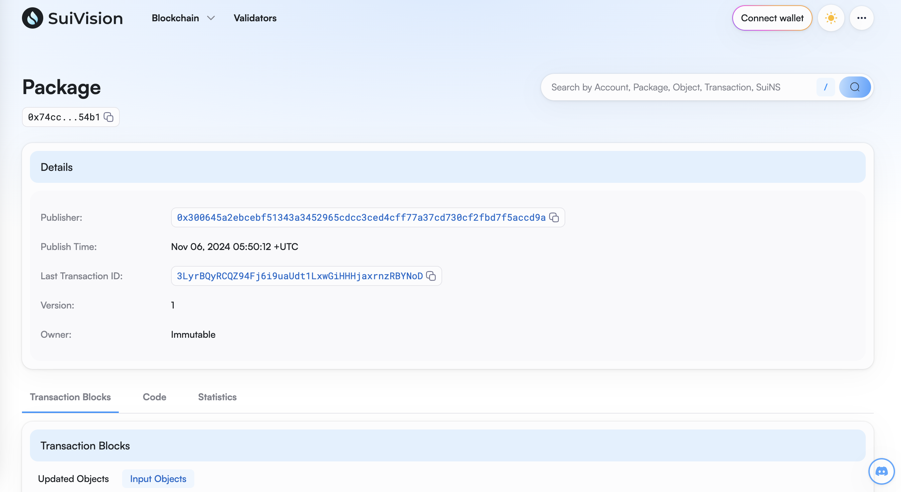
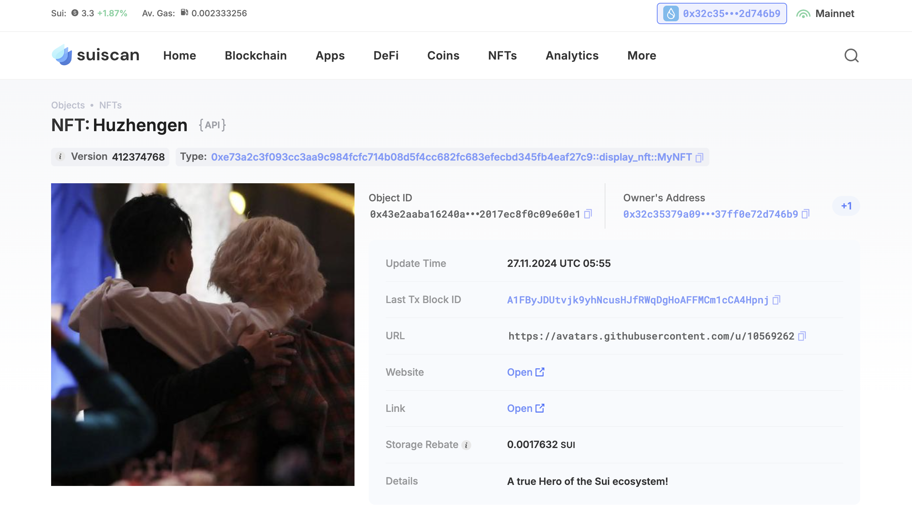

## 基本信息
- Sui钱包地址: `0x32c35379a0973c650485b32550841a25bf21ccf247c1f9efc037ff0e72d746b9`
> 首次参与需要完成第一个任务注册好钱包地址才被合并，并且后续学习奖励会打入这个地址
- github: `huzhengen`

## 个人简介
- 工作经验: 3年
- 技术栈: `JavaScript` `React`
> 重要提示 请认真写自己的简介
- Web2 前端开发，学习 Move
- 联系方式: GitHub: `huzhengen` 

## 任务

##   01 hello move  
- [x] Sui cli version: sui 1.37.1-homebrew
- [x] Sui钱包截图: 
- [x] package id: 3LyrBQyRCQZ94Fj6i9uaUdt1LxwGiHHHjaxrnzRBYNoD
- [x] package id 在 scan上的查看截图:

##   02 move coin
- [] My Coin package id : 
- [] Faucet package id : 
- [] 转账 `My Coin` hash:
- [] `Faucet Coin` address1 mint hash:
- [] `Faucet Coin` address2 mint hash:

##   03 move NFT
- [x] nft package id : 0xe73a2c3f093cc3aa9c984fcfc714b08d5f4cc682fc683efecbd345fb4eaf27c9
- [x] nft object id : 0x877f9e619b274de1084f5008fd2898a0f8ad61b93bbe40155291af59e0c244f2
- [x] 转账 nft  hash: Dci1G4jS7TiobzdRH3tNicdFgkZG9Mt8SSZNKdxDoD8H
- [x] scan上的NFT截图:

##   04 Move Game
- [] game package id :
- [] deposit Coin hash:
- [] withdraw `Coin` hash:
- [] play game hash:

##   05 Move Swap
- [] swap package id :
- [] call swap CoinA-> CoinB  hash :
- [] call swap CoinB-> CoinA  hash :

##   06 Dapp-kit SDK PTB
- [] save hash :

##   07 Move CTF Check In
- [] CLI call 截图 : 
- [] flag hash :

##   08 Move CTF Lets Move
- [] proof : 
- [] flag hash :
