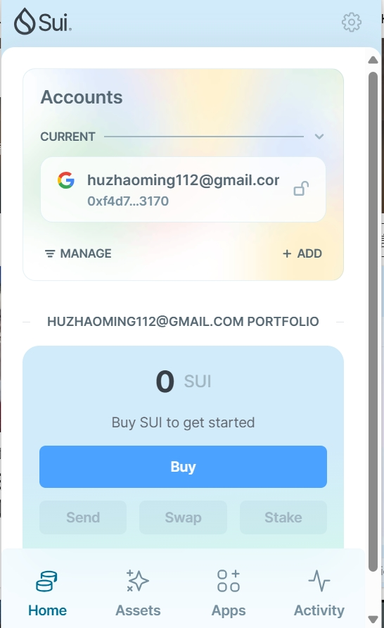
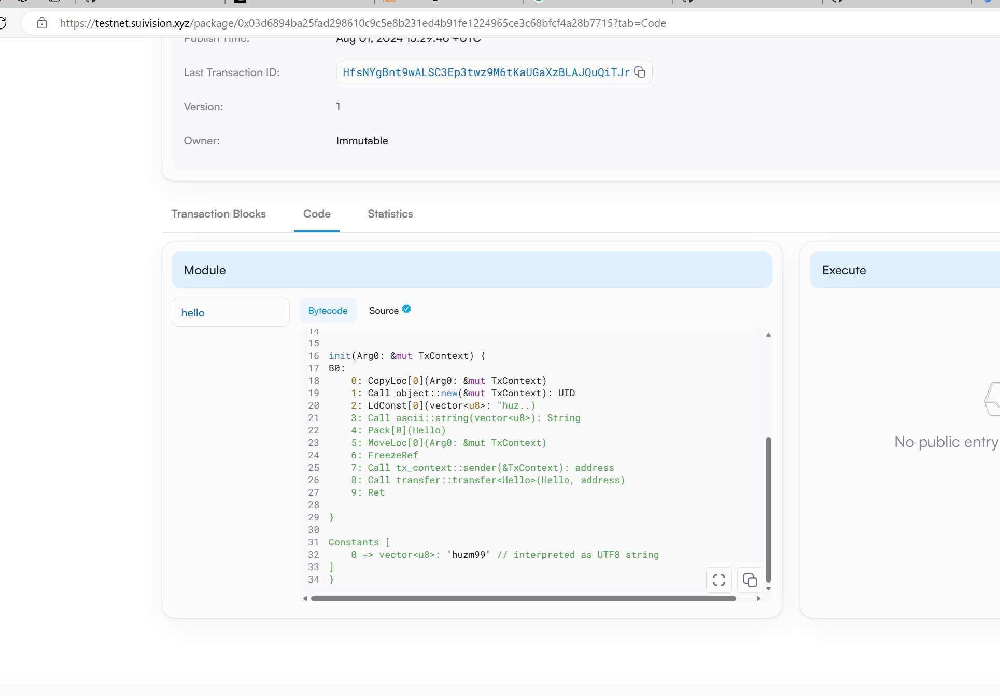
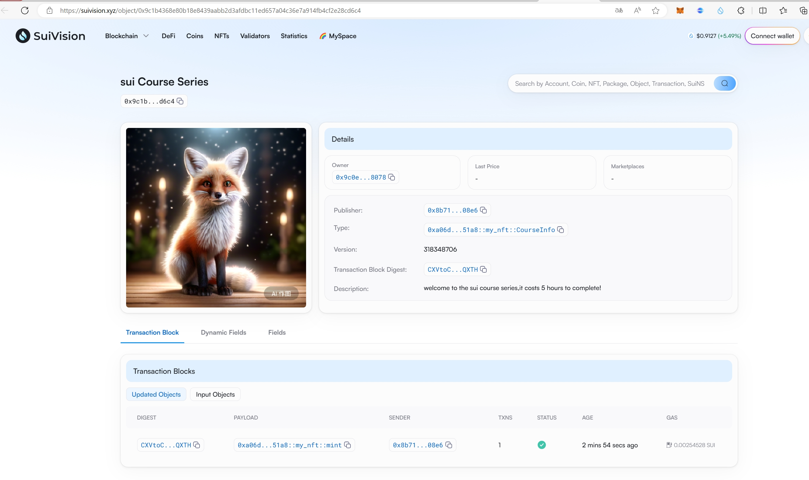

## 基本信息
- Sui钱包地址: `0xf4d7b9c956241352225d4115e271260a94843a0dc639ee5e1d7bc67f026a3170`
> 首次参与需要完成第一个任务注册好钱包地址才被合并，并且后续学习奖励会打入这个地址
- github: `huzm99`

## 个人简介
- 工作经验: 12年
- 技术栈: `C#` `go`  'java','javascript'
> 重要提示 请认真写自己的简介
- 多年web2开发经验，对Move特别感兴趣，想通过Move入门区块链
- 联系方式: tg: `xxx` 

## 任务

##   01 hello move  
- [x] Sui cli version:1.30.1
- [x] Sui钱包截图: 
- [x] package id: 0x03d6894ba25fad298610c9c5e8b231ed4b91fe1224965ce3c68bfcf4a28b7715
- [x] package id 在 scan上的查看截图:

##   02 move coin
- [x] My Coin package id : 0x3e4109d35ebc92330b6ac81d975cbc9989c2cabb7d302d731a51f91c652b7d5e
- [x] Faucet package id : 0x13f6e071dc284a0f8f86a6a9e303317b78000dd66daaf1c97a37bb7ad8e2a8e6
- [x] 转账 `My Coin` hash:3qcopCs4dzDk6eY1s8ciwSRyu5GqX66LjRYV2gpqLENn
- [x] `Faucet Coin` address1 mint hash:CG1xQnTYLS8X4fz5NRy53oscTuSMw5ZD5gMZwE9ySFVL
- [x] `Faucet Coin` address2 mint hash:GmHxr28GJzH4VwDQqbu6J6TgSfgLN18HAMTg8UA3FKPE

##   03 move NFT
- [] nft package id :0xa06dada764722c2a30dec7d3f94ef3c61d856f719ffff41ca4622bab223251a8
- [] nft object id : 0xd6ba603058106d82619db9ccb353339f1287cc307876c9d87fc52cf6b2b84121
- [] 转账 nft  hash:CXVtoC97HbFr2symEHWDHbKBHX1vvvsRDieCNHtQXTH
- [] scan上的NFT截图:

##   04 Move Game
- [] game package id :
- [] deposit Coin hash:
- [] withdraw `Coin` hash:
- [] play game hash:

##   05 Move Swap
- [] swap package id :
- [] call swap CoinA-> CoinB  hash :
- [] call swap CoinB-> CoinA  hash :

##   06 Dapp-kit SDK PTB
- [] save hash :

##   07 Move CTF Check In
- [] CLI call 截图 : 
- [] flag hash :

##   08 Move CTF Lets Move
- [] proof : 
- [] flag hash :
