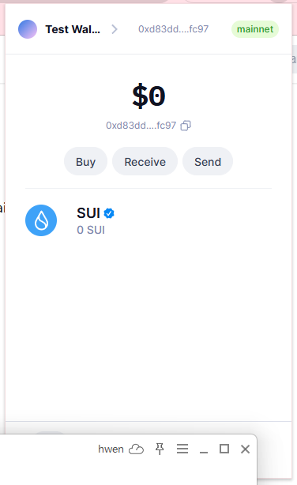
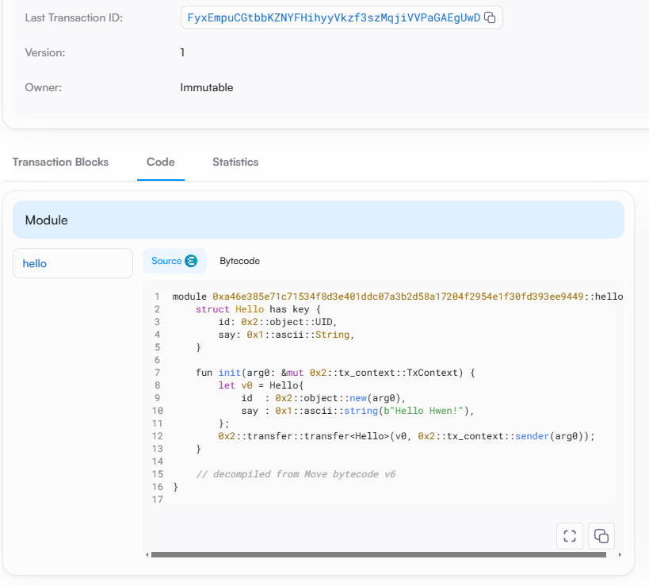
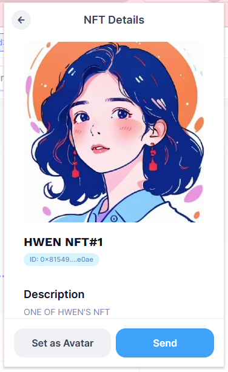
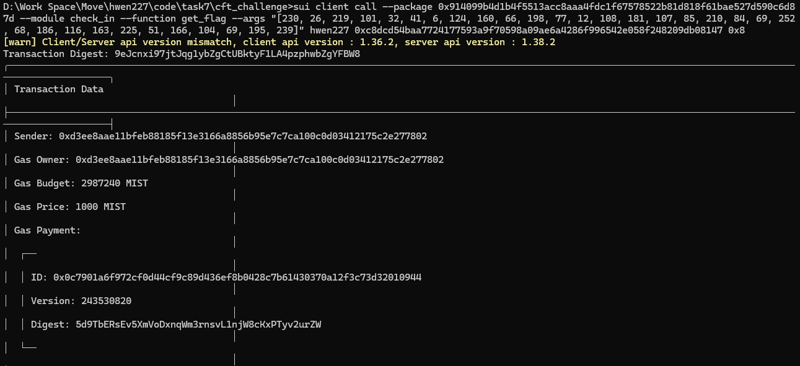

## 基本信息
- Sui钱包地址: `0xd83dda8dcdae875933dc6c1814a08e0a3e62204aeac2314a0bba0a0be757fc97`
- github: `hwen227`

## 个人简介
- 计算机专业
- 技术栈: `java` `javascript` `python` `c++`
    - 正在学习使用solidity编写智能合约，参加共学营来了解move语言以及sui生态，加深对区块链的理解
    - 寻找远程工作中
- 联系方式: 微信: `Luca0227` 

## 任务

##   01 hello move  
- [✓] Sui cli version: sui 1.36.2-3ada97c109cc
- [✓] Sui钱包截图: 
- [✓] package id: 0x0a46e385e71c71534f8d3e401ddc07a3b2d58a17204f2954e1f30fd393ee9449
- [✓] package id 在 scan上的查看截图:

##   02 move coin
- [✓] My Coin package id : 0x025c077dd399fe7d9a18271df29ea6b4922782d64f6aee06e218c0af9586546b
- [✓] Faucet package id : 0xc4a538a0f477051636e06e2cea07a179f5a62e8125ed1eef92fa84993eb729ac
- [✓] 转账 `My Coin` hash: GYtZkdMo8RjJsMHhqm5Bv1V56EAPDjNpRwTZy9bSKKTG
- [✓] `Faucet Coin` address1 mint hash: BeCYs1GUxkWeqq1wqFeunCb8SegEM1EuqqGXiMyr4FcZ
- [✓] `Faucet Coin` address2 mint hash: HxVBpPgtD4DVPPu4VHuFw12CtAQhGXCNTcUAkR1A6x4P

##   03 move NFT
- [✓] nft package id : 0x8e2e51ec7307cd7a525e46b158e932d971fbf4c46cd7e7dd0b0ed90e5413d223
- [✓] nft object id : 0x81549006100165cfa96f4635d09b340b564dd899c632be38ca6e6e09e2c3e0ae
- [✓] 转账 nft  hash: FVhVDEE4gb9VKK3Lu79SyEJnGD4sCN2X5SVPucUE7wdK
- [✓] scan上的NFT截图:

##   04 Move Game
- [✓] game package id : 0x5d530517d4fee43180fd1ea82ea1f6c7afc8dbde3e052cc24e2942b382fbb82a
- [✓] deposit Coin hash: Gpzu4SvSSz8MoQ6SpkJoRHbj3FCMpLEvqnJcqjzyocyX
- [✓] withdraw `Hwen Faucet Coin` hash: 4g1fYE6XFmCxZhiYbZqqk5tU1TU757PzXTpgpnbPPohT
- [✓] play game hash: AATCc2d2pME3NAF2uXVvBZiZ8VHam5hjmieQBBSukovd

##   05 Move Swap
- [✓] swap package id : 0x3fb5d5b05557c3fe832c720dec96c6f6f622879fa0586b5c8b5eb8252e3f2dbc
- [✓] call swap CoinA-> CoinB  hash : DtWSweEj3RNcCsKq6udvNyPfHpfmczYi8hjtEUwVZWYo
- [✓] call swap CoinB-> CoinA  hash : DaWSAdBts9WPjwK5kdijCXiCho5YCxcQN5kz12wxHJQQ

##   06 Dapp-kit SDK PTB
- [✓] save hash : 9mjuMcMCanaNjhdGugcU2VK9QYj5unTxNwoUJEKqnUcQ

##   07 Move CTF Check In
- [✓] CLI call 截图 : 
- [✓] flag hash :9eJcnxi97jtJqg1ybZgCtUBktyF1LA4pzphwbZgYFBW8

##   08 Move CTF Lets Move
- [✓] proof : [205, 54, 35, 157, 132, 102, 202, 116]
- [✓] flag hash : BYo4dxxtB4rgHVFwVbYMiLJtBb9di7yGwwH48uDP2g62
