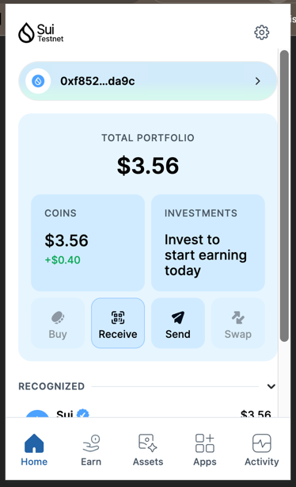
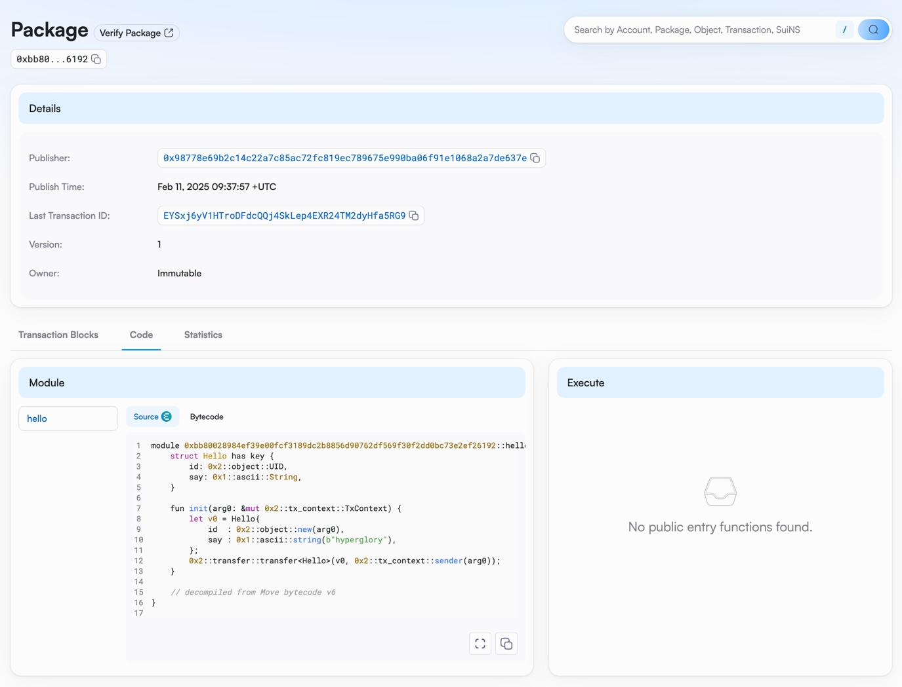

## 基本信息
- Sui钱包地址: `0xf852936d658c2906cce58c87b2cb55423812c1549a62ea0fc5e7db61fd2eda9c`
> 首次参与需要完成第一个任务注册好钱包地址才被合并，并且后续学习奖励会打入这个地址
- github: `hyperglory`

## 个人简介
- 工作经验: 9年
- 技术栈: `Java` `Python`
> 重要提示 请认真写自己的简介
- 多年web2后端开发经验，熟悉区块链、web3，链上老玩家，目前对区块链开发感兴趣，希望通过系统性的学习move语言和sui公链进入web3行业，成为web3全栈工程师
- 联系方式: tg: `@hyperglory` 

## 任务

##   01 hello move  
- [x] Sui cli version: sui 1.42.2-homebrew
- [x] Sui钱包截图: 
- [x] package id: 0xbb80028984ef39e00fcf3189dc2b8856d90762df569f30f2dd0bc73e2ef26192
- [x] package id 在 scan上的查看截图:

##   02 move coin
- [] My Coin package id : 
- [] Faucet package id : 
- [] 转账 `My Coin` hash:
- [] `Faucet Coin` address1 mint hash:
- [] `Faucet Coin` address2 mint hash:

##   03 move NFT
- [] nft package id :
- [] nft object id : 
- [] 转账 nft  hash:
- [] scan上的NFT截图:

##   04 Move Game
- [] game package id :
- [] deposit Coin hash:
- [] withdraw `Coin` hash:
- [] play game hash:

##   05 Move Swap
- [] swap package id :
- [] call swap CoinA-> CoinB  hash :
- [] call swap CoinB-> CoinA  hash :

##   06 Dapp-kit SDK PTB
- [] save hash :

##   07 Move CTF Check In
- [] CLI call 截图 : 
- [] flag hash :

##   08 Move CTF Lets Move
- [] proof : 
- [] flag hash :

