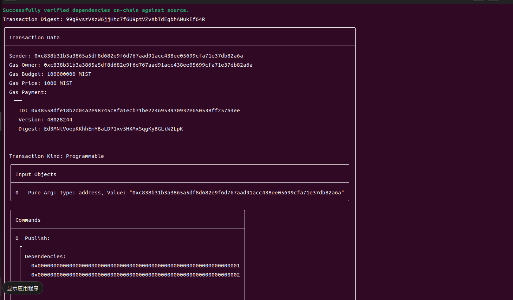
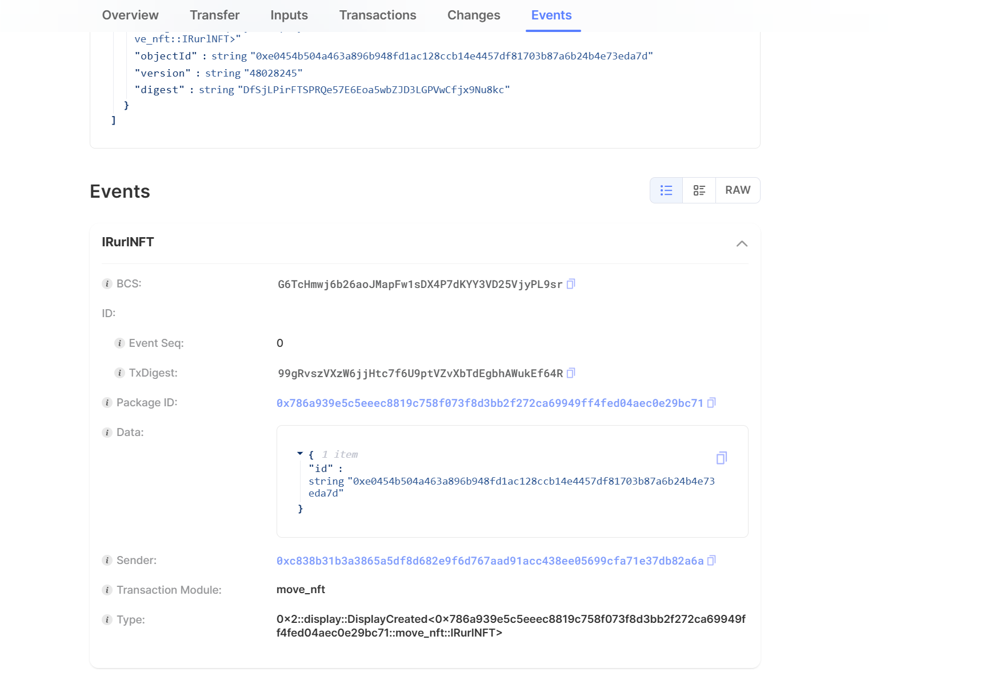

## 基本信息

- Sui钱包地址: 0xc838b31b3a3865a5df8d682e9f6d767aad91acc438ee05699cfa71e37db82a6a

- github: iRurl

## 任务
## 03 move NFT
- [] nft package id :0x786a939e5c5eeec8819c758f073f8d3bb2f272ca69949ff4fed04aec0e29bc71
- [] nft object id : 0xe0454b504a463a896b948fd1ac128ccb14e4457df81703b87a6b24b4e73eda7d
- [] 转账 nft  hash: 99gRvszVXzW6jjHtc7f6U9ptVZvXbTdEgbhAWukEf64R

- [x] Sui cli version: 1.27.0
- [x]  CLI call截图: 
- [x]  scan上的查看截图:

