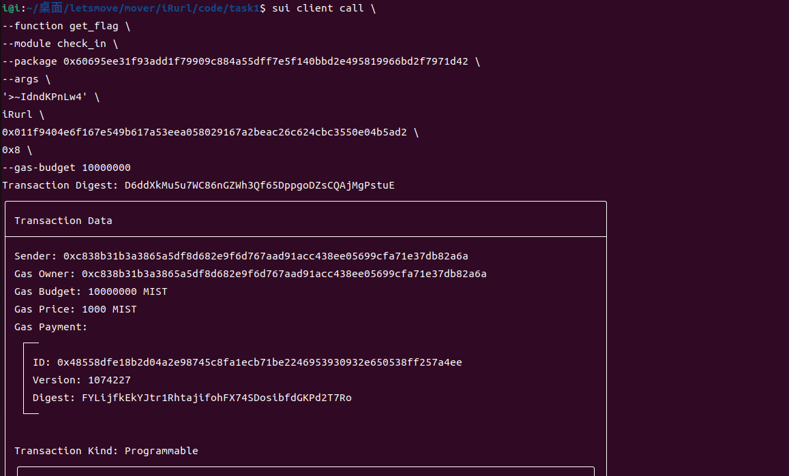

## 基本信息

- Sui钱包地址: 0xc838b31b3a3865a5df8d682e9f6d767aad91acc438ee05699cfa71e37db82a6a

- github: iRurl

```
sui client call \
--function get_flag \
--module check_in \
--package 0x60695ee31f93add1f79909c884a55dff7e5f140bbd2e495819966bd2f7971d42 \
--args \
'>~IdndKPnLw4' \
0x011f9404e6f167e549b617a53eea058029167a2beac26c624cbc3550e04b5ad2 \
0x8 \
iRurl \
--gas-budget 10000000
```
## 任务

## 07 check_in

Transaction Digest: D6ddXkMu5u7WC86nGZWh3Qf65DppgoDZsCQAjMgPstuE

- [x] Sui cli version: 1.27.0
- [x] package id: 0x60695ee31f93add1f79909c884a55dff7e5f140bbd2e495819966bd2f7971d42  
- [x]  CLI call截图: 
- [x]  scan上的查看截图:

