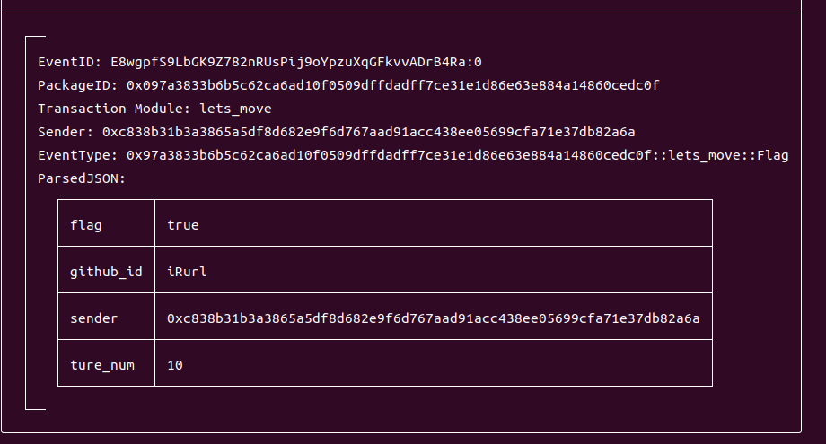
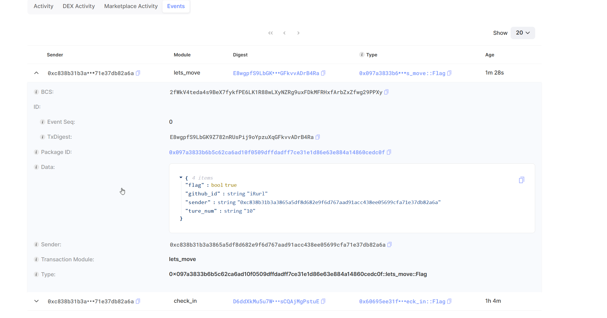

## 基本信息

- Sui钱包地址: 0xc838b31b3a3865a5df8d682e9f6d767aad91acc438ee05699cfa71e37db82a6a

- github: iRurl

```
sui client call \
--function get_flag \
--module lets_move \
--package 0x097a3833b6b5c62ca6ad10f0509dffdadff7ce31e1d86e63e884a14860cedc0f \
--args \
7b8b7644e55e54e7d650 \
iRurl \
0x19e76ca504c5a5fa5e214a45fca6c058171ba333f6da897b82731094504d5ab9 \
0x8 \
--gas-budget 10000000
```
## 任务

## 08 lets move

Transaction Digest: E8wgpfS9LbGK9Z782nRUsPij9oYpzuXqGFkvvADrB4Ra 

- [x] Sui cli version: 1.27.0
- [x] package id: 0x60695ee31f93add1f79909c884a55dff7e5f140bbd2e495819966bd2f7971d42  
- [x]  CLI call截图: 
- [x]  scan上的查看截图:

