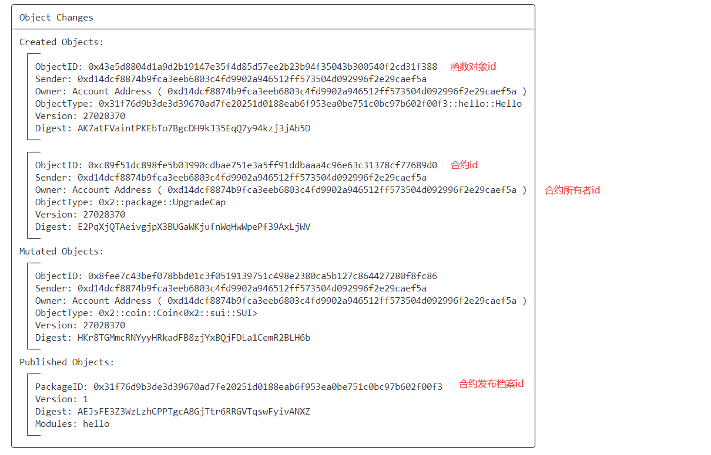

# Task 1 - hello move

## 发布项目

### 新建项目

```bash
sui move new hello_move
```

### 编译智能合约、发布智能合约

```bash
sui move build
sui client publish --gas-budget 10000000
```

得到测试网packageid:0x31f76d9b3de3d39670ad7fe20251d0188eab6f953ea0be751c0bc97b602f00f3

### 异变对象


