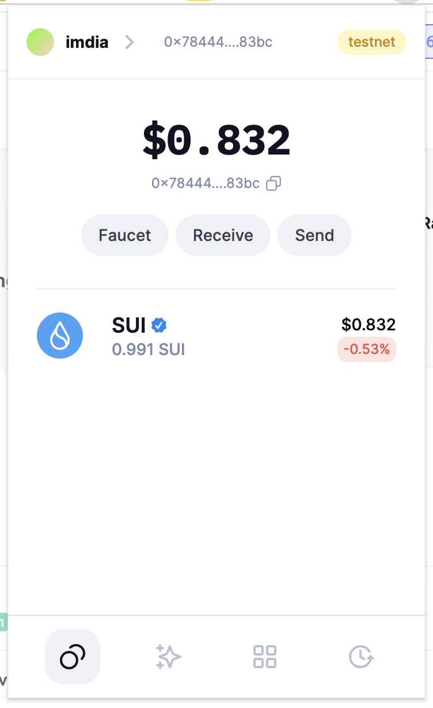
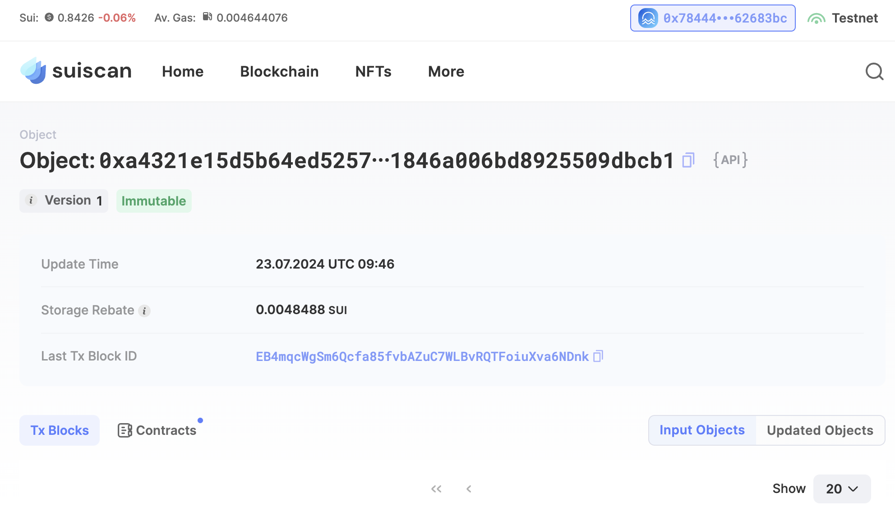
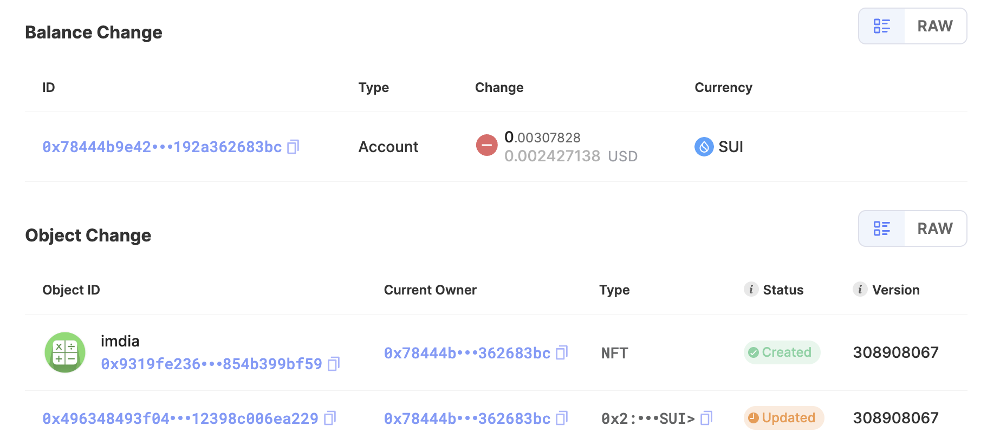

## 基本信息
- Sui钱包地址: `0x78444b9e42a6f9bd2544e80656270bfba227d3238154bcded245192a362683bc`
> 首次参与需要完成第一个任务注册好钱包地址才被合并，并且后续学习奖励会打入这个地址
- github: `imdia`

## 个人简介
- 工作经验: 1年
- 技术栈: `Rust` `nodejs` `tailwindcss` `react`
- 多年web2开发经验，对Move特别感兴趣，想通过Move入门区块链
- 联系方式: tg: `@Y8XwQ42qVvUxZGVh` 

## 任务

##   01 hello move  
- [x] Sui cli version: sui 1.28.4-fc0623927416
- [x] Sui钱包截图: 
- [x] package id: 0xa4321e15d5b64ed525781b8be865f0ba8f4d3d3bdd1846a006bd8925509dbcb1 
- [x] package id 在 scan上的查看截图:

##   02 move coin
- [x] My Coin package id : 0x6b6c7b2c758e0a391cf636013f9ce177f6b81f4834a7d4c472e156d260148a2b
- [x] Faucet package id : 0x6b6c7b2c758e0a391cf636013f9ce177f6b81f4834a7d4c472e156d260148a2b
- [x] 转账 `My Coin` hash: 2kcpnzg9J3DXofhP9BMMjTMDWWWcdRYtG4gtLa1yzHjT
- [x] `Faucet Coin` address1 mint hash: Fiqq1oiy9j17NkBJFLwVSgFDGwjE7oKWTEsae5PeGYsg
- [x] `Faucet Coin` address2 mint hash: 52SviPbqzCLkciLXgfYE4mbfP6P4hVhHk4rNShSSAh8E

##   03 move NFT
- [x] nft package id : 0x2c6bda444ed347f4fe7cc42421a209974b07bb5591da363e61cc05eb3d3c4b33
- [x] nft object id : 0xd3fb9efedcb89e3aed36eb6f6f21d10b453c9b4e90eb74fb709ec758c050aec4
- [x] 转账 nft  hash: GmDdsMmiVsri9hbbGoBcHnBY57hRbPThYov3JJConqPc
- [x] scan上的NFT截图:

##   04 Move Game
- [x] game package id : 0x147bd4512e6ae9fd6e2e733e4a51714ec966be7359be617cf8eb352d79ce723a
- [x] deposit Coin hash: 5KD8bPTtwK8kzFr9XY9KHLo7aSW8kyXU34q1zCHmqDmL
- [x] withdraw `Coin` hash: 3p2Aq7g54RiNH76fSeLMJb5cL6BmRiPK7XPgDdYLsF8Y
- [x] play game hash: FMVsYT3pQTMdPkhL5MC1fzeg7ekEw14REVVvSQR3aFHD

