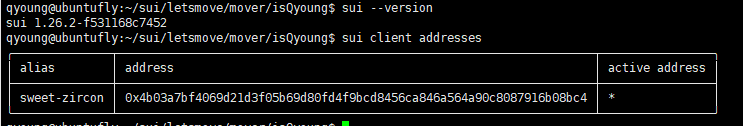
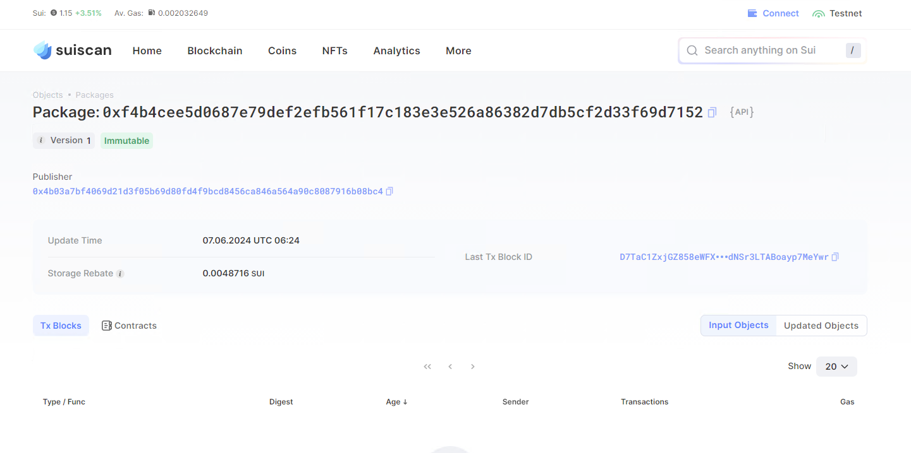

## 基本信息
- Sui钱包地址: `0x741a3483255771b31d81d52b2018d6d69c739ec49f3077dadda93414825baa1b`
> 首次参与需要完成第一个任务注册好钱包地址才被合并，并且后续学习奖励会打入这个地址
- github: `isQyoung`

## 个人简介
- 工作经验: 5年
- 技术栈: `Python` `Shell`
> 重要提示 请认真写自己的简介
- 偶然接触区块链, 觉得很有意思，期待以各种途径了解学习区块链,希望有一天可以为区块链出一份力
- 联系方式: tg: `@isQyoung` 

## 任务

##   01 hello move  
- [] Sui cli version: 1.26.2-f531168c7452
- [] Sui钱包截图: 
- [] package id: 0xf4b4cee5d0687e79def2efb561f17c183e3e526a86382d7db5cf2d33f69d7152
- [] package id 在 scan上的查看截图:

##   02 move coin
- [] My Coin package id : 
- [] Faucet package id : 
- [] 转账 `My Coin` hash:
- [] `Faucet Coin` address1 mint hash:
- [] `Faucet Coin` address2 mint hash:

##   03 move NFT
- [] nft package id :
- [] nft object id : 
- [] 转账 nft  hash:
- [] scan上的NFT截图:

##   04 Move Game
- [] game package id :
- [] deposit Coin hash:
- [] withdraw `Coin` hash:
- [] play game hash:

##   05 Move Swap
- [] swap package id :
- [] call swap CoinA-> CoinB  hash :
- [] call swap CoinB-> CoinA  hash :

##   06 Dapp-kit SDK PTB
- [] save hash :
