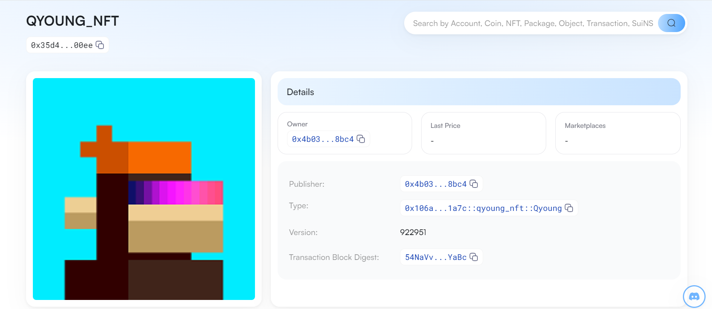
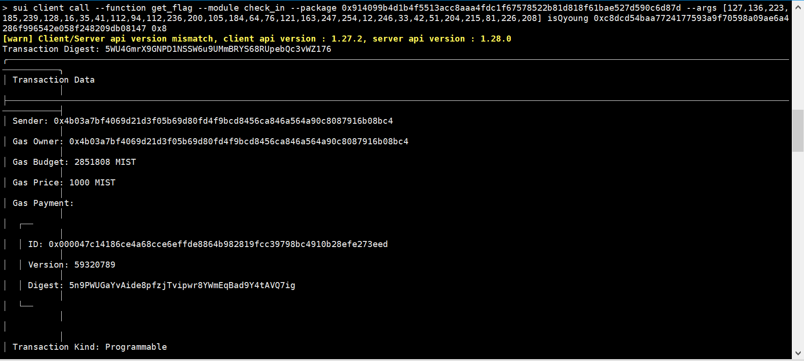

## 基本信息
- Sui钱包地址: `0x741a3483255771b31d81d52b2018d6d69c739ec49f3077dadda93414825baa1b`
> 首次参与需要完成第一个任务注册好钱包地址才被合并，并且后续学习奖励会打入这个地址
- github: `isQyoung`

## 个人简介
- 工作经验: 5年
- 技术栈: `Python` `Shell`
> 重要提示 请认真写自己的简介
- 偶然接触区块链, 觉得很有意思，期待以各种途径了解学习区块链,希望有一天可以为区块链出一份力
- 联系方式: tg: `@isQyoung` 

## 任务

##   01 hello move  
- [] Sui cli version: 1.26.2-f531168c7452
- [] Sui钱包截图: 
- [] package id: 0xf4b4cee5d0687e79def2efb561f17c183e3e526a86382d7db5cf2d33f69d7152
- [] package id 在 scan上的查看截图:

##   02 move coin
- [] My Coin package id : 0x10a875b82f2809e40b75af3b7d12b161007b90d5653e07e88d516fa229ed0cfa
- [] Faucet package id : 0x2d5da0195bef2cbef4644999afb9b2d5cd0f5b5b6c1f3887f75060a3b821d137
- [] 转账 `My Coin` hash: 3r7T1ER65BWToKDcTTfNpaFtcD8kiubvtk4huJ53spty
- [] `Faucet Coin` address1 mint hash: 9oeeBCRhJ5786ctUVLBgWqfiZEyuvpH59StQmZmXD3cw
- [] `Faucet Coin` address2 mint hash: R7XWoGWgSg8KJahCmJCKmpuTZbuS3gLPQjPzeZuvz8U

##   03 move NFT
- [] nft package id : 0x106afe9a22dda46d5e91e53202fb45bb820af80444f8404745ba3f867aba1a7c
- [] nft object id : 0xc96066f186536298adf904d43aadaee721ab85065d5f28eade2506a1f6b3b666
- [] 转账 nft  hash: 9uxskAwMYHJXZoitwgTfjfAJV9hgnqR5KeDEqg88QMSv
- [] scan上的NFT截图:

##   04 Move Game
- [] game package id : 0x31827cb9ca9237858a2d070eb11444996b15ebe2962cfd808bf47e8b3de39ade
- [] deposit Coin hash: 5JuXzVp1293ibnFoRs2CjLtjLEoMwAgrFXqAxwBKuHFU
- [] withdraw `Coin` hash: DyctAYagDdzDui8Z6eggbYbqAA9kLkGAhxvXje997oic
- [] play game hash: H4wJvaPerFF5ryXwiaKrTzouXY3YTxy3SBQkmuuwaY9T

##   05 Move Swap
- [] swap package id : 0x6e89ab467c2999a02e8c8f52e993cfce2050bead2fc9ec8f36cf4b32b84a8d04
- [] call swap CoinA-> CoinB  hash : 7KcV6HfRJpSeyLSR1oQ8mhLzR1wE5wXhn7qdBdiAkdeD
- [] call swap CoinB-> CoinA  hash : 8a4iz9NSH7TYGaYw6D14sdEBpMSAprfNxBvkrMPWXuHB

##   06 Dapp-kit SDK PTB
- [] save hash : 21Hu85qu8k57qjQNBrUr34WckG8J77q5dJasA1Lmk6G7

##   07 Move CTF Check In
- [] CLI call 截图 : 
- [] flag hash : 5WU4GmrX9GNPD1NSSW6u9UMmBRYS68RUpebQc3vWZ176

##   08 Move CTF Lets Move
- [] proof : [116, 49, 162]
- [] flag hash : 9shGCd9SbABHUmQBmk47kh4BWVQmVDeeN2q5ieeY9YXE
