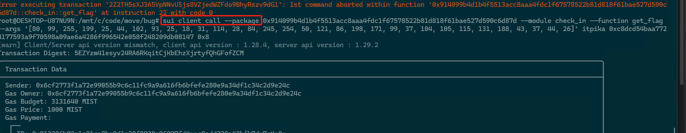
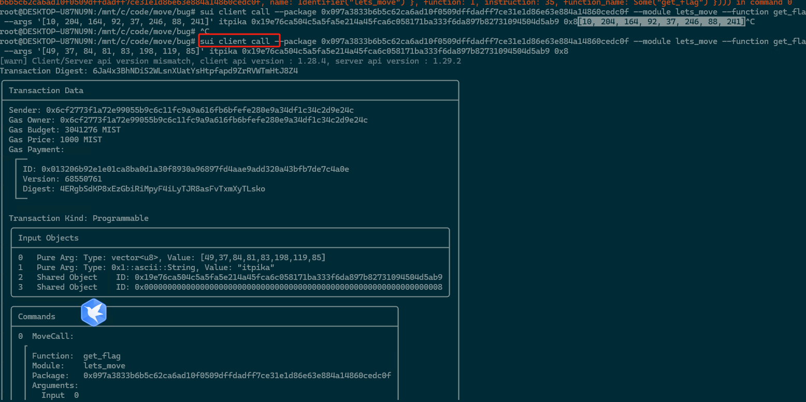

## 基本信息
- Sui钱包地址: `0xd9e7292403b8cf260555f70e82fde5b1436233404286c9609c5210a286e5b056`
> 首次参与需要完成第一个任务注册好钱包地址才被合并，并且后续学习奖励会打入这个地址
- github: `itpika`

## 个人简介
- 工作经验: 7年
- 技术栈: `Rust` `GO`
> 重要提示 请认真写自己的简介
- 多年web2开发经验，对Move特别感兴趣，想通过Move入门区块链
- 联系方式: tg: `pass rong` 

## 任务

##   01 hello move  
- [] Sui cli version: sui 1.26.1-540d384f226a
- [] package id: 0xac3f6a3fef5c1400dd184af89d1702b852a5f270a75f263ce5ed011b7170ffa2

##   02 move coin
- [] My Coin package id : 0x0862e71714864da0b347133aff509b5ce7e3d7a2600adc55dccac09e0f6923ac
- [] Faucet package id : 0x9e4700a5b7664faa9345591e1c75760a6db76d78a9674b63aca97d162b109ce2
- [] 转账 `My Coin` hash: 529FC4trcQgbDhxpMd4BMwHUrq5BvanxMe9P82gny8zn
- [] `Faucet Coin` address1 mint hash: 7eUtq5Xi754StrnqChavH7r3VSdN9MzNvnQ45gn4h9PL
- [] `Faucet Coin` address2 mint hash: 3fNNABcmraubQetggDKuMT3QVZtGRH6cmi8YfvXoK6nf

##   03 move NFT
- [] nft package id : 0x7b90f4793fe47417552fcd3fb1175ef04218252e248b31a38300d4496b2eb500
- [] nft object id : 0x9d65c2ef502278a06e27705f712616a7f35ebd39429b3b146d04d49a23fbb90b
- [] 转账 nft  hash: DJHjAPJ8bp6hafFcT1nXuuZdWokwfZuNhChJNJBs2bG1

##   04 Move Game
- [] game package id : 0x4f30771a362b150df5f9ef19a0f47139cde60494df57a7a937bc083eafc25d0e
- [] deposit Coin hash: GwjTsFSVkmkjfQYUTNSDtLMkXJL2AwrKf9Bq91Hg12bs
- [] withdraw `Coin` hash: 玩游戏的时候赢了当时就把奖励发给用户，没有提取功能，问题不大吧
- [] play game hash: GHMAWVqXzu1qzr72MXkc1rzQuMz4gYw5KG42VUQuAp39

##   05 Move Swap
- [] swap package id : 0x1ed0470b006b5960c0834cdc73db2bc6c8492ed110582fa582267e4c3b948ccd
- [] call swap CoinA-> CoinB  hash : 4jUSpDBX3qKfqYoh12U1ccRSv1GFnHQczdPQcE5pqp4i
- [] call swap CoinB-> CoinA  hash : FJPR5UoipSfKxoMLiQjZ2Ehc4etwRzAU359hmdb4qXre

##   06 Dapp-kit SDK PTB
- [] save hash : 49v2UsXwCkm6cNyVRf15gSRTiVDhhqJNEJhRnKvwbiHV

##   07 Move CTF Check In
- [] CLI call 截图 : 
- [] flag hash : 5EZYzm41esyv24RA6RKqitCjKbEhzXjrtyfQhGFofZCM

##   08 Move CTF Lets Move
- [] CLI call 截图 : 
- [] flag hash : 6Ja4x3BhNDiS2WLsnXUatYsHtpfapd9ZrRVWTmHtJ8Z4
