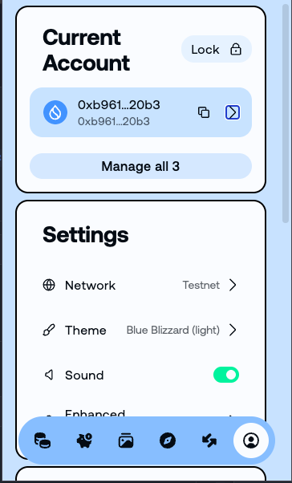
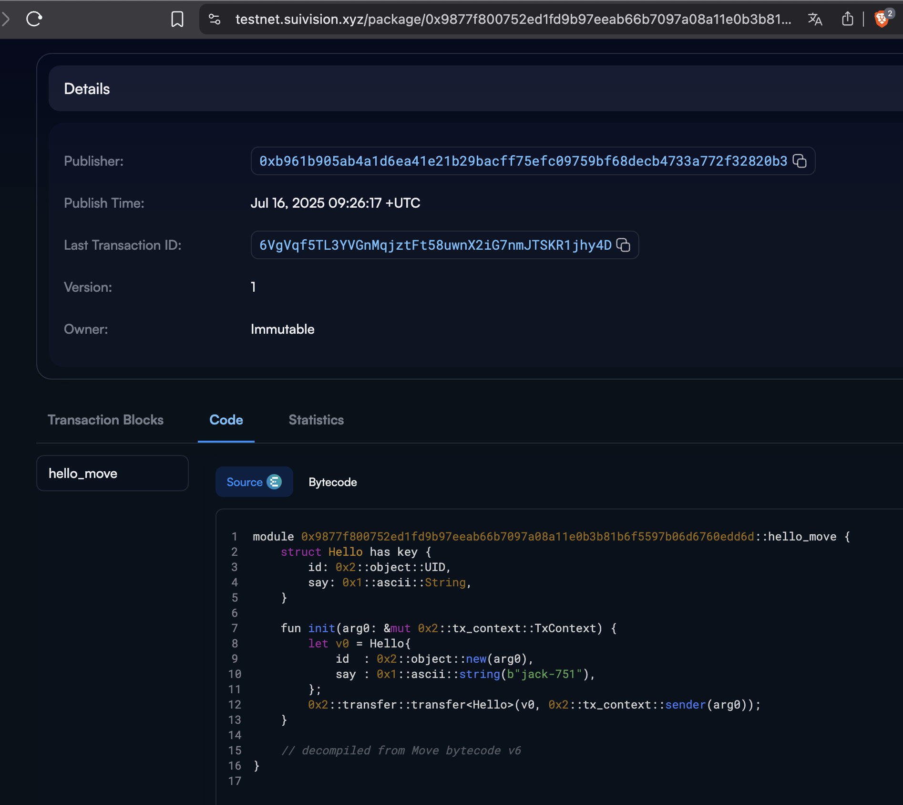
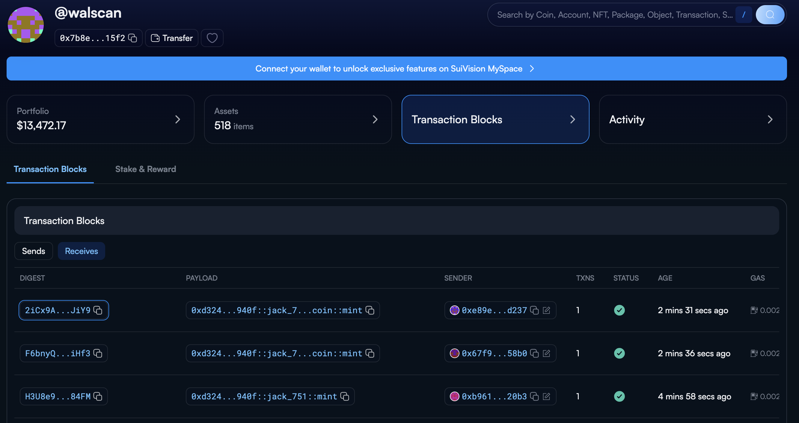

## 基本信息
- Sui钱包地址: `0xb961b905ab4a1d6ea41e21b29bacff75efc09759bf68decb4733a772f32820b3`
- github: `jack-751`

## 个人简介
- 工作经验: 9年
- 技术栈: `C#`、`Solidity`、`TypeScript`、 
- 對 Sui Move 特別感興趣，想成為 Move 語法開發者。
- 联系方式: tg: `@JackCiou` 

## 任务

##   01 hello move  
- [√] Sui cli version: 1.51.1
- [√] Sui钱包截图: 
- [√] package id: 0x9877f800752ed1fd9b97eeab66b7097a08a11e0b3b81b6f5597b06d6760edd6d
- [√] package id 在 scan上的查看截图:

##   02 move coin
- [√] My Coin package id : [0xd324003f9bd2409e139a24ac0ec2329a6a27e1da847e1dda3927bc78343e940f](https://suivision.xyz/package/0xd324003f9bd2409e139a24ac0ec2329a6a27e1da847e1dda3927bc78343e940f)
- [√] Faucet package id : [0xd324003f9bd2409e139a24ac0ec2329a6a27e1da847e1dda3927bc78343e940f](https://suivision.xyz/package/0xd324003f9bd2409e139a24ac0ec2329a6a27e1da847e1dda3927bc78343e940f)
- [√] 转账 `My Coin` hash: [H3U8e9zK3f2naRQbpZzxmw7QY7hgrDJcJ5MW3TeL84FM](https://suivision.xyz/txblock/H3U8e9zK3f2naRQbpZzxmw7QY7hgrDJcJ5MW3TeL84FM)
- [√] `Faucet Coin` address1 mint hash: [F6bnyQ3DFjNffJrfUrgfjSRfnv3wQxyVHj8tffUoiHf3](https://suivision.xyz/txblock/F6bnyQ3DFjNffJrfUrgfjSRfnv3wQxyVHj8tffUoiHf3)
- [√] `Faucet Coin` address2 mint hash: [2iCx9AS9FDnT6kz65XVYNiTBQbPm3E8tHJr9sQ9CJiY9](https://suivision.xyz/txblock/2iCx9AS9FDnT6kz65XVYNiTBQbPm3E8tHJr9sQ9CJiY9)
- 三筆交易scan上的查看截图

##   03 move NFT
- [] nft package id :
- [] nft object id : 
- [] 转账 nft  hash:
- [] scan上的NFT截图:

##   04 Move Game
- [] game package id :
- [] deposit Coin hash:
- [] withdraw `Coin` hash:
- [] play game hash:

##   05 Move Swap
- [] swap package id :
- [] call swap CoinA-> CoinB  hash :
- [] call swap CoinB-> CoinA  hash :

##   06 Dapp-kit SDK PTB
- [] save hash :

##   07 Move CTF Check In
- [] CLI call 截图 : 
- [] flag hash :

##   08 Move CTF Lets Move
- [] proof : 
- [] flag hash :

