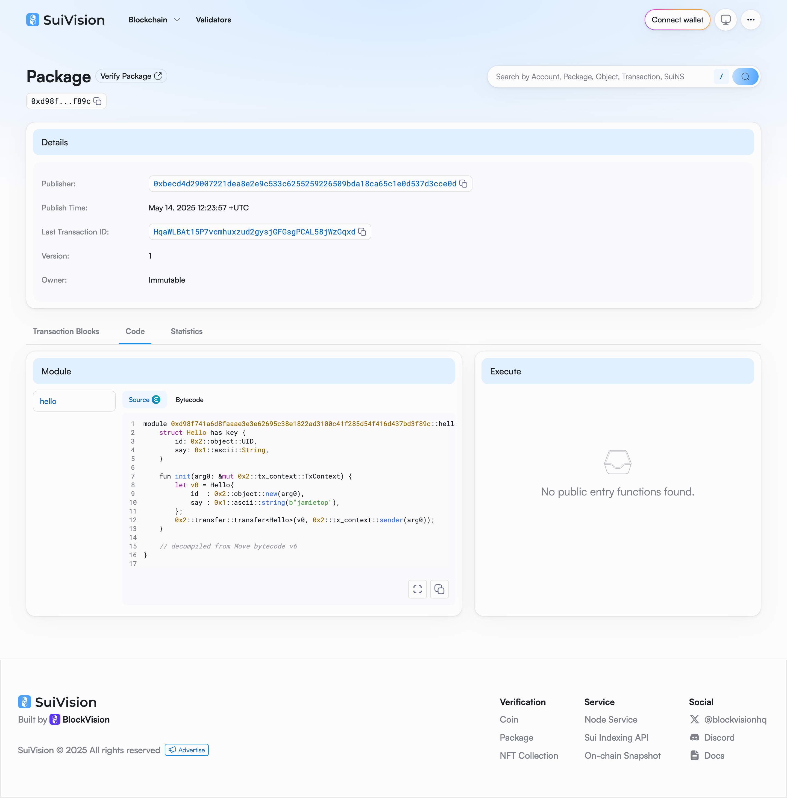

## 基本信息
- Sui钱包地址: `0x874a6ce568f6bb600e93a1f0fec3bc975ea75877902fede4729c772b11707b68`
> 首次参与需要完成第一个任务注册好钱包地址才被合并，并且后续学习奖励会打入这个地址
- github: `jamietop`

## 个人简介
- 工作经验: 10年
- 技术栈: `Node.js` `Rust` `MoonBit`
> 重要提示 请认真写自己的简介
- 多年web2开发经验，对Move特别感兴趣，想通过Move入门区块链
- fullstack developer in web/AI using Node.js/Rust/MoonBit
- 联系方式: tg: `xxx`

## 任务

##   01 hello move
- [x] Sui cli version: `sui 1.48.1-406f619fd590`
- [x] Sui钱包截图: 
- [x] package id: `0xd98f741a6d8faaae3e3e62695c38e1822ad3100c41f285d54f416d437bd3f89c`
- [x] package id 在 scan上的查看截图:

##   02 move coin
- [] My Coin package id :
- [] Faucet package id :
- [] 转账 `My Coin` hash:
- [] `Faucet Coin` address1 mint hash:
- [] `Faucet Coin` address2 mint hash:

##   03 move NFT
- [] nft package id :
- [] nft object id :
- [] 转账 nft  hash:
- [] scan上的NFT截图:

##   04 Move Game
- [] game package id :
- [] deposit Coin hash:
- [] withdraw `Coin` hash:
- [] play game hash:

##   05 Move Swap
- [] swap package id :
- [] call swap CoinA-> CoinB  hash :
- [] call swap CoinB-> CoinA  hash :

##   06 Dapp-kit SDK PTB
- [] save hash :

##   07 Move CTF Check In
- [] CLI call 截图 : 
- [] flag hash :

##   08 Move CTF Lets Move
- [] proof :
- [] flag hash :

