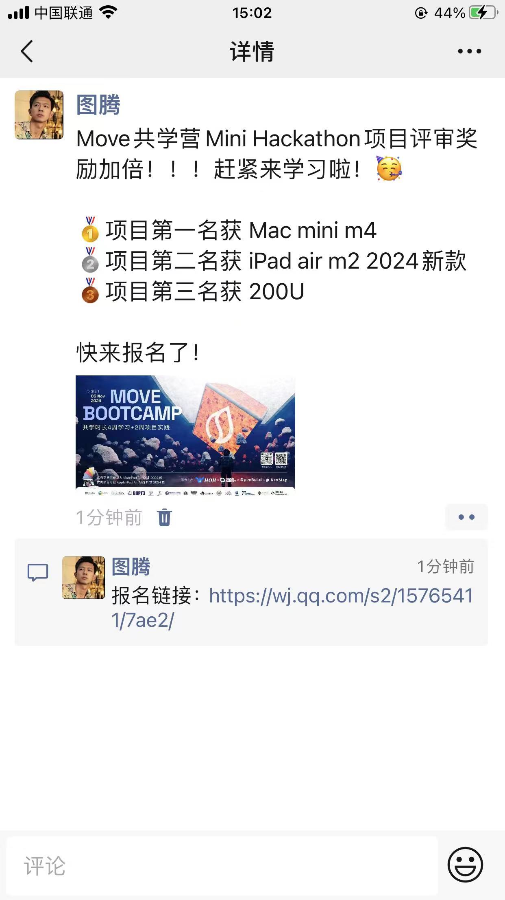
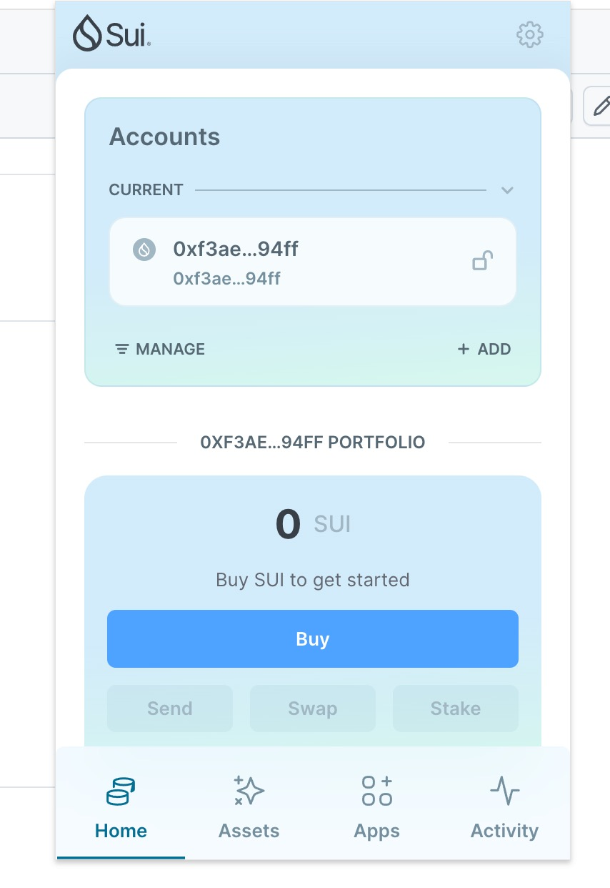
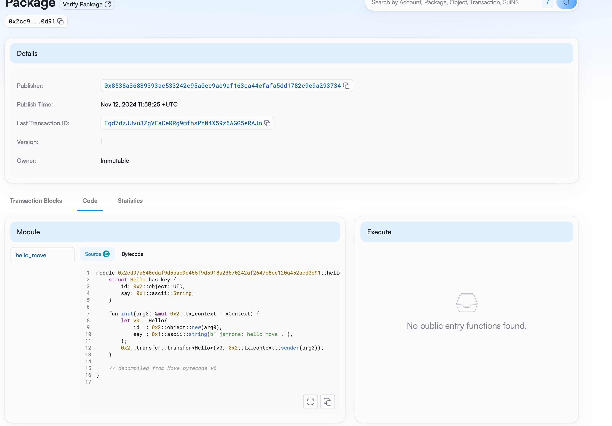
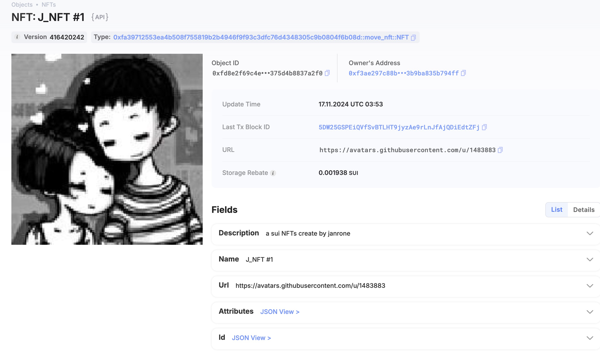

## 基本信息

- Sui 钱包地址: `0xf3ae297c88b60fa70dd8c860c8b595d02e56fd41074ace7aa93b9ba835b794ff`
  > 首次参与需要完成第一个任务注册好钱包地址才被合并，并且后续学习奖励会打入这个地址
- github: `janrone`

## 个人简介

- 工作经验: 10 年
- 技术栈: `Java` `TypeScript`
- 多年移动开发经验，对 Web3 ，Move 特别感兴趣，想通过 Move 入门区块链

## 为共学营宣传（在朋友圈或者群聊中转发海报/文章）

- [x] 宣传截图:

## 对外输出学习笔记

- [x] 第一篇笔记【[学习笔记链接](https://blog.csdn.net/janronehoo/article/details/143723416)】

## 任务

## 01. hello move

- [x] Sui cli version：sui 1.37.1-homebrew
- [x] Sui 钱包截图: 
- [x] PackageID: 0x2cd97a540cdaf9d5bae9c455f9d5918a23570242af2647e8ee120a452acd0d91
- [x] https://testnet.suivision.xyz/package/0x2cd97a540cdaf9d5bae9c455f9d5918a23570242af2647e8ee120a452acd0d91?tab=Code
- [x] 

## 02 move coin

- [x] My Coin package id : 0x5eba66432f3f60b472895c003872af367cc73f81c726207fae9585026da3858c
- [x] Faucet package id : 0x5865895f21bad55e8c747d2b53a3787a123b55c2dd0ea070e0813873b1e2c347
- [x] 转账 `My Coin` hash: 8kyMipWo4U4iCBsxvqjkN5UDQUuyeuoyoWZLXrvw4rYC
- [x] `Faucet Coin` address1 mint hash: B2YVMGK3v1Ti8TTKQ9GST95jnpAFEexqmqSdBJMsGT8z
- [x] `Faucet Coin` address2 mint hash: DsTyxsjSaYjMAmC6Bn2Nf9WyG6vpXDSoTcCM572BJ6Lg

## 03 move NFT

- [x] nft package id : 0xfa39712553ea4b508f755819b2b4946f9f93c3dfc76d4348305c9b0804f6b08d
- [x] nft object id : 0xfd8e2f69c4eae0f4db3d963bcf055fc42991b7ce53482341f8375d4b8837a2f0
- [x] 转账 nft hash: 4CwsV6sx2q7qgFsZ1ADADYkj6rp2yWtF4dFnyCdJj2C1
- [x] scan 上的 NFT 截图:

## 04 Move Game

- [x] game package id : 0xef7757243da29bc7efe22a38a27200c9f826cfd045739ee3c79e13b6b93ae78a
- [x] deposit Coin hash: AteMkxCoTTNtvQD1DQgr39911vkQCxNZsGWj4uFxGJw
- [x] withdraw `Coin` hash: ALLscCgww3Yo5yekaucbm2TfzZjuudkusvEfZ2X3kkyS
- [x] play game hash: CW5woz1EzzX7FhMtiBKZwqXkXxF8W7yjT6UDkGB1piwZ

## 05 Move Swap

- [x] swap package id : 0xac069d4c34a5af5f663e8a6e3fd8dfcf442f841e088e1f0ced3da5f9cb0a07ba
- [x] call swap CoinA-> CoinB hash : 6CWP5wR6GWTm4eF4oqeQzHVNcqUYF6CWCc6UAiaQsTEC
- [x] call swap CoinB-> CoinA hash : 9WiV5HtymFyc2PiwTQQc5ynBXkurSioE4NGkpa9sTxh

## 06 Dapp-kit SDK PTB

- [x] save hash : AtinX5qkhqc84UNW72ZbHzEtU9cb1foBbb3UgN6wEBXh

## 07 Move CTF Check In

- [] CLI call 截图 : 
- [] flag hash :

## 08 Move CTF Lets Move

- [] proof :
- [] flag hash :
