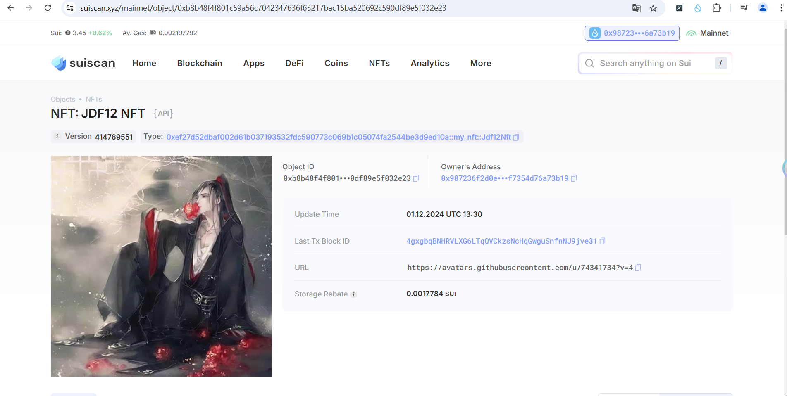

## 基本信息
- Sui钱包地址: `0xdd9613fd605c38478a81ef4bce18723df2f52f7a99d1195e6921831d94702d71`
> 首次参与需要完成第一个任务注册好钱包地址才被合并，并且后续学习奖励会打入这个地址
- github: `jdf12`

## 个人简介
- 工作经验: 2.5年
- 技术栈: `java` `c` `javascript`
> 重要提示 请认真写自己的简介
- 两年半Java web2开发经验，对Move特别感兴趣，想通过Move入门区块链与web3
- 联系方式: github: `https://github.com/jdf12` 

## 任务

##   01 hello move  
- [✓] Sui cli version: sui 1.37.1-7839b9501066
- [✓] Sui钱包截图: 
- [✓] package id: 0x1ee1ac7448b211837dbb232dcdc9c18915d3490943082a2368c63506e6e2d3b1
- [✓] package id 在 scan上的查看截图:

##   02 move coin
- [] My Coin package id : [0xc3f979a4dc8fe5c0387ecd06cf5be44df4ddeaa635272b0f1456b3f706960705](https://suivision.xyz/package/0xc3f979a4dc8fe5c0387ecd06cf5be44df4ddeaa635272b0f1456b3f706960705) 
- [] Faucet package id : [0xc3f979a4dc8fe5c0387ecd06cf5be44df4ddeaa635272b0f1456b3f706960705](https://suivision.xyz/package/0xc3f979a4dc8fe5c0387ecd06cf5be44df4ddeaa635272b0f1456b3f706960705)
- [] 转账 `My Coin` hash: [9AztZt6Ptm7jvd9eaJGcLqY1NTrUZJ3WrnvEzL6f4q6f](https://suivision.xyz/txblock/9AztZt6Ptm7jvd9eaJGcLqY1NTrUZJ3WrnvEzL6f4q6f?tab=Changes)
- [] `Faucet Coin` address1 mint hash: [6bKoLJ1EgxyjXGBHQU88PdSMKzb8SiNve9ux5RqmaxUr](https://suivision.xyz/txblock/6bKoLJ1EgxyjXGBHQU88PdSMKzb8SiNve9ux5RqmaxUr?tab=Changes)
- [] `Faucet Coin` address2 mint hash: [Bumpx5G8j4KPDTguntjP8VYTcUarWQzq1u5LEE3VEiUD](https://suivision.xyz/txblock/Bumpx5G8j4KPDTguntjP8VYTcUarWQzq1u5LEE3VEiUD?tab=Changes)

##   03 move NFT
- [] nft package id : [0xef27d52dbaf002d61b037193532fdc590773c069b1c05074fa2544be3d9ed10a](https://suivision.xyz/package/0xef27d52dbaf002d61b037193532fdc590773c069b1c05074fa2544be3d9ed10a)
- [] nft object id : [0x0f4f14f517755416002474cab193c79c26388652fe469d87f354be97a841684d](https://suiscan.xyz/mainnet/object/0x0f4f14f517755416002474cab193c79c26388652fe469d87f354be97a841684d)
- [] 转账 nft  hash: 
- [] scan上的NFT截图:

##   04 Move Game
- [] game package id :
- [] deposit Coin hash:
- [] withdraw `Coin` hash:
- [] play game hash:

##   05 Move Swap
- [] swap package id :
- [] call swap CoinA-> CoinB  hash :
- [] call swap CoinB-> CoinA  hash :

##   06 Dapp-kit SDK PTB
- [] save hash :

##   07 Move CTF Check In
- [] CLI call 截图 : 
- [] flag hash :

##   08 Move CTF Lets Move
- [] proof : 
- [] flag hash :
