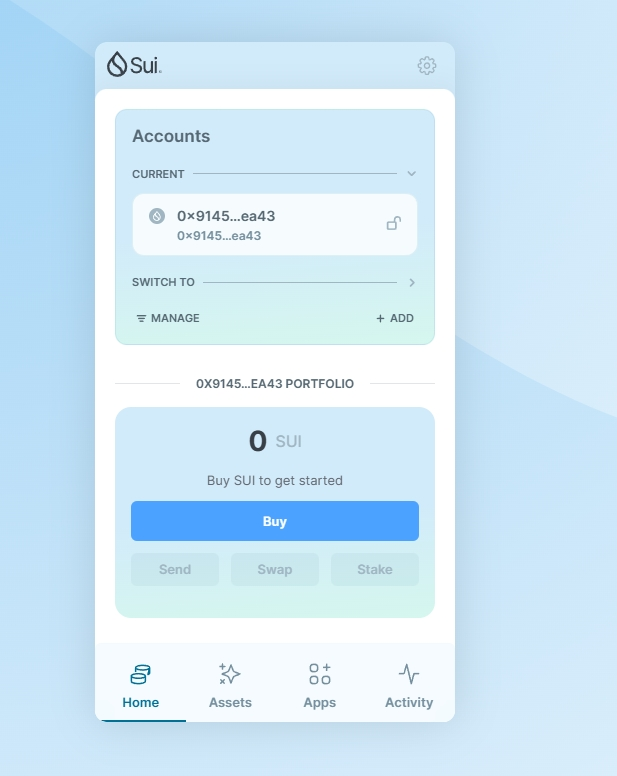
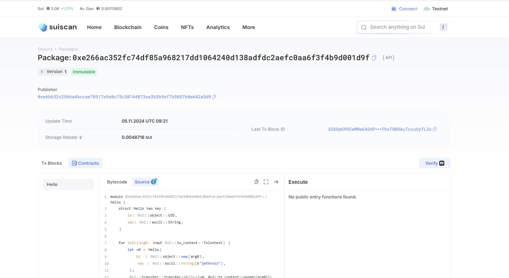
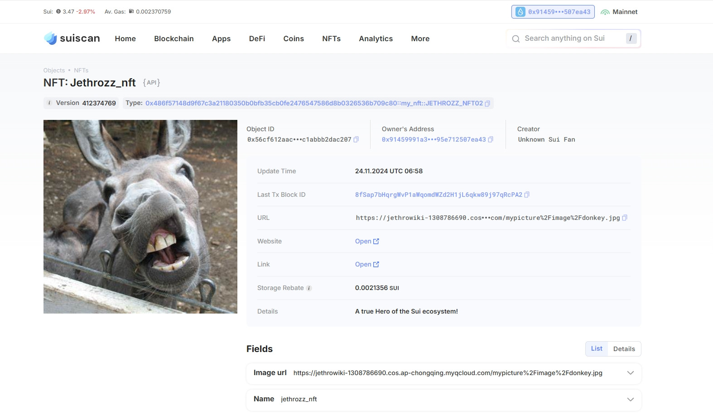
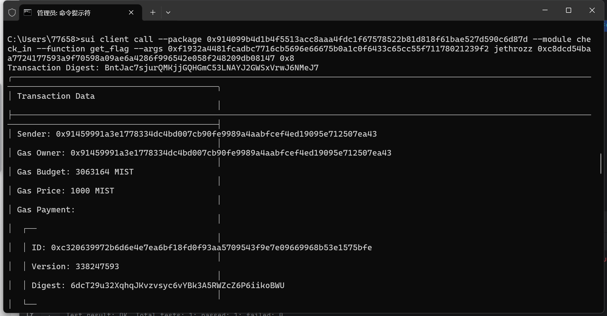

## 基本信息
- Sui钱包地址: `0x91459991a3e1778334dc4bd007cb90fe9989a4aabfcef4ed19095e712507ea43`
> 首次参与需要完成第一个任务注册好钱包地址才被合并，并且后续学习奖励会打入这个地址
- github: `jethrozz`

## 个人简介
- 工作经验: 5年
- 技术栈: `JAVA` `JS` `Solidity` 
> 重要提示 请认真写自己的简介
- 多年web2后端开发经验，会一些前端，学了一些Rust和Solidity，感觉Sui在未来应该会更火，所以想了解一下，顺便看看能不能增长一下自己的技能树
- 联系方式: wechat: `xinchen_zhu` 

## 任务

##   01 hello move  
- [✔] Sui cli version: sui 1.37.1-7839b9501066
- [✔] Sui钱包截图: 
- [✔] package id: 0xe266ac352fc74df85a968217dd1064240d138adfdc2aefc0aa6f3f4b9d001d9f
- [✔] package id 在 scan上的查看截图:

##   02 move coin
- [✔] My Coin package id : 0xdbdacdcea63c748df6e247db1fcdc759af2255e2463e6c60815b161d23d866e9
- [✔] Faucet package id : 0xdbdacdcea63c748df6e247db1fcdc759af2255e2463e6c60815b161d23d866e9
- [✔] 转账 `My Coin` hash: 7fZD9u3zVAvXLeXqXugKwRPGYYAqiaPALqMmQRiQffL7
- [✔] `Faucet Coin` address1 mint hash: GvsScjav22iC98CkWzg2mCWm1kSR7saLTXVfxCybnoN8
- [✔] `Faucet Coin` address2 mint hash: iJQPVQXM8N4ymZ3khEqVYApX6fBLACGMNENsmXEaYsE

##   03 move NFT
- [✔] nft package id : 0x486f57148d9f67c3a21180350b0bfb35cb0fe2476547586d8b0326536b709c80
- [✔] nft object id : 0x56cf612aac46fc25552a12fca554c19802140cf916411c56e65c1abbb2dac207
- [✔] 转账 nft  hash: 8fSap7bHqrgWvP1aWqomdWZd2H1jL6qkw89j97qRcPA2
- [✔] scan上的NFT截图:

##   04 Move Game
- [✔] game package id : 0x68138d5d4accc1de3b9140775fe19ea95e06a6832525168e90194f6583958cf1
- [✔] deposit Coin hash: 3C5XoBLRq9zrnFrq6YaMhR1RteLN1GKFFCgVJ3vobKMH
- [✔] withdraw `Coin` hash: FYQTZSdhEwduTZupPuMA1zUGBAaa61DGr6yJSvMagZY8
- [✔] play game hash: 4k2VesRJCUkicaFg9b2dkMihF6TzQbVrYnfFuay1mUZE

##   05 Move Swap
- [✔] swap package id : 0x05bc4dcb87aa2a6279ee03177b43506920f453e6ec279b7d630937229ecfd0f9
- [✔] call swap CoinA-> CoinB  hash : 7kKTL8MFkaUM4xFZe5hbdFvzM4veWa7QSDP7a5AYa8i9
- [✔] call swap CoinB-> CoinA  hash : g95FnkyEtpeJQ8u7xJvBBZT7KPofRZkhGGszTevsWkV

##   06 Dapp-kit SDK PTB
- [✔] save hash : GKk1dJeaDuJoQ2v3NyuXc4KWjdLbcUcJJGryQhJAUbk3

##   07 Move CTF Check In
- [✔] CLI call 截图 : 
- [✔] flag hash : BntJac7sjurQMKjjGQHGmC53LNAYJ2GWSxVrwJ6NMeJ7

##   08 Move CTF Lets Move
- [✔] proof : [130, 223, 247, 247, 150, 175, 149, 209]
- [✔] flag hash : 9BzgZR1mhnTRnax5K69vx5oM8MHrHP1X5wbirgsK7W3
