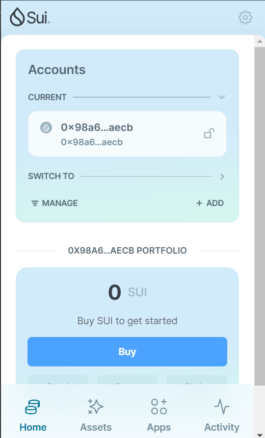

## 基本信息
- Sui钱包地址: `0x98a63ee7a96786419e21ae16cd34d65d96df82d25cc6943f12df455f410eaecb`
> 首次参与需要完成第一个任务注册好钱包地址才被合并，并且后续学习奖励会打入这个地址
- github: `jiangjinmou`

## 个人简介
- 工作经验: 2 年
- 技术栈: `python` `rust` `java`
- 还是学生，对区块链特别感兴趣，想通过Move入门区块链
- 联系方式: email: `jiangjinmou@outlook.com` 

## 任务

##   01 hello move  
- [x] Sui cli version: sui-client 1.42.2-55ba9e9399eb   
- [x] Sui钱包截图: 
- [x] package id:  0xa471ed316bd86bab61e5ccf196c76723644c9a48152458dd70ee0a9fefd5ded0 
- [x] package id 在 scan上的查看截图:

##   02 move coin
- [x] My Coin package id : 0xaa9b8678f073d5df303d3e81a6802f33815c721d0d27bc50f36c2b96be5f4efd
- [x] Faucet package id : 0xaa9b8678f073d5df303d3e81a6802f33815c721d0d27bc50f36c2b96be5f4efd
- [x] 转账 `My Coin` hash: 8N3gqKRnirWSB8ybv7Evqt6hQtYh9aD3R1AsH1aCfqsL
- [x] `Faucet Coin` address1 mint hash: 2tY7N8jPnJE4upAU8HVcqoGuY7nx2dM93RZJHCFBd9Nu
- [x] `Faucet Coin` address2 mint hash: CQdh5p3gn3qs8bzbMQqaoyE35gphUvzGG6BaV2pMHTC2

##   03 move NFT
- [x] nft package id : 0x9207122b3bc53a4200e3b624ff69ba0d1a9a24f74090252fdec57081bdbd42e7
- [x] nft object id : 0x6eb167888e54720ac855f2a57a22eeb94e4f6c1aa62f4fb8fe7658cccc4cca79
- [x] 转账 nft  hash: 1FovNkZHV9uZ5GEfHXEjDYZYKMfjU3FkmWtSLfivXfL
- [x] scan上的NFT截图:
