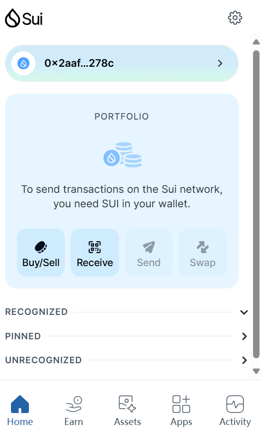
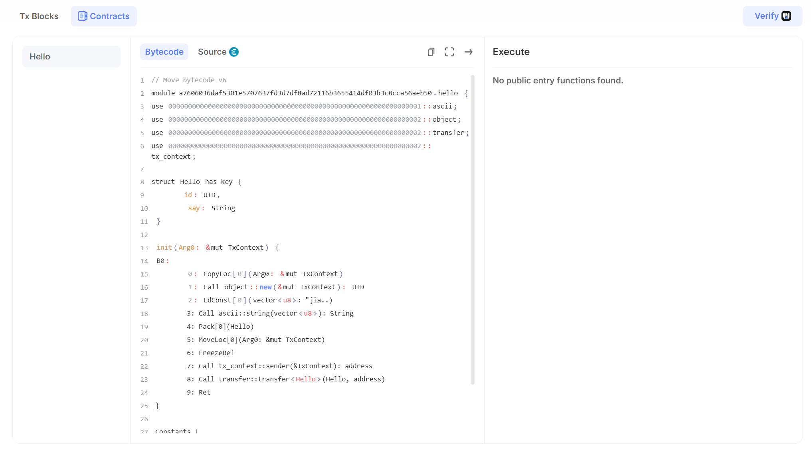

## 基本信息
- Sui钱包地址: `0x2aafd9b6605fe4e19100b0455765a7d1938289b246b50b55c1105a7d9da5278c`
> 首次参与需要完成第一个任务注册好钱包地址才被合并，并且后续学习奖励会打入这个地址
- github: `jiangzhangy`

## 个人简介
- 工作经验: 8年
- 技术栈: `PHP` `GO` `MySql` `Redis` `前端常用技术栈`
> 重要提示 请认真写自己的简介
- 8年web2开发经验，能从零构建大型WEB2项目，抽象能力强，对项目管理有多年经验，能独立或者合作完成各种项目，对Move特别感兴趣，想通过Move入门区块链
- 联系方式: tg: `bikeaner` 

## 任务

##   01 hello move  
- [] Sui cli version:sui 1.47.0-f3e72b60708b
- [] Sui钱包截图: 
- [] package id: 0xa7606036daf5301e5707637fd3d7df8ad72116b3655414df03b3c8cca56aeb50
- [] package id 在 scan上的查看截图:

##   02 move coin
- [] My Coin package id : 
- [] Faucet package id : 
- [] 转账 `My Coin` hash:
- [] `Faucet Coin` address1 mint hash:
- [] `Faucet Coin` address2 mint hash:

##   03 move NFT
- [] nft package id :
- [] nft object id : 
- [] 转账 nft  hash:
- [] scan上的NFT截图:

##   04 Move Game
- [] game package id :
- [] deposit Coin hash:
- [] withdraw `Coin` hash:
- [] play game hash:

##   05 Move Swap
- [] swap package id :
- [] call swap CoinA-> CoinB  hash :
- [] call swap CoinB-> CoinA  hash :

##   06 Dapp-kit SDK PTB
- [] save hash :

##   07 Move CTF Check In
- [] CLI call 截图 : 
- [] flag hash :

##   08 Move CTF Lets Move
- [] proof : 
- [] flag hash :

