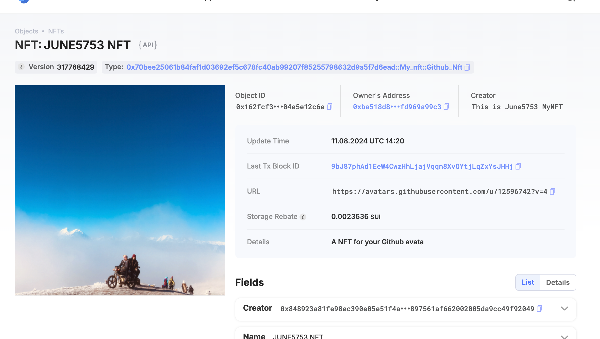

## 基本信息
- Sui钱包地址: `0x71f1fc77f292b2c0b366e00bda842af6dc60281335e9bbe72076de5996026553`
> 首次参与需要完成第一个任务注册好钱包地址才被合并，并且后续学习奖励会打入这个地址
- github: `june5753`

## 个人简介
- 工作经验: 10
- 技术栈: `Java` `solidity`
- 多年移动端开发经验，对 Move 特别感兴趣，想通过 Move 入门区块链
- 联系方式: tg: ``
- 
## 任务

##   01 hello move
- [] Sui cli version:
- [] Sui钱包截图: 
- [] package id:  0x5846b38f3bb042a17dcc23aa1d188aa90f0ec02d4bd65772d7ea25a59f7f2a24
- [] package id 在 scan上的查看截图:

##   02 move coin
- [] My Coin package id : 0x9eca0a616305718c72e850e58b405f057fa4e32205dd6a9a843faeb2c45d58b4
- [] Faucet package id  0x6cf97a47a354a5a178b7ae3a769c00a56bbea45582be582d06013328f60b44d7
- [] 转账 `My Coin` hash: GM63RjRxWtXV8d6N6RpDsJzsWNnhrCv4rQKa3WEErgXB
- [] `Faucet Coin` address1 mint hash:3kdu24JzSy1TUfsRMzuMv4odgjEYVV4MUraZKjz84d6o
- [] `Faucet Coin` address2 mint hash:DHtqV26wUyHWrsj2uxHLaSk4njDjNqHtmpQsFLntHH3o

##   03 move NFT
- [] nft package id : 0x70bee25061b84faf1d03692ef5c678fc40ab99207f85255798632d9a5f7d6ead
- [] nft object id : 0x162fcf3199e2f8b8e963866968d6105412ed460ef8725753b5731704e5e12c6e
- [] 转账 nft  hash: 9bJ87phAd1EeW4CwzHhLjajVqqn8XvQYtjLqZxYsJHHj
- [] scan上的NFT截图:

##   04 Move Game
- [] game package id :  0xfd35101cf63fc015c6a6c8a90d718e88c01e6276e631b55cfbf6b37ba565a927             
- [] deposit Coin hash: 6HUXejWdjEiYw8mJScbtnACPvqenx9wRG1D7kHwPWz2i
- [] withdraw `Coin` hash: FE7qza8uK749g14fGtrNHgk5Z9Vfo5Va3w7FoQfnj6Qk
- [] play game hash: CbwmYEeVotCzNjqdhEZr7zLXSyMwpQfoDFzeri9kaadQ

- 第一次游戏：[Scan截图](./images/task4/1_user_winner.jpg)
- 第二次游戏：[Scan截图](./images/task4/2_robot_winner.jpg)
- 第三次游戏：[Scan截图](./images/task4/3_user_winner.jpg)

##   05 Move Swap
- [] swap package id :
- [] call swap CoinA-> CoinB  hash :
- [] call swap CoinB-> CoinA  hash :

##   06 Dapp-kit SDK PTB
- [] save hash :

##   07 Move CTF Check In
- [] CLI call 截图 : 
- [] flag hash :

##   08 Move CTF Lets Move
- [] proof :
- [] flag hash :
