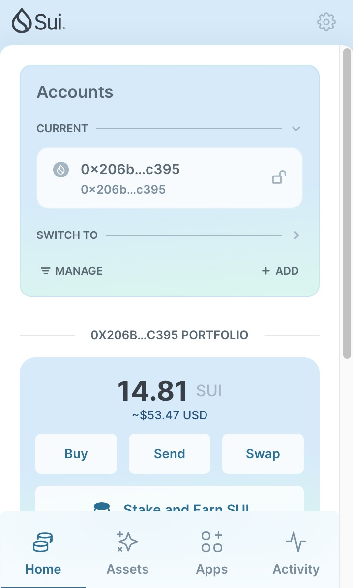
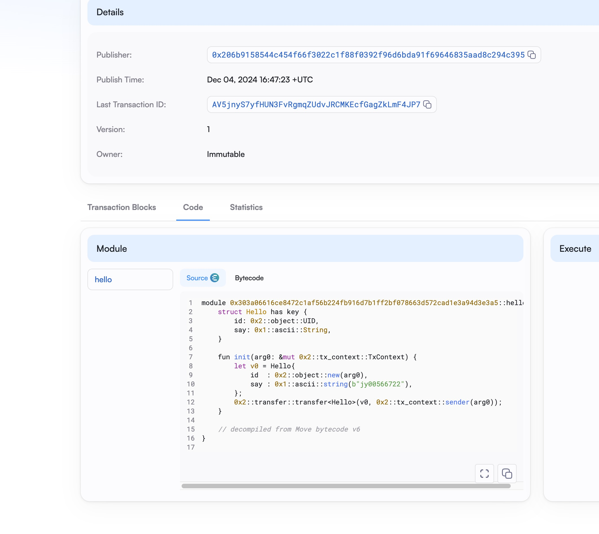

## 基本信息
- Sui钱包地址: `0x206b9158544c454f66f3022c1f88f0392f96d6bda91f69646835aad8c294c395`
> 首次参与需要完成第一个任务注册好钱包地址才被合并，并且后续学习奖励会打入这个地址
- github: `jy00566722`

## 个人简介
- 工作经验: 5年
- 技术栈: `Golang` `Javascript` `Vue` `React`
> 重要提示 请认真写自己的简介
- 主要开发chrome插件，后端主要使用golang,前端用vue,目前在转react。通过Move入门区块链,目前的想法:通过Sui的NFT与POD相结合，销售个性化产品,这是链上与线下的结合,我认为会有市场。
- 联系方式: tg: `https://t.me/oelitt` 

## 任务

##   01 hello move  
- [✓] Sui cli version: sui 1.43.1-homebrew
- [✓] Sui钱包截图: 
- [✓] package id: 0xb1f66a17bec1c70c453b0ad18bfc1fe9ef5b5bf5e17b720f0a6eae8e38df8cbf
- [✓] package id 在 scan上的查看截图:

##   02 move coin
- [✓] My Coin package id : 0xa1ac78023288ccc0cb05694d8eada4b341bf7f209c1d234299c0c658052e9857
- [✓] Faucet package id : 0x64b1f6f09e42d41fd7b8f2da95fc8d0c1f03fe3dda72b143005065e1dcc3fcb7
- [✓] 转账 `My Coin` hash: FkADn7zkH6SgdFWkLpiWzDUz34h77onE8Bhdw8RaKmtg
- [✓] `Faucet Coin` address1 mint hash:2d84SiaCdNkuybCahAXi2enKK71cKWhjF5P39AMFpdGN
- [✓] `Faucet Coin` address2 mint hash: C5kb8MR4GE5LYCTbVqh6VFiFC2BR9haf4vvPEPjkjb2B

##   03 move NFT
- [] nft package id :
- [] nft object id : 
- [] 转账 nft  hash:
- [] scan上的NFT截图:

##   04 Move Game
- []  game package id :
- []  deposit Coin hash:
- []  withdraw `Coin` hash:
- []  play game hash:

##   05 Move Swap
- []  swap package id :
- []  call swap CoinA-> CoinB  hash :
- []  call swap CoinB-> CoinA  hash :

##   06 Dapp-kit SDK PTB
- [] save hash :

##   07 Move CTF Check In
- [] CLI call 截图 : 
- []  flag hash :

##   08 Move CTF Lets Move
- [] proof : 
- [] flag hash :
