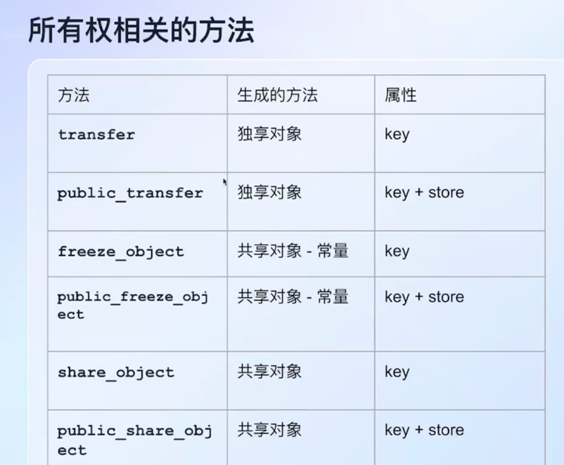
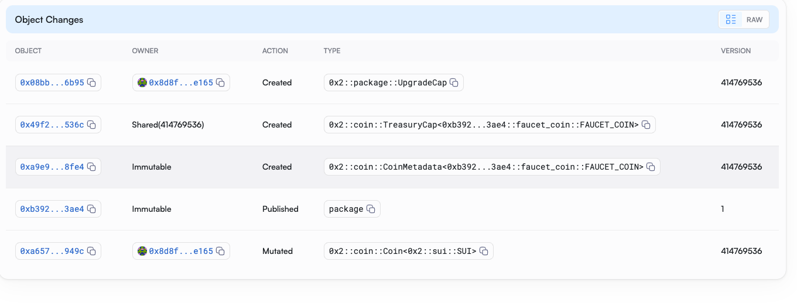

# Task 1

1. Version mismatch

`[warning] Client/Server api version mismatch, client api version : 1.39.0, server api version : 1.37.2`

- 最开始是client版本低，结果一update不小心update过头超过了server的version，捣鼓半天server没有update成功，大概率是要运行docker的，但是之后再说吧。

  - update client的code `cargo install --locked --git https://github.com/MystenLabs/sui.git --branch testnet sui --features tracing`
- 解决方案是卸载sui重新安装1.37.2 `cargo uninstall sui
cargo install --locked --git https://gitee.com/MystenLabs/sui.git --tag sui_v1.37.2_1731021158_release sui`

2. 转换environment

- 查看运行环境 `sui client envs`
- 添加testnet `sui client new-env --alias testnet --rpc https://fullnode.testnet.sui.io:443`
- Mainnet `sui client new-env --alias mainnet --rpc https://fullnode.mainnet.sui.io:443`
- 转换到testnet `sui client switch --env testnet` 

3. 领水

`sui client faucet --address <address>` 当前地址不用加address

# Task 2 Coin
## 知识点
### 能力 Ability
key, store, drop, copy

- copy: 值可以被复制
- drop: 在作用域范围结束后值可以被丢弃
- key: 在全局存储操作中值可以被用为key键
- store: 值可以在全局存储中被存储

在 Sui Move 中拥有 key 和 store 能力特性的定制类型被视为资产，资产可以在全局存储中存储，也可以在不同账号之间转移。

### 参数传递 (使用 value, ref 和 mut ref)

```sui move
use sui::object::{Self};

// 你被许可获取分数但不能修改它 &T read
public fun view_score(transcriptObject: &TranscriptObject): u8{
transcriptObject.literature
}

// 你被允许查看和编辑分数，但不能删除它 &mut read, write
public entry fun update_score(transcriptObject: &mut TranscriptObject, score: u8){
transcriptObject.literature = score
}

// 你被允许对分数做任何的操作，包括查看、编辑、删除整个 transcript  T transfer, delete, write, read
public entry fun delete_transcript(transcriptObject: TranscriptObject){
let TranscriptObject {id, history: _, math: _, literature: _ } = transcriptObject;
object::delete(id);
}
```


### 所有权

https://intro-zh.sui-book.com/unit-two/lessons/1_%E4%BD%BF%E7%94%A8sui_objects.html



-------------
## Code

`sui client publish `


### sui client call

`sui client call --help`

-- type-args 泛型参数 是package-id
-- args <TreasuryCapID>
-- package 0x2 官方的包


```bash
sui client call --function mint_and_transfer --module coin --package 0x2 \
 --type-args 0xdc08824abbae44a21376facc1d68e171b6900f65235160f9fe57d836df82b814::faucet_coin::FAUCET_COIN \
 --args 0xbe3bb88c4617745dd01764722897e927aaa18c4945d27c9e676379c0d89dede1 1000000000 0xd4525535fa7178fbba30422982b539bfff0e3752b9b6a3f9c76d6cafc9057412 

```

## Task 3 发布NFT

- NFT 必须有key


